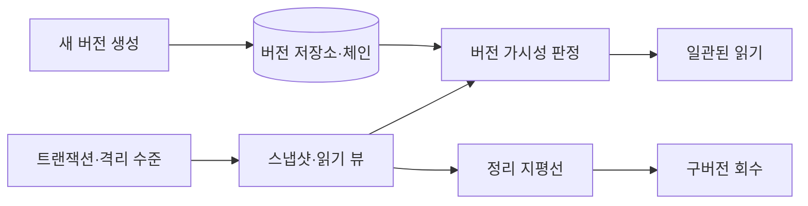
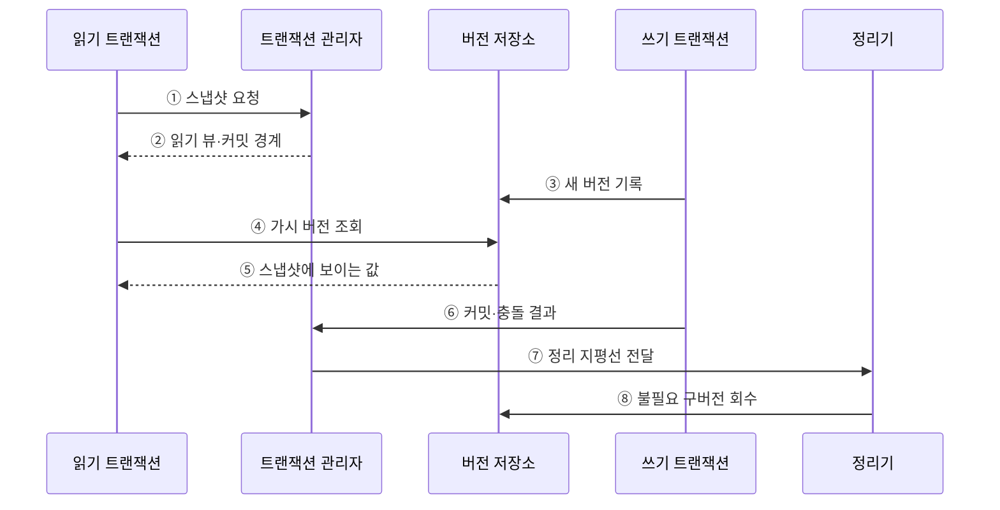

---
sidebar:
  order: 87
  label: "087. MVCC 다중 버전 동시성 제어 (MVCC)"
  badge:
    text: "미출제 · 50%"
    variant: note
title: "MVCC 다중 버전 동시성 제어 (MVCC)"
date: "2026-07-25T18:19:00+09:00"
tags:
  - "notes-software"
weight: 87
extra:
  question_no: "087"
  source_status: "미출제"
  source_history: ""
  priority: 50
  priority_note: "MVCC는 동시 읽기·버전 정리 설계 핵심"
---

## 미리 알고가기

- **다중 버전 동시성 제어(Multi-Version Concurrency Control, MVCC)**: 한 데이터의 여러 버전과 가시성 규칙으로 읽기·쓰기 간 대기를 줄이는 동시성 제어 방식
- **스냅샷(Snapshot)**: 트랜잭션이나 문장이 일관되게 볼 수 있는 논리 시점의 데이터 모습
- **읽기 뷰(Read View)**: 활성 트랜잭션과 커밋 경계를 기록해 보이는 버전을 판정하는 구조
- **실행 취소 로그(Undo Log)**: 일부 DBMS가 변경 전 값을 보존해 롤백·과거 버전 조회에 사용하는 로그
- **버전 저장 방식(Version Storage)**: 이전 값을 별도 Undo 영역이나 테이블의 새 튜플 등으로 보존하는 제품별 구현
- **가시성(Visibility)**: 버전 생성·종료 트랜잭션과 스냅샷을 비교해 현재 읽을 수 있는지 판정하는 규칙
- **정리 지평선(Cleanup Horizon)**: 활성 트랜잭션 중 가장 오래된 가시성 요구를 기준으로 구버전 회수 가능 여부를 나누는 경계
- **진공 청소·가비지 컬렉션(Vacuum/Garbage Collection)**: 어떤 활성 스냅샷도 필요로 하지 않는 구버전을 회수하는 작업
- **버전 체인(Version Chain)**: 최신 값에서 과거 버전을 찾도록 연결한 구조
- **버전 팽창(Version Bloat)**: 오래된 스냅샷 때문에 회수하지 못한 버전이 쌓여 저장·조회 비용이 커지는 현상

## Ⅰ. 개요

- 정의/개념: 스냅숏에 보이는 행 버전을 읽게 함
- **배경/필요성**: 읽기·쓰기 대기로 다중 버전 동시성 필요

### 쉽게 이해하기 (학습용)

- 읽는 거래는 허용된 옛 버전을 보고 쓰는 거래는 새 버전을 만들어 서로 기다리는 시간을 줄인다.

## Ⅱ. 특징

- 조회는 스냅샷을 참조해 쓰기 차단을 줄인다.
- 생성·종료 시점 메타데이터로 버전 가시성을 판정한다.
- 과거 버전이 쌓여 백그라운드 정리가 필요하다.
- 쓰기 충돌은 잠금·롤백·재시도로 보호한다.

### 쉽게 이해하기 (학습용)

- 읽기 대기는 줄지만 구버전이 공간을 차지하므로 안전한 시점에 회수해야 한다.

## Ⅲ. 아키텍처 및 구성요소

**도표안 A — 구조도**

**도표안 B — sequenceDiagram**

| 설계 요소 | 설명 |
|:---|:---|
| 버전 메타데이터 | 생성·종료 트랜잭션으로 가시성 판정 |
| 스냅샷·읽기 뷰 | 볼 수 있는 커밋 경계와 활성 범위 정의 |
| 버전 저장소·체인 | 현재·과거 버전을 제품별 방식으로 보존 |
| 충돌 제어·정리기 | 동시 쓰기를 통제하고 불필요 버전 회수 |

**동작 원리**

- ① 읽기 트랜잭션이 격리 수준에 맞는 스냅샷을 요청한다.
- ② 관리자가 활성 트랜잭션과 커밋 경계를 포함한 읽기 뷰를 제공한다.
- ③ 쓰기 트랜잭션이 기존 값을 즉시 덮지 않고 새 버전을 기록한다.
- ④ 읽기가 버전 메타데이터와 읽기 뷰로 볼 수 있는 값을 요청한다.
- ⑤ 저장소가 최신 값 또는 버전 체인의 과거 값 중 가시 버전을 반환한다.
- ⑥ 쓰기는 충돌 검증을 통과하면 커밋하고 아니면 대기·취소·재시도한다.
- ⑦ 관리자가 가장 오래된 활성 스냅샷을 기준으로 정리 지평선을 전달한다.
- ⑧ 정리기가 어떤 활성 읽기도 필요로 하지 않는 구버전을 회수한다.

> 요약: 스냅샷별 가시 버전을 읽게 하고 새 버전 기록과 안전한 구버전 회수를 병행한다.

### 쉽게 이해하기 (학습용)

- 독자는 자기 기준에 맞는 판본을 보고 아무도 읽지 않는 옛 판본은 청소부가 치운다.

## Ⅳ. 종류 및 비교

| 비교축 | 다중 버전 동시성 제어 | 잠금 중심 제어 |
|:---|:---|:---|
| 핵심 특징 | 보이는 버전을 선택해 읽기 대기 감소 | 잠금 해제까지 충돌 접근 대기 |
| 일관성 기준 | 스냅샷·가시성·충돌 규칙 | 잠금 범위·획득 순서·보유 기간 |
| 주요 위험 | 버전 저장·판정·정리 비용 | 경합·교착·긴 대기 |
| 적용 기준 | 읽기 비중과 시점 일관성이 중요 | 충돌 접근의 직접 순서 제어가 중요 |

> 요약: 잠금 대기와 스냅샷 읽기를 비교

### 쉽게 이해하기 (학습용)

- MVCC는 독자에게 맞는 판본을 보여 주고 잠금 방식은 충돌 작업의 순서를 직접 통제한다.

## Ⅴ. 실무 고려사항 및 대책

| 고려사항 | 문제점 | 대책 |
|:---|:---|:---|
| 장기 트랜잭션 | 정리 지평선이 멈춰 버전 팽창 증가 | 유휴·장기 트랜잭션 제한과 읽기 작업 분할 |
| 정리 지연 | 저장 공간·인덱스·버전 탐색 비용 증가 | Vacuum·GC 지연·회수량·팽창률 관측 |
| 쓰기 충돌 오해 | MVCC가 동시 갱신까지 자동 해결한다고 착각 | 조건부 갱신·잠금·충돌 오류 재시도 적용 |
| 제품별 차이 | 문장·트랜잭션 스냅샷과 저장 위치가 다름 | DBMS의 격리·가시성·정리 구현을 기준으로 설계 |
| 복제·백업 지연 | 오래된 버전 보존 요구가 정리를 막음 | 복제 슬롯·백업·장기 조회의 보존 지평선 관리 |

> 적용 사례: 주문 조회는 트랜잭션 제한 시간을 두고 가장 오래된 스냅샷과 버전 팽창률을 관측한다.

### 쉽게 이해하기 (학습용)

- 오래 열린 조회를 제한하면 구버전을 제때 회수해 저장·조회 비용을 줄일 수 있다.

## Ⅵ. 결론

- MVCC는 스냅샷 가시성으로 읽기·쓰기 대기를 줄이는 대신 버전 저장·충돌·정리 비용을 만든다.
- 제품별 구현과 스냅샷 수명·정리 지평선·재시도 정책을 함께 관리한다.

### 쉽게 이해하기 (학습용)

- MVCC는 읽기 대기를 줄이는 대신 구버전과 쓰기 충돌을 남기므로 수명·정리·재시도를 관리해야 한다.
