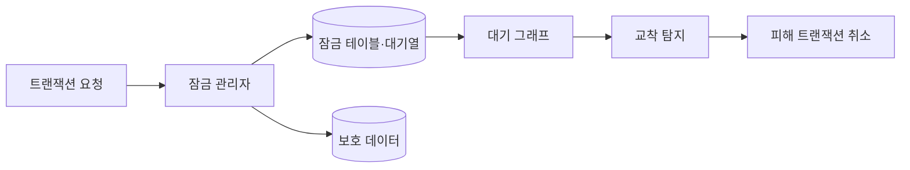
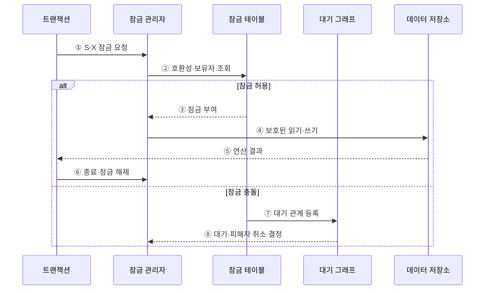

---
sidebar:
  order: 88
  label: "088. 락 관리 — 2단계 잠금 프로토콜 (2PL Two-Phase Locking)"
  badge:
    text: "미출제 · 30%"
    variant: note
title: "락 관리 — 2단계 잠금 프로토콜 (2PL Two-Phase Locking)"
date: "2026-07-25T18:20:00+09:00"
tags:
  - "notes-software"
weight: 88
extra:
  question_no: "088"
  source_status: "미출제"
  source_history: ""
  priority: 30
  priority_note: "2PL은 직렬성·교착상태 절충의 기본 기법"
---

## 미리 알고가기

- **2단계 잠금(Two-Phase Locking, 2PL)**: 잠금 획득과 해제를 성장·축소 단계로 분리해 충돌 직렬 가능성을 보장하는 프로토콜
- **성장 단계(Growing Phase)**: 새 잠금은 얻을 수 있지만 보유 잠금은 해제하지 않는 단계
- **축소 단계(Shrinking Phase)**: 보유 잠금은 해제할 수 있지만 새 잠금은 얻지 않는 단계
- **공유 잠금(Shared Lock, S-Lock)**: 여러 읽기는 함께 허용하지만 같은 자원의 배타 잠금과 충돌하는 잠금
- **배타 잠금(Exclusive Lock, X-Lock)**: 데이터 변경 동안 같은 자원의 다른 공유·배타 잠금을 막는 잠금
- **교착 상태(Deadlock)**: 둘 이상의 트랜잭션이 서로 보유한 잠금을 기다려 진행하지 못하는 상태
- **잠금 관리자(Lock Manager)**: 자원별 잠금 보유자·모드·대기열을 기록하고 요청 허용 여부를 판정하는 구성요소
- **대기 그래프(Wait-For Graph)**: 트랜잭션 간 잠금 대기 방향을 나타내며 순환으로 교착을 찾는 그래프
- **잠금점(Lock Point)**: 성장 단계에서 마지막 잠금을 획득한 시점
- **연쇄 롤백(Cascading Rollback)**: 미커밋 값을 읽은 트랜잭션이 원본 트랜잭션 취소를 따라 함께 취소되는 현상
- **엄격한 2PL(Strict 2PL)**: 모든 배타 잠금을 커밋·롤백 때까지 유지해 미커밋 변경 읽기와 연쇄 롤백을 막는 방식
- **강한 엄격 2PL(Rigorous 2PL)**: 공유·배타 잠금을 모두 트랜잭션 종료까지 유지하는 방식

## Ⅰ. 개요

- 정의/개념: 잠금 획득과 해제 단계를 분리함
- **배경/필요성**: 동시 쓰기 충돌로 직렬 가능 잠금 규칙 필요

### 쉽게 이해하기 (학습용)

- 잠금을 모으는 동안에는 풀지 않고 하나라도 푼 뒤에는 새 잠금을 받지 않는다.

## Ⅱ. 특징

- 잠금 해제 뒤에는 새 잠금을 얻지 못한다.
- 직렬성은 보장하지만 교착을 일으킬 수 있다.
- 엄격 제어는 종료까지 배타 잠금을 유지한다.
- 잠금 단위가 관리 비용과 동시 처리량을 좌우한다.

### 쉽게 이해하기 (학습용)

- 실행 결과의 순서는 맞추지만 서로 자물쇠를 쥔 채 기다리는 교착이 생길 수 있다.

## Ⅲ. 아키텍처 및 구성요소

**도표안 A — 구조도**

**도표안 B — sequenceDiagram**

| 설계 요소 | 설명 |
|:---|:---|
| 잠금 관리자 | 자원별 보유자·모드·대기열 추적 |
| 성장·축소 제어 | 첫 해제 뒤 새 잠금 요청 차단 |
| 대기 그래프 | 트랜잭션 대기 관계의 순환 탐지 |
| 피해자 선정 | 교착 시 취소 비용을 비교해 롤백 대상 결정 |

**동작 원리**

- ① 트랜잭션이 읽기에는 공유, 쓰기에는 배타 잠금을 요청한다.
- ② 잠금 관리자가 현재 보유 모드·보유자·대기열을 확인한다.
- ③ 호환되면 성장 단계의 트랜잭션에 잠금을 부여한다.
- ④ 부여된 잠금 범위 안에서 데이터 읽기·쓰기를 수행한다.
- ⑤ 저장소가 연산 결과를 트랜잭션에 반환한다.
- ⑥ 기본 2PL은 축소 단계에, 엄격한 2PL은 종료 때 배타 잠금을 해제한다.
- ⑦ 충돌하면 대기 관계를 그래프에 추가하고 잠금 부여를 보류한다.
- ⑧ 순환이 없으면 대기하고 교착이면 피해 트랜잭션을 취소해 순환을 끊는다.

> 요약: 성장 단계에서 잠금을 모으고 축소 단계에서만 해제하며 교착은 탐지·취소로 해소한다.

### 쉽게 이해하기 (학습용)

- 물건을 담는 동안에는 빼지 않고 하나를 빼기 시작하면 새 물건을 담지 않는다.

## Ⅳ. 종류 및 비교

| 비교축 | 기본 2단계 잠금 | 엄격한 2단계 잠금 |
|:---|:---|:---|
| 핵심 특징 | 축소 단계에 진입하면 임의 해제 가능함 | 트랜잭션 종료 시까지 배타 잠금을 유지함 |
| 복구 영향 | 해제 값을 읽을 수 있어 연쇄 롤백 위험이 있음 | 쓰기 잠금을 유지해 연쇄 롤백을 방지함 |
| 주요 위험 | 취소 시 범위 확산으로 복잡도가 상승함 | 잠금 유지 시간이 길어져 대기 지연이 발생함 |
| 적용 기준 | 조기 해제·복구 통제 가능 | 연쇄 롤백 방지 우선 |

> 요약: 해제 시점으로 일반·엄격 제어 구분

### 쉽게 이해하기 (학습용)

- 기본 방식은 축소 단계에서 잠금을 풀고 엄격한 방식은 쓰기 잠금을 종료까지 유지한다.

## Ⅴ. 실무 고려사항 및 대책

| 고려사항 | 문제점 | 대책 |
|:---|:---|:---|
| 잠금 순서 불일치 | 서로 반대 순서로 자원을 잡아 교착 증가 | 업무별 전역 잠금 순서 표준화 |
| 넓은 잠금 단위 | 불필요한 요청까지 대기해 처리량 저하 | 정합성에 필요한 최소 행·키 범위 잠금 |
| 긴 보유 시간 | 외부 호출·사용자 대기 동안 잠금 유지 | 트랜잭션 안의 느린 I/O를 제거하고 경계 축소 |
| 교착 재시도 부재 | 정상적인 교착 피해자 취소가 사용자 실패로 노출 | 멱등성·제한 재시도·백오프 적용 |
| 기아(Starvation) | 같은 트랜잭션이 반복해서 피해자로 선택 | 나이·롤백 비용·재시도 횟수를 피해자 선정에 반영 |

> 적용 사례: 이체는 계좌 번호순으로 잠그고 교착 피해자 트랜잭션을 멱등 재시도한다.

### 쉽게 이해하기 (학습용)

- 모든 이체가 계좌 번호순으로 잠그면 반대 순서 대기로 생기는 교착을 줄일 수 있다.

## Ⅵ. 결론

- 2PL은 성장·축소 규칙으로 충돌 직렬 가능성을 보장하지만 잠금 대기와 교착을 만든다.
- 잠금 순서·범위·보유 시간과 피해자 재시도를 함께 설계한다.

### 쉽게 이해하기 (학습용)

- 2PL은 올바른 실행 순서를 만들지만 교착과 대기를 줄이는 운영 설계가 필요하다.
