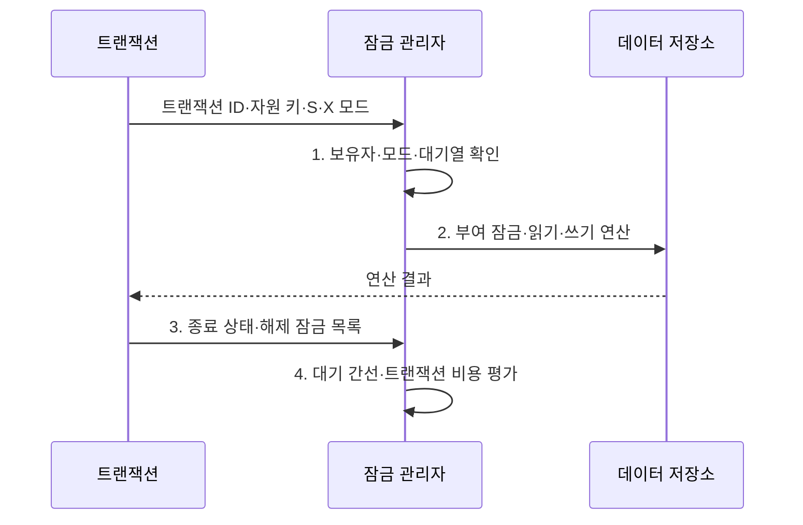

---
sidebar:
  order: 88
  label: "088. 락 관리: 2단계 잠금 프로토콜 (2PL Two-Phase Locking)"
  badge:
    text: "미출제 · 30%"
    variant: note
title: "락 관리: 2단계 잠금 프로토콜 (2PL Two-Phase Locking)"
date: "2026-08-02T12:00:00+09:00"
tags:
  - "notes-software"
weight: 88
extra:
  question_no: "088"
  source_status: "미출제"
  source_history: ""
  priority: 30
  priority_note: "2PL은 직렬성·교착상태 절충의 기본 기법"
---

## Ⅰ. 개요

핵심 용어

- **2단계 잠금(Two-Phase Locking, 2PL)**: 잠금 획득과 해제를 성장·축소 단계로 나눠 충돌 직렬 가능성을 보장하는 잠금 기반 동시성 제어 규약이다.
- **갱신 손실·비직렬 결과**: 무순서 동시 쓰기로 변경이 덮이거나 순차 실행으로 설명할 수 없는 결과가 생기는 현상이다.

- 정의/개념: **2단계 잠금(2PL)**은 잠금 획득과 해제를 성장•축소 단계로 분리해 충돌 직렬 가능성을 보장하는 **잠금 기반 동시성 제어 규약**
- 배경/필요성: 무순서 동시 쓰기는 **갱신 손실·비직렬 결과** 유발

#### 한줄 요약

- 잠금을 모으는 동안에는 풀지 않고 하나라도 푼 뒤에는 새 잠금을 받지 않는다.

## Ⅱ. 특징

핵심 용어

- **단계 분리**: 첫 잠금 해제 뒤에는 새 잠금을 얻지 못하게 하는 2PL 원칙이다.
- **직렬성·교착**: 올바른 순차 결과를 보장하는 대신 잠금 순환 대기가 생길 수 있는 절충이다.
- **엄격 제어**: 미커밋 변경 읽기를 막도록 배타 잠금을 거래 종료까지 유지하는 방식이다.

- **단계 분리**: 첫 해제 뒤 새 잠금 획득 금지
- **직렬성·교착**: 순서 보장과 대기 순환 발생
- **엄격 제어**: 종료까지 배타 잠금 유지

#### 한줄 요약

- 실행 결과의 순서는 맞추지만 서로 자물쇠를 쥔 채 기다리는 교착이 생길 수 있다.

## Ⅲ. 구조 및 구성요소

핵심 용어

- **보유자·모드·대기열**: 자원별 잠금 상태와 요청 순서를 관리하는 잠금 테이블 정보이다.
- **첫 잠금 해제 후 새 요청 차단**: 성장 단계에서 축소 단계로 넘어간 뒤 지키는 제약이다.
- **트랜잭션 대기 순환**: 서로의 잠금을 기다리는 간선이 고리를 이뤄 교착이 된 상태이다.
- **교착 피해자(Deadlock Victim)**: 대기 순환을 끊기 위해 비용을 고려해 롤백 대상으로 선택한 트랜잭션이다.

| 구성요소 | 책임 |
|:---|:---|
| 잠금 관리자 | **보유자·모드·대기열** 추적 |
| 성장·축소 제어 | **첫 잠금 해제 후 새 요청 차단** |
| 대기 그래프 | **트랜잭션 대기 순환** 탐지 |
| 피해자 선정 | 교착 시 **롤백 대상·비용** 결정 |

#### 한줄 요약

- 잠금 요청과 대기 관계를 관리하고 교착 시 취소 대상을 고른다.

## Ⅳ. 흐름도

핵심 용어

- **보유자·모드·대기열**: 잠금 호환성으로 요청을 부여하거나 기다리게 하는 정보이다.
- **S·X 잠금 모드**: 여러 읽기를 허용하는 공유 잠금(Shared Lock)과 다른 읽기·쓰기를 배제하는 배타 잠금(Exclusive Lock)이다.
- **종료 상태·해제 잠금 목록**: 축소 단계에서 반환할 잠금과 거래 완료 상태이다.
- **대기 간선·트랜잭션 비용**: 교착 순환과 취소할 피해자를 판정하는 자료이다.

**동작 원리**

- **1. 보유자·모드·대기열 확인**: 잠금 호환성으로 부여·대기 결정
- **2. 부여 잠금·읽기·쓰기 연산**: 성장 단계의 보호 범위에서 접근
- **3. 종료 상태·해제 잠금 목록**: 축소 단계에서 보유 잠금만 반환
- **4. 대기 간선·트랜잭션 비용**: 순환과 교착 피해자를 판정

> 요약: 성장 단계에서 잠금을 모으고 축소 단계에서만 해제하며 교착은 탐지·취소로 해소

#### 한줄 요약

- 물건을 담는 동안에는 빼지 않고 하나를 빼기 시작하면 새 물건을 담지 않는다.

## Ⅴ. 종류 및 비교

핵심 용어

- **기본 2단계 잠금**: 축소 단계에서 잠금을 조기 해제할 수 있는 2PL 방식이다.
- **엄격한 2단계 잠금**: 모든 배타 잠금을 커밋·롤백까지 유지해 연쇄 롤백을 막는 방식이다.

| 잠금 해제 관점 | 기본 2단계 잠금 | 엄격한 2단계 잠금 |
|:---|:---|:---|
| 적용 기준 | **조기 해제·복구 통제** 가능 | **연쇄 롤백 방지** 우선 |
| 핵심 특징 | 축소 단계에서 **잠금 해제** 가능 | 종료까지 **배타 잠금 유지** |
| 한계 | **연쇄 롤백 위험** | **잠금 유지·대기 지연** 증가 |

> 요약: 해제 시점으로 일반·엄격 제어 구분

#### 한줄 요약

- 기본 방식은 축소 단계에서 잠금을 풀고 엄격한 방식은 쓰기 잠금을 종료까지 유지한다.

## Ⅵ. 실무 고려사항 및 대책

핵심 용어

- **전역 잠금 순서**: 모든 거래가 자원을 같은 순서로 잠가 대기 순환을 줄이는 규칙이다.
- **최소 행·키 범위 잠금**: 업무 불변식을 보호하는 데 필요한 가장 좁은 데이터 범위에만 잠금을 거는 원칙이다.
- **느린 I/O 분리·거래 경계 축소**: 원격 호출과 사용자 대기 같은 지연 작업을 트랜잭션 밖으로 옮겨 잠금 보유 시간을 줄이는 방식이다.
- **멱등·제한 재시도·백오프**: 교착 피해자 작업을 중복 효과 없이 횟수와 간격을 통제해 복구하는 방식이다.
- **나이·비용·재시도 횟수**: 같은 거래가 반복 피해자가 되는 기아를 막기 위한 선정 기준이다.

| 문제 | 대책 | 효과 |
|:---|:---|:---|
| 트랜잭션마다 자원 잠금 순서가 달라 대기 순환 | **전역 잠금 순서** 표준화 | **교착 발생** 감소 |
| 넓은 범위를 잠가 무관한 거래까지 대기 | **최소 행·키 범위**만 잠금 | **불필요한 대기** 감소 |
| 외부 I/O 동안 잠금을 유지해 경합 시간 증가 | **느린 I/O 분리·거래 경계 축소** | **잠금 유지시간** 단축 |
| 교착 피해자 재시도가 없어 일시 충돌을 사용자 노출 | **멱등·제한 재시도·백오프** 적용 | **피해자 취소 자동 복구** |
| 같은 거래를 반복 피해자로 골라 기아 발생 | **나이·비용·재시도 횟수** 반영 | **반복 피해자 선정** 방지 |

> 적용 사례: 이체는 계좌 번호순으로 잠그고 교착 피해자 트랜잭션을 멱등 재시도

#### 한줄 요약

- 모든 이체가 계좌 번호순으로 잠그면 반대 순서 대기로 생기는 교착을 줄일 수 있다.

## Ⅶ. 결론

핵심 용어

- **엄격 2PL**: 연쇄 롤백 방지를 위해 배타 잠금을 종료까지 유지하는 방식이다.
- **기본 2PL**: 조기 잠금 해제와 별도 복구 통제가 가능한 방식이다.

- 연쇄 롤백 방지는 **엄격 2PL**, 조기 해제·복구 통제는 **기본 2PL**

#### 한줄 요약

- 2PL은 올바른 실행 순서를 만들지만 교착과 대기를 줄이는 운영 설계가 필요하다.
