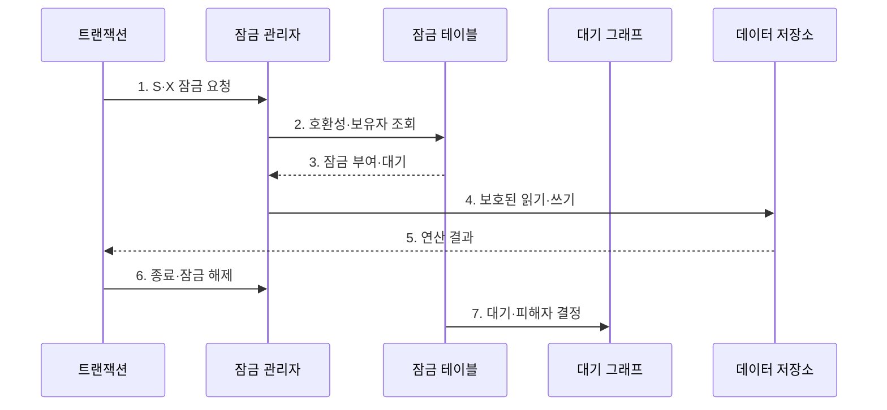

---
sidebar:
  order: 88
  label: "088. 락 관리: 2단계 잠금 프로토콜 (2PL Two-Phase Locking)"
  badge:
    text: "미출제 · 30%"
    variant: note
title: "락 관리: 2단계 잠금 프로토콜 (2PL Two-Phase Locking)"
date: "2026-07-25T18:20:00+09:00"
tags:
  - "notes-software"
weight: 88
extra:
  question_no: "088"
  source_status: "미출제"
  source_history: ""
  priority: 30
  priority_note: "2PL은 직렬성·교착상태 절충의 기본 기법"
---

## 미리 알고가기

- **2단계 잠금(Two-Phase Locking, 2PL)**: 잠금 획득과 해제를 성장·축소 단계로 분리해 충돌 직렬 가능성을 보장하는 프로토콜
- **성장 단계(Growing Phase)**: 새 잠금은 얻을 수 있지만 보유 잠금은 해제하지 않는 단계
- **축소 단계(Shrinking Phase)**: 보유 잠금은 해제할 수 있지만 새 잠금은 얻지 않는 단계
- **공유 잠금(Shared Lock, S-Lock)**: 여러 읽기는 함께 허용하지만 같은 자원의 배타 잠금과 충돌하는 잠금
- **배타 잠금(Exclusive Lock, X-Lock)**: 데이터 변경 동안 같은 자원의 다른 공유·배타 잠금을 막는 잠금
- **교착 상태(Deadlock)**: 둘 이상의 트랜잭션이 서로 보유한 잠금을 기다려 진행하지 못하는 상태
- **잠금 관리자(Lock Manager)**: 자원별 잠금 보유자·모드·대기열을 기록하고 요청 허용 여부를 판정하는 구성요소
- **대기 그래프(Wait-For Graph)**: 트랜잭션 간 잠금 대기 방향을 나타내며 순환으로 교착을 찾는 그래프
- **잠금점(Lock Point)**: 성장 단계에서 마지막 잠금을 획득한 시점
- **연쇄 롤백(Cascading Rollback)**: 미커밋 값을 읽은 트랜잭션이 원본 트랜잭션 취소를 따라 함께 취소되는 현상
- **엄격한 2PL(Strict 2PL)**: 모든 배타 잠금을 커밋·롤백 때까지 유지해 미커밋 변경 읽기와 연쇄 롤백을 막는 방식
- **강한 엄격 2PL(Rigorous 2PL)**: 공유·배타 잠금을 모두 트랜잭션 종료까지 유지하는 방식

## Ⅰ. 개요

- 정의/개념: 잠금 획득과 해제 단계를 분리함
- **배경/필요성**: 동시 쓰기 충돌로 직렬 가능 잠금 규칙 필요

### 쉽게 이해하기 (학습용)

- 잠금을 모으는 동안에는 풀지 않고 하나라도 푼 뒤에는 새 잠금을 받지 않는다.

## Ⅱ. 특징

- **단계 분리**: 첫 해제 뒤 새 잠금 획득 금지
- **직렬성·교착**: 순서 보장과 대기 순환 발생
- **엄격 제어**: 종료까지 배타 잠금 유지

### 쉽게 이해하기 (학습용)

- 실행 결과의 순서는 맞추지만 서로 자물쇠를 쥔 채 기다리는 교착이 생길 수 있다.

## Ⅲ. 구조 및 구성요소

| 구성요소 | 책임 |
|:---|:---|
| 잠금 관리자 | 보유자·모드·대기열 추적 |
| 성장·축소 제어 | 첫 해제 뒤 새 요청 차단 |
| 대기 그래프 | 대기 관계의 순환 탐지 |
| 피해자 선정 | 교착 시 롤백 대상 결정 |

### 쉽게 이해하기 (학습용)

- 잠금 요청과 대기 관계를 관리하고 교착 시 취소 대상을 고른다.

## Ⅳ. 흐름도

**동작 원리**

- **1. S·X 잠금 요청**: 읽기·쓰기 모드를 요구한다.
- **2. 호환성·보유자 조회**: 대기열을 확인한다.
- **3. 잠금 부여·대기**: 호환 여부로 처리한다.
- **4. 보호된 읽기·쓰기**: 잠금 범위에서 연산한다.
- **5. 연산 결과**: 처리 값을 반환한다.
- **6. 종료·잠금 해제**: 규칙에 따라 잠금을 푼다.
- **7. 대기·피해자 결정**: 교착 순환을 취소로 해소한다.

> 요약: 성장 단계에서 잠금을 모으고 축소 단계에서만 해제하며 교착은 탐지·취소로 해소한다.

### 쉽게 이해하기 (학습용)

- 물건을 담는 동안에는 빼지 않고 하나를 빼기 시작하면 새 물건을 담지 않는다.

## Ⅴ. 종류 및 비교

| 비교축 | 기본 2단계 잠금 | 엄격한 2단계 잠금 |
|:---|:---|:---|
| 적용 기준 | 조기 해제·복구 통제 가능 | 연쇄 롤백 방지 우선 |
| 핵심 특징 | 축소 단계에서 잠금 해제 가능 | 종료까지 배타 잠금 유지 |
| 한계 | 연쇄 롤백 위험 | 잠금 유지와 대기 지연 증가 |

> 요약: 해제 시점으로 일반·엄격 제어 구분

### 쉽게 이해하기 (학습용)

- 기본 방식은 축소 단계에서 잠금을 풀고 엄격한 방식은 쓰기 잠금을 종료까지 유지한다.

## Ⅵ. 실무 고려사항 및 대책

| 고려사항 | 대책 | 효과 |
|:---|:---|:---|
| 잠금 순서 불일치 | 전역 잠금 순서 표준화 | 교착 발생 감소 |
| 넓은 잠금 단위 | 최소 행·키 범위만 잠금 | 불필요한 대기 감소 |
| 긴 보유 시간 | 느린 I/O 제거와 경계 축소 | 잠금 유지시간 단축 |
| 교착 재시도 부재 | 멱등·제한 재시도·백오프 적용 | 피해자 취소 자동 복구 |
| 기아 | 나이·비용·재시도 횟수 반영 | 반복 피해자 선정 방지 |

> 적용 사례: 이체는 계좌 번호순으로 잠그고 교착 피해자 트랜잭션을 멱등 재시도한다.

### 쉽게 이해하기 (학습용)

- 모든 이체가 계좌 번호순으로 잠그면 반대 순서 대기로 생기는 교착을 줄일 수 있다.

## Ⅶ. 결론

- **잠금 순서·범위·보유 시간**으로 2PL의 교착 비용을 줄인다.

### 쉽게 이해하기 (학습용)

- 2PL은 올바른 실행 순서를 만들지만 교착과 대기를 줄이는 운영 설계가 필요하다.
