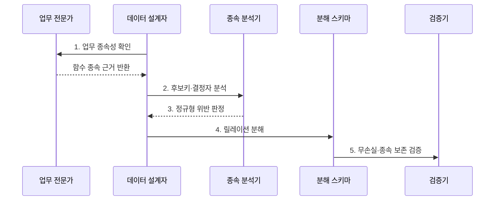

---
sidebar:
  order: 89
  label: "089. 데이터베이스 정규화 1NF~BCNF (Database Normalization)"
  badge:
    text: "기출 · 70%"
    variant: note
title: "데이터베이스 정규화 1NF~BCNF (Database Normalization)"
date: "2026-07-27T23:59:59+09:00"
tags:
  - "notes-software"
weight: 89
extra:
  question_no: "089"
  source_status: "기출"
  source_history: "120회, 135회"
  priority: 70
  priority_note: "120·135회 반복, 정규화·함수종속 핵심"
---

## 미리 알고가기

- **정규화(Normalization)**: 데이터 종속성을 분석해 중복과 변경 이상을 줄이도록 릴레이션을 분해하는 논리 설계
- **함수 종속성(Functional Dependency, FD)**: 같은 결정자 값이면 종속자 값도 같아야 한다는 제약
- **완전 함수 종속(Full Functional Dependency)**: 종속자가 복합 결정자 전체에는 종속하지만 어떤 진부분집합에도 종속하지 않는 관계
- **부분 함수 종속(Partial Functional Dependency)**: 종속자가 복합 결정자의 일부에도 종속하는 관계
- **이행 함수 종속(Transitive Functional Dependency)**: X→Y와 Y→Z를 통해 X→Z가 간접 성립하는 관계
- **제1정규형(First Normal Form, 1NF)**: 각 튜플의 속성값을 관계 모델에서 더 나누지 않는 단일 값으로 표현한 정규형
- **제2정규형(Second Normal Form, 2NF)**: 1NF이며 모든 비주요 속성이 각 후보키에 완전 함수 종속인 정규형
- **제3정규형(Third Normal Form, 3NF)**: 모든 비자명 FD X→A에서 X가 슈퍼키이거나 A가 주요 속성인 정규형
- **보이스-코드 정규형(Boyce-Codd Normal Form, BCNF)**: 모든 비자명 FD의 결정자가 슈퍼키인 정규형
- **결정자(Determinant)**: 함수 종속에서 다른 속성값을 정하는 왼쪽 속성 집합
- **후보키(Candidate Key)**: 모든 튜플을 유일하게 식별하는 최소 슈퍼키
- **주요 속성(Prime Attribute)**: 하나 이상의 후보키에 포함되는 속성
- **비주요 속성(Non-prime Attribute)**: 어떤 후보키에도 포함되지 않는 속성
- **무손실 조인 분해(Lossless-join Decomposition)**: 분해한 릴레이션을 조인했을 때 거짓 튜플 없이 원래 관계를 정확히 복원하는 분해
- **종속성 보존(Dependency Preservation)**: 분해된 각 릴레이션의 제약만 검사해 원래 함수 종속을 강제할 수 있는 성질
- **이상 현상(Anomaly)**: 중복 사실 때문에 삽입·갱신·삭제가 다른 사실을 손상하거나 불일치를 만드는 현상
- **반정규화(Denormalization)**: 측정된 읽기 병목을 줄이려고 중복이나 결합 구조를 의도적으로 추가하는 설계

## Ⅰ. 개요

- 정의/개념: 함수 종속을 기준으로 **릴레이션을 무손실 분해**하는 설계 기법
- 배경/필요성: 변경 이상과 무결성 위반의 구조적 제거

### 쉽게 이해하기 (학습용)

- 고객 정보가 주문마다 반복되면 주소가 일부만 바뀔 수 있어 고객과 주문을 분리한다.

## Ⅱ. 특징

- **함수 종속·후보키**로 변경 이상 원인 판정
- **무손실 분해**로 자연 조인 시 원본 릴레이션 복원
- **종속성 보존**으로 조인 없는 제약 검사 가능

### 쉽게 이해하기 (학습용)

- 정규화는 같은 사실을 한곳에 저장해 수정 오류를 줄이지만 조회 때 표를 다시 연결할 수 있다.

## Ⅲ. 구조 및 구성요소

| 구성요소 | 책임 |
|:---|:---|
| 함수 종속성 | 결정자와 종속자의 값 제약 표현 |
| 후보키·결정자 | 최소 식별자와 FD 왼쪽 구분 |
| 무손실 분해 | 조인으로 원본 릴레이션 복원 |
| 종속성 보존 | 분해 릴레이션에서 제약 검사 |

### 쉽게 이해하기 (학습용)

- 업무 종속과 키를 찾아 표를 나누고 복원과 제약 유지를 확인한다.

## Ⅳ. 흐름도

**동작 원리**

- **1. 업무 종속성 확인**: 정책·유일성으로 함수 종속 도출
- **2. 후보키·결정자 분석**: 속성 폐쇄로 키와 결정자 식별
- **3. 정규형 위반 판정**: 부분·이행·비키 결정자 확인
- **4. 릴레이션 분해**: 위반 종속을 별도 관계로 분리
- **5. 무손실·종속 보존 검증**: 조인 복원과 제약 유지 확인

> 요약: 업무 함수 종속과 후보키로 분해하고 무손실 조인·종속성 보존을 검증

### 쉽게 이해하기 (학습용)

- 사실을 정하는 규칙대로 표를 나누고 다시 합쳤을 때 원본만 나오는지 확인한다.

## Ⅴ. 종류 및 비교

| 정규형 | 1NF·2NF | 3NF | BCNF |
|:---|:---|:---|:---|
| 적용 기준 | 반복값·부분 종속을 분리할 때 | 간접 종속을 분리할 때 | 남은 결정자 이상을 제거할 때 |
| 핵심 특징 | 단일 값·부분 종속 제거 | 결정자·종속자 조건 적용 | 모든 결정자가 슈퍼키 |
| 한계 | 이행·비후보 결정자 이상 | 주요 속성이 종속자인 일부 이상 | 종속성 보존이 깨질 수 있음 |

> 요약: 1NF부터 BCNF까지 다중값과 종속 이상을 순차 제거함

### 쉽게 이해하기 (학습용)

- 단일 값에서 시작해 키 일부 종속과 키가 아닌 결정자의 이상을 차례로 줄인다.

## Ⅵ. 실무 고려사항 및 대책

| 고려사항 | 대책 | 효과 |
|:---|:---|:---|
| 표본 기반 FD | 전문가·정책·수명주기로 근거 확인 | 우연한 값의 규칙 오판 방지 |
| 후보키 누락 | 속성 폐쇄로 최소 후보키 도출 | 정규형 판정 오류 방지 |
| 무손실 미검증 | 분해마다 무손실 조건 검증 | 거짓 튜플과 원본 손실 방지 |
| BCNF 맹목 적용 | 보존 여부를 비교해 3NF 절충 | 제약 검사의 조인 비용 통제 |
| 성급한 반정규화 | 병목 측정 후 동기화 책임 명시 | 중복·갱신 이상 재도입 방지 |

> 적용 사례: 신규 거래 스키마는 업무 함수 종속과 후보키로 정규화하고 무손실 조인을 검증

### 쉽게 이해하기 (학습용)

- 거래 모델은 사실의 종속대로 표를 나누고 다시 합쳤을 때 원본과 같은지 확인한다.

## Ⅶ. 결론

- **함수 종속·무손실·제약 보존**으로 목표 정규형을 결정

### 쉽게 이해하기 (학습용)

- 정규화는 중복 사실을 줄이고 반정규화는 측정된 조회 병목에만 검토한다.
