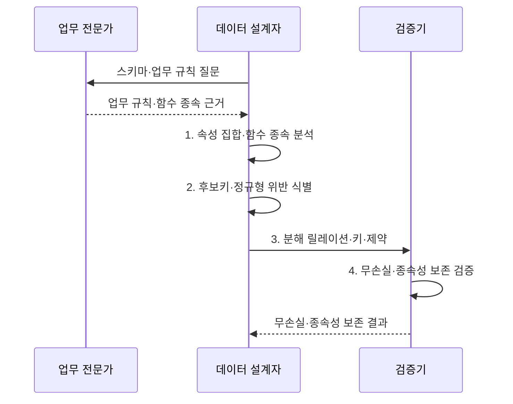

---
sidebar:
  order: 89
  label: "089. 데이터베이스 정규화 1NF~BCNF (Database Normalization)"
  badge:
    text: "기출 · 70%"
    variant: note
title: "데이터베이스 정규화 1NF~BCNF (Database Normalization)"
date: "2026-08-02T12:00:00+09:00"
tags:
  - "notes-software"
weight: 89
extra:
  question_no: "089"
  source_status: "기출"
  source_history: "120회, 135회"
  priority: 70
  priority_note: "120·135회 반복, 정규화·함수종속 핵심"
---

## Ⅰ. 개요

핵심 용어

- **데이터베이스 정규화(Database Normalization)**: 함수 종속을 기준으로 릴레이션을 무손실 분해해 중복과 삽입·갱신·삭제 이상을 줄이는 관계 스키마 설계 기법이다.
- **삽입·갱신·삭제 이상**: 중복 사실 때문에 한 변경이 다른 사실을 손상하거나 불일치를 만드는 현상이다.

- 정의/개념: **데이터베이스 정규화**는 함수 종속을 기준으로 릴레이션을 무손실 분해해 중복과 변경 이상을 줄이는 **관계 스키마 설계 기법**
- 배경/필요성: 한 릴레이션의 여러 사실 반복은 **삽입·갱신·삭제 이상** 유발

#### 한줄 요약

- 고객 정보가 주문마다 반복되면 주소가 일부만 바뀔 수 있어 고객과 주문을 분리한다.

## Ⅱ. 특징

핵심 용어

- **함수 종속·후보키**: 속성값 결정 관계와 튜플을 유일하게 식별하는 최소 속성 집합이다.
- **무손실 분해**: 분해 릴레이션을 자연 조인했을 때 거짓 튜플 없이 원본을 복원하는 성질이다.
- **종속성 보존**: 분해된 각 릴레이션의 제약만 검사해 원래 함수 종속을 강제할 수 있는 성질이다.

- **함수 종속·후보키**로 변경 이상 원인 판정
- **무손실 분해**로 자연 조인 시 원본 릴레이션 복원
- **종속성 보존**으로 조인 없는 제약 검사 가능

#### 한줄 요약

- 정규화는 같은 사실을 한곳에 저장해 수정 오류를 줄이지만 조회 때 표를 다시 연결할 수 있다.

## Ⅲ. 구조 및 구성요소

핵심 용어

- **결정자·종속자 값 제약**: 같은 결정자 값이면 종속자 값도 같아야 한다는 함수 종속 규칙이다.
- **최소 식별자·FD 왼쪽 속성**: 후보키와 다른 속성을 결정하는 속성 집합을 구분한 개념이다.
- **FD(Functional Dependency, 함수 종속)**: 한 속성 집합의 값이 같으면 다른 속성 집합의 값도 같아야 하는 결정 관계이다.
- **원본 릴레이션 복원**: 분해된 표를 조인해 추가·누락 행 없이 기존 관계를 되찾는 성질이다.

| 구성요소 | 책임 |
|:---|:---|
| 함수 종속성 | **결정자·종속자 값 제약** 표현 |
| 후보키·결정자 | **최소 식별자·FD 왼쪽 속성** 구분 |
| 무손실 분해 | 자연 조인으로 **원본 릴레이션 복원** |
| 종속성 보존 | 분해 릴레이션에서 **원래 제약 검사** |

#### 한줄 요약

- 업무 종속과 키를 찾아 표를 나누고 복원과 제약 유지를 확인한다.

## Ⅳ. 흐름도

핵심 용어

- **속성 집합·함수 종속 집합**: 후보키와 정규형 위반을 분석하는 입력 자료이다.
- **후보키·정규형 위반 목록**: 부분·이행·비키 결정자 문제를 식별한 결과이다.
- **분해 릴레이션·키·제약**: 위반 종속을 별도 관계로 나눈 목표 스키마이다.
- **분해 스키마·함수 종속 집합**: 분해된 릴레이션 구조와 각 구조에서 유지해야 할 결정 규칙을 묶은 검증 입력이다.

**동작 원리**

- **1. 속성 집합·함수 종속 분석**: 속성 폐쇄로 후보키·결정자 식별
- **2. 후보키·정규형 위반 식별**: 부분·이행·비키 결정자 확인
- **3. 분해 릴레이션·키·제약**: 위반 종속을 별도 관계로 분리
- **4. 분해 스키마·함수 종속 집합**: 조인 복원과 제약 유지 검증

> 요약: 업무 함수 종속과 후보키로 분해하고 무손실 조인·종속성 보존을 검증

#### 한줄 요약

- 사실을 정하는 규칙대로 표를 나누고 다시 합쳤을 때 원본만 나오는지 확인한다.

## Ⅴ. 종류 및 비교

핵심 용어

- **반복값·부분 종속**: 1NF와 2NF 단계에서 제거하는 다중값과 복합키 일부에 대한 종속이다.
- **이행 함수 종속**: 키가 아닌 속성을 거쳐 다른 속성이 간접 결정되는 관계이다.
- **비슈퍼키 결정자**: 후보키를 포함하지 않으면서 다른 속성을 결정하는 BCNF 위반 요소이다.
- **1NF·2NF·3NF·BCNF**: 원자값, 부분 종속, 이행 종속, 비슈퍼키 결정자를 차례로 제한하는 제1·제2·제3정규형과 보이스-코드 정규형이다.

| 정규형 | 1NF·2NF | 3NF | BCNF |
|:---|:---|:---|:---|
| 적용 기준 | **반복값·부분 종속** 분리 | **이행 함수 종속** 분리 | **비슈퍼키 결정자** 제거 |
| 핵심 특징 | **단일 값·완전 함수 종속** | **슈퍼키·주요 속성 조건** | 모든 **비자명 FD 결정자**가 슈퍼키 |
| 한계 | **이행·비후보 결정자 이상** 잔존 | 주요 속성 종속의 **일부 이상** 잔존 | **종속성 보존**이 깨질 수 있음 |

> 요약: 1NF부터 BCNF까지 다중값과 종속 이상을 순차 제거함

#### 한줄 요약

- 단일 값에서 시작해 키 일부 종속과 키가 아닌 결정자의 이상을 차례로 줄인다.

## Ⅵ. 실무 고려사항 및 대책

핵심 용어

- **속성 폐쇄로 최소 후보키**: 함수 종속을 반복 적용해 모든 속성을 결정하는 최소 집합을 찾는 방법이다.
- **전문가·정책·수명주기 근거**: 값의 우연한 일치가 아니라 업무 의미와 규칙 및 데이터 변화 전체에서 함수 종속이 성립함을 확인하는 자료이다.
- **분해마다 무손실 조건**: 표를 나눌 때마다 원본 복원과 거짓 튜플 방지를 확인하는 기준이다.
- **종속성 보존 여부로 3NF·BCNF**: 제약 검사 비용과 이상 제거 강도를 비교해 목표 정규형을 고르는 판단이다.
- **병목 측정·동기화 책임**: 반정규화 전 실제 조회 지연을 확인하고 중복 데이터의 갱신 일관성을 담당할 주체와 방법을 정하는 통제이다.

| 문제 | 대책 | 효과 |
|:---|:---|:---|
| 현재 표본의 우연한 값 일치를 함수 종속으로 오판 | **전문가·정책·수명주기 근거** 확인 | **우연한 규칙 오판** 방지 |
| 후보키 일부를 놓쳐 정규형 위반을 잘못 판정 | **속성 폐쇄로 최소 후보키** 도출 | **정규형 판정 오류** 방지 |
| 분해 후 복원 검증이 없어 거짓 튜플·원본 손실 | **분해마다 무손실 조건** 검증 | **거짓 튜플·원본 손실** 방지 |
| BCNF만 추구해 중요한 종속성 검사가 조인에 의존 | **종속성 보존 여부로 3NF·BCNF** 선택 | **제약 검사 조인 비용** 통제 |
| 병목 측정 없이 반정규화해 중복·갱신 이상 재도입 | **병목 측정·동기화 책임** 명시 | **중복·갱신 이상** 재도입 방지 |

> 적용 사례: 신규 거래 스키마는 업무 함수 종속과 후보키로 정규화하고 무손실 조인을 검증

#### 한줄 요약

- 거래 모델은 사실의 종속대로 표를 나누고 다시 합쳤을 때 원본과 같은지 확인한다.

## Ⅶ. 결론

핵심 용어

- **함수 종속·무손실·제약 보존**: 목표 정규형을 정하는 업무 규칙, 복원 가능성, 검사 가능성이다.
- **목표 정규형**: 중복·이상 제거와 제약 검사 비용을 고려해 선택한 정규화 수준이다.

- **함수 종속·무손실·제약 보존**으로 목표 정규형을 결정

#### 한줄 요약

- 정규화는 중복 사실을 줄이고 반정규화는 측정된 조회 병목에만 검토한다.
