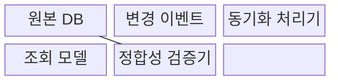
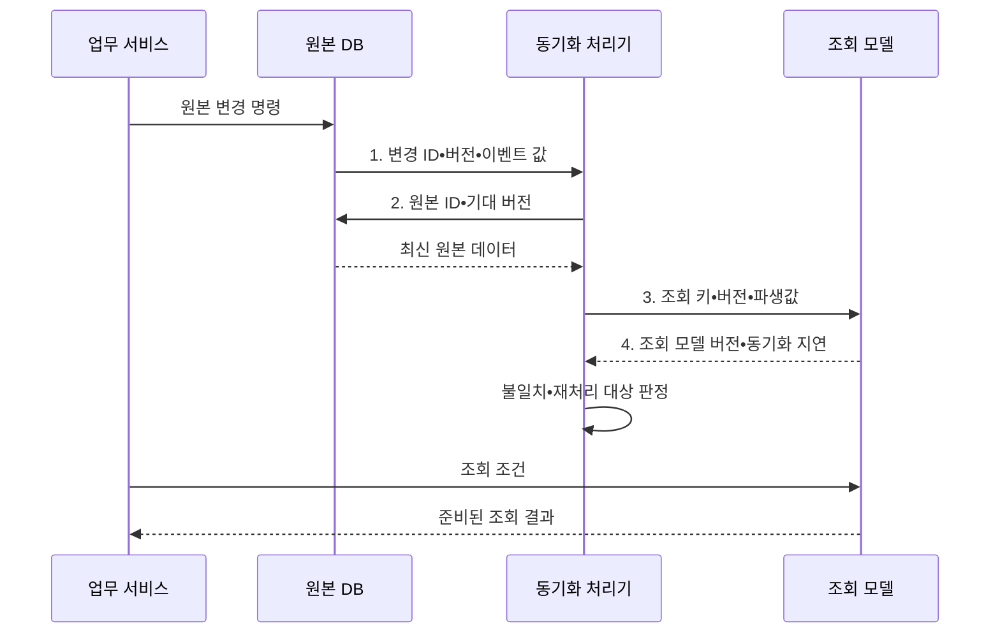

---
sidebar:
  order: 90
  label: "090. 반정규화•성능 트레이드오프 (Denormalization)"
  badge:
    text: "기출 • 70%"
    variant: note
title: "반정규화•성능 트레이드오프 (Denormalization)"
date: "2026-08-03T09:18:33+09:00"
tags:
  - "notes-software"
weight: 90
extra:
  question_no: "090"
  source_status: "기출"
  source_history: "135회"
  priority: 70
  priority_note: "135회 기출, 성능 위한 중복 허용 판단"
---

## Ⅰ. 개요

핵심 용어

- **반정규화(Denormalization)**: 측정된 조회 병목을 줄이기 위해 데이터 중복•테이블 통합•사전 집계를 의도적으로 도입하는 읽기 성능 최적화 설계이다.
- **p95 지연 목표 초과**: 전체 요청의 95% 완료 경계 응답시간이 허용 기준을 넘는 상태이다.

- 정의/개념: **반정규화** 는 측정된 조회 병목을 줄이기 위해 데이터 중복•테이블 통합•사전 집계를 의도적으로 도입하는 **읽기 성능 최적화 설계**
- 배경/필요성: 정규화 구조의 반복 조인•집계가 **p95 지연 목표 초과**

#### 한줄 요약

- 자주 찾는 내용을 미리 복사해 두고 원본이 바뀔 때 복사본도 맞추는 방식이다.

## Ⅱ. 특징

핵심 용어

- **조회 단축**: 조인•집계와 디스크 접근을 줄여 읽기 응답시간을 낮추는 효과이다.
- **쓰기 증가**: 같은 사실을 여러 위치에 갱신하며 쓰기 작업과 실패 지점이 늘어나는 비용이다.
- **정합성 통제**: 원본과 복사본 사이의 지연•누락•불일치를 감시하고 복구하는 활동이다.

- **조회 단축**: 조인•집계와 디스크 접근 감소
- **쓰기 증가**: 같은 사실을 여러 위치에 갱신
- **정합성 통제**: 동기화 지연과 실패 관리

#### 한줄 요약

- 읽기는 빨라지지만 복사본이 늘어날수록 수정 누락을 막기 어려워진다.

## Ⅲ. 구조 및 구성요소

핵심 용어

- **기준 데이터•버전**: 불일치 때 최종 판단에 사용하는 원본 값과 변경 순서 정보이다.
- **변경 식별자•버전•값**: 원본 변경을 조회 모델에 전달하는 이벤트 내용이다.
- **반정규화 데이터**: 읽기 패턴에 맞춰 중복•통합•요약해 저장한 조회 모델이다.
- **원본 차이•동기화 지연**: 정합성 검증기가 탐지하는 값 불일치와 반영 시간 차이이다.

| 구성요소 | 책임 |
|:---|:---|
| 원본 DB | 정규화된 **기준 데이터•버전** 관리 |
| 변경 이벤트 | **변경 식별자•버전•값** 전달 |
| 동기화 처리기 | **중복•통합•요약 구조** 갱신 |
| 조회 모델 | 읽기용 **반정규화 데이터** 저장 |
| 정합성 검증기 | **원본 차이•동기화 지연** 탐지 |

#### 한줄 요약

- 원본 변경을 조회용 복사본에 반영하고 차이와 지연을 검사한다.

## Ⅳ. 흐름도

핵심 용어

- **변경 ID•버전•이벤트 값**: 원본 변경 사실과 순서를 동기화 처리기에 전달하는 정보이다.
- **원본 ID•기대 버전**: 누락과 순서 역전을 막도록 최신 원본을 확인하는 조건이다.
- **조회 키•버전•파생값**: 읽기 모델에 반영할 식별자와 순서 및 계산 결과이다.
- **조회 모델 버전•동기화 지연**: 불일치와 재처리 대상을 판정하는 관측 정보이다.

**동작 원리**

- **1. 변경 ID•버전•이벤트 값**: 원본 변경 사실을 동기화 처리기에 제공
- **2. 원본 ID•기대 버전**: 누락•순서 역전을 막도록 최신 원본 확인
- **3. 조회 키•버전•파생값**: 중복•요약 데이터를 조회 모델에 반영
- **4. 조회 모델 버전•동기화 지연**: 불일치와 지연을 찾아 재처리

> 요약: **원본 변경 이벤트** 로 **조회 모델•정합성** 을 함께 관리

#### 한줄 요약

- 원본을 먼저 고친 뒤 복사본을 갱신하고, 조회는 준비된 복사본에서 빠르게 처리한다.

## Ⅴ. 종류 및 비교

핵심 용어

- **중복 컬럼(Duplicated Column)**: 조인을 줄이려고 다른 테이블의 속성값을 복제한 열이다.
- **요약 테이블(Summary Table)**: 반복 조회하는 집계 결과를 미리 저장한 테이블이다.
- **테이블 통합**: 상시 조인하는 관련 테이블을 하나의 구조로 합치는 반정규화 방식이다.

| 반정규화 유형 | 중복 컬럼 | 요약 테이블 | 테이블 통합 |
|:---|:---|:---|:---|
| 적용 기준 | **빈번한 속성 조인** | **반복 집계 조회** | **1:1•상시 조인** |
| 핵심 특징 | 속성을 다른 표에 **복제** | **집계 결과 사전 저장** | 관련 테이블을 **통합** |
| 한계 | **속성 갱신 누락** | **최신성 지연** | **중복•NULL 증가** |

> 요약: **측정된 읽기 병목** 에만 **관리 가능한 중복** 추가

#### 한줄 요약

- 이름•합계처럼 자주 쓰는 값을 미리 저장하면 빨라지지만 바뀔 때마다 함께 고쳐야 한다.

## Ⅵ. 실무 고려사항 및 대책

핵심 용어

- **실행 계획•p95•I/O 전후 비교**: 중복 추가 전후의 조회 경로와 꼬리 지연 및 입출력을 측정하는 검증이다.
- **I/O(Input/Output, 입출력)**: 저장장치와 메모리 사이에서 데이터 페이지를 읽거나 쓰는 작업이다.
- **단일 원본•소유권**: 불일치가 생겼을 때 기준이 되는 권위 있는 데이터 저장소와 그 값을 변경할 책임 주체를 명시하는 원칙이다.
- **트랜잭셔널 아웃박스•멱등성**: 원본 변경과 이벤트 기록을 원자화하고 반복 처리를 안전하게 만드는 방식이다.
- **허용 지연•대기열 감시**: 조회 모델의 최신성 목표를 정하고 아직 반영되지 않은 이벤트 수와 체류 시간을 관찰하는 통제이다.
- **버전 검사•재처리•정합성 검증**: 누락•역순 이벤트를 발견하고 원본과 조회 모델을 다시 맞추는 활동이다.

| 문제 | 대책 | 효과 |
|:---|:---|:---|
| 전후 측정 없이 중복을 추가해 쓰기 비용만 증가 | **실행 계획•p95•I/O 전후 비교** | **효과 없는 중복** 방지 |
| 여러 복사본을 원본으로 취급해 불일치 판정 불가 | **단일 원본•소유권** 명시 | **불일치 판정 기준** 확보 |
| 원본 갱신과 이벤트 발행이 분리돼 일부 반영 | **트랜잭셔널 아웃박스•멱등성** 적용 | **일부 갱신•중복 반영** 방지 |
| 허용 최신성을 정하지 않아 지연 장애 판단 불가 | **허용 지연•대기열 감시** | **동기화 지연 범위** 통제 |
| 누락•역순 이벤트로 원본과 조회 모델이 불일치 | **버전 검사•재처리•정합성 검증** | **누락•순서 역전** 복구 |

> **적용 사례**: 대시보드의 일별 매출을 요약 테이블에 저장하고, 원본 주문과의 차이 및 동기화 지연을 함께 감시

#### 한줄 요약

- “얼마나 빨라졌는가”와 “얼마나 늦거나 틀릴 수 있는가”를 함께 측정해야 한다.

## Ⅶ. 결론

핵심 용어

- **조회 이득•동기화 비용•허용 최신성**: 반정규화 여부를 결정하는 읽기 성능 개선, 복사본 관리 부담, 지연 허용 기준이다.
- **반정규화**: 측정된 읽기 병목을 줄이려고 관리 가능한 데이터 중복을 추가하는 설계이다.

- **조회 이득•동기화 비용•허용 최신성** 으로 반정규화를 결정

#### 한줄 요약

- 복사로 얻는 속도가 복사본 관리 부담보다 클 때만 사용하는 방법이다.
