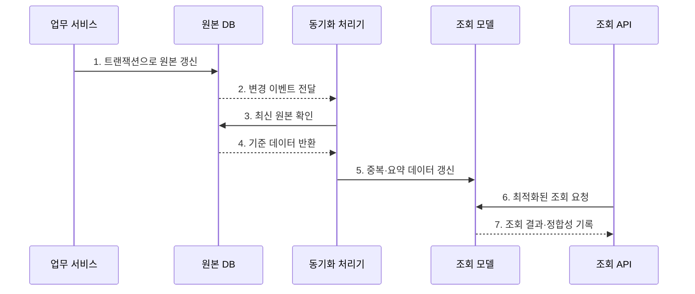

---
sidebar:
  order: 90
  label: "090. 반정규화·성능 트레이드오프 (Denormalization)"
  badge:
    text: "기출 · 70%"
    variant: note
title: "반정규화·성능 트레이드오프 (Denormalization)"
date: "2026-07-27T23:59:59+09:00"
tags:
  - "notes-software"
weight: 90
extra:
  question_no: "090"
  source_status: "기출"
  source_history: "135회"
  priority: 70
  priority_note: "135회 기출, 성능 위한 중복 허용 판단"
---

## 미리 알고가기

- **반정규화(Denormalization)**: 조회 성능을 위해 데이터 중복을 의도적으로 허용하는 설계
- **정규화(Normalization)**: 중복과 갱신 이상을 줄이도록 테이블을 분해하는 설계
- **조인(Join)**: 공통 속성으로 여러 테이블의 행을 결합하는 연산
- **집계(Aggregation)**: 여러 행을 합계·평균·건수 등의 요약값으로 계산하는 연산
- **요약 테이블(Summary Table)**: 반복 조회하는 집계 결과를 미리 저장한 테이블
- **원본 데이터(Source of Truth)**: 불일치 발생 시 최종 기준이 되는 권위 있는 데이터
- **최종 일관성(Eventual Consistency)**: 갱신 직후에는 값이 달라도 시간이 지나면 같아지는 성질
- **p95 지연**: 전체 요청 중 빠른 95%가 완료되는 경계 응답시간

## Ⅰ. 개요

- 정의/개념: 중복 구조로 **반복 조인·집계 비용 감소**
- **배경/필요성**: 측정된 조회 병목과 응답 지연 개선

### 쉽게 이해하기 (학습용)

- 자주 찾는 내용을 미리 복사해 두고 원본이 바뀔 때 복사본도 맞추는 방식이다.

## Ⅱ. 특징

- **조회 단축**: 조인·집계와 디스크 접근 감소
- **쓰기 증가**: 같은 사실을 여러 위치에 갱신
- **정합성 통제**: 동기화 지연과 실패 관리

### 쉽게 이해하기 (학습용)

- 읽기는 빨라지지만 복사본이 늘어날수록 수정 누락을 막기 어려워진다.

## Ⅲ. 구조 및 구성요소

| 구성요소 | 책임 |
|:---|:---|
| 원본 DB | 정규화된 기준 데이터 관리 |
| 변경 이벤트 | 원본 변경 사실과 식별자 전달 |
| 동기화 처리기 | 중복·통합·요약 구조 갱신 |
| 조회 모델 | 읽기용 반정규화 데이터 저장 |
| 정합성 검증기 | 원본 차이와 지연 탐지 |

### 쉽게 이해하기 (학습용)

- 원본 변경을 조회용 복사본에 반영하고 차이와 지연을 검사한다.

## Ⅳ. 흐름도

**동작 원리**

- **1. 트랜잭션으로 원본 갱신**: 기준 데이터를 바꾼다.
- **2. 변경 이벤트 전달**: 변경 사실을 알린다.
- **3. 최신 원본 확인**: 누락과 순서 역전을 막는다.
- **4. 기준 데이터 반환**: 복사에 필요한 값을 보낸다.
- **5. 중복·요약 데이터 갱신**: 조회 모델에 반영한다.
- **6. 최적화된 조회 요청**: 준비된 구조를 읽는다.
- **7. 조회 결과·정합성 기록**: 결과와 지연을 남긴다.

### 쉽게 이해하기 (학습용)

- 원본을 먼저 고친 뒤 복사본을 갱신하고, 조회는 준비된 복사본에서 빠르게 처리한다.

## Ⅴ. 종류 및 비교

| 판단 기준 | 중복 컬럼 | 요약 테이블 | 테이블 통합 |
|:---|:---|:---|:---|
| 적용 기준 | 빈번한 속성 조인 | 반복 집계 조회 | 1:1·상시 조인 |
| 핵심 특징 | 속성을 다른 표에 복제 | 집계 결과를 미리 저장 | 관련 테이블을 결합 |
| 한계 | 속성 갱신 누락 | 최신성 지연 | 중복·NULL 증가 |

> 반정규화는 정규화를 포기하는 것이 아니라 측정된 읽기 병목에 관리 가능한 중복을 추가하는 것이다.

### 쉽게 이해하기 (학습용)

- 이름·합계처럼 자주 쓰는 값을 미리 저장하면 빨라지지만 바뀔 때마다 함께 고쳐야 한다.

## Ⅵ. 실무 고려사항 및 대책

| 고려사항 | 대책 | 효과 |
|:---|:---|:---|
| 적용 근거 | 실행 계획·p95·I/O 전후 비교 | 효과 없는 중복 방지 |
| 원본 지정 | 단일 원본과 소유권 명시 | 불일치 판정 기준 확보 |
| 갱신 원자성 | 트랜잭션·Outbox·멱등 적용 | 일부 갱신 방지 |
| 최신성 | 허용 지연과 대기열 감시 | 지연 범위 통제 |
| 정합성 | 버전 검사·재처리·대사 수행 | 누락·순서 역전 복구 |

> **적용 사례**: 대시보드의 일별 매출을 요약 테이블에 저장하고, 원본 주문과의 차이 및 동기화 지연을 함께 감시한다.

### 쉽게 이해하기 (학습용)

- “얼마나 빨라졌는가”와 “얼마나 늦거나 틀릴 수 있는가”를 함께 측정해야 한다.

## Ⅶ. 결론

- **조회 이득·동기화 비용·허용 최신성**으로 반정규화를 정한다.

### 쉽게 이해하기 (학습용)

- 복사로 얻는 속도가 복사본 관리 부담보다 클 때만 사용하는 방법이다.
