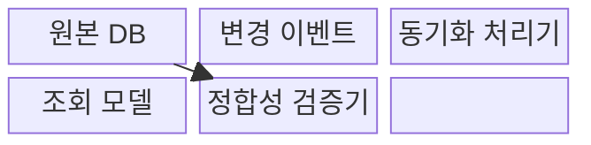
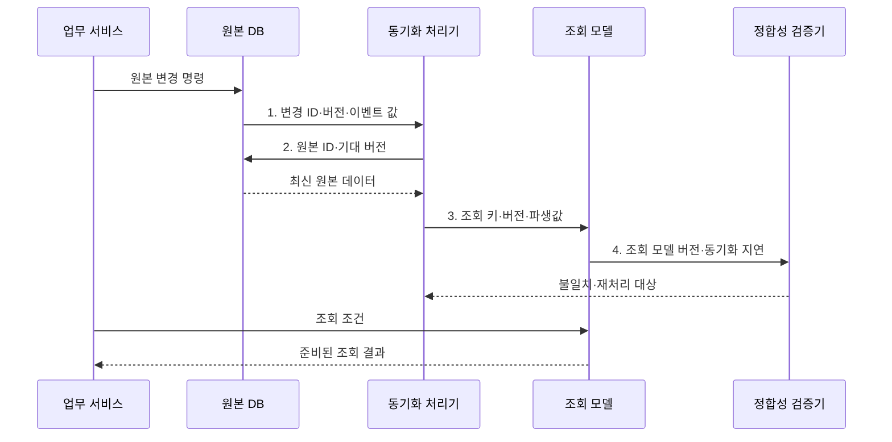

---
sidebar:
  order: 90
  label: "090. 반정규화·성능 트레이드오프 (Denormalization)"
  badge:
    text: "기출 · 70%"
    variant: note
title: "반정규화·성능 트레이드오프 (Denormalization)"
date: "2026-07-30T23:34:30+09:00"
tags:
  - "notes-software"
weight: 90
extra:
  question_no: "090"
  source_status: "기출"
  source_history: "135회"
  priority: 70
  priority_note: "135회 기출, 성능 위한 중복 허용 판단"
---

## 미리 알고가기

- **반정규화(Denormalization)**: 조회 성능을 위해 데이터 중복을 의도적으로 허용하는 설계
- **정규화(Normalization)**: 중복과 갱신 이상을 줄이도록 테이블을 분해하는 설계
- **조인(Join)**: 공통 속성으로 여러 테이블의 행을 결합하는 연산
- **집계(Aggregation)**: 여러 행을 합계·평균·건수 등의 요약값으로 계산하는 연산
- **요약 테이블(Summary Table)**: 반복 조회하는 집계 결과를 미리 저장한 테이블
- **원본 데이터(Source of Truth)**: 불일치 발생 시 최종 기준이 되는 권위 있는 데이터
- **최종 일관성(Eventual Consistency)**: 갱신 직후에는 값이 달라도 시간이 지나면 같아지는 성질
- **p95 지연(p95 Latency)**: ‘피 구십오 지연’으로 읽으며 꼬리 지연을 보기 위해 전체 요청 중 빠른 95%가 완료되는 경계 응답시간을 나타낸다.
- **입출력(Input/Output, I/O)**: 저장장치와 메모리 사이에서 데이터를 읽고 쓰는 동작
- **변경 이벤트(Change Event)**: 원본의 변경 식별자·버전·값을 동기화 처리기에 알리는 메시지
- **조회 모델(Read Model)**: 읽기 패턴에 맞춰 중복·집계해 저장한 반정규화 데이터 구조
- **정합성 검증(Reconciliation)**: 원본과 조회 모델을 비교해 누락·불일치를 찾아 재처리하는 활동
- **트랜잭셔널 아웃박스(Transactional Outbox)**: 원본 변경과 발행할 이벤트를 같은 트랜잭션에 기록하는 패턴
- **멱등성(Idempotency)**: 같은 변경 이벤트를 반복 처리해도 결과가 한 번 처리한 것과 같은 성질
- **중복 컬럼(Duplicated Column)**: 조인을 줄이려고 다른 테이블의 속성값을 복제한 열
- **NULL**: 값이 없거나 알려지지 않았음을 나타내는 데이터베이스 표지

## Ⅰ. 개요

- 정의/개념: 데이터 중복을 허용해 **조인·집계 비용을 줄이는 설계**
- 배경/필요성: 정규화 구조의 반복 조인·집계가 **p95 지연 목표 초과**

### 쉽게 이해하기 (학습용)

- 자주 찾는 내용을 미리 복사해 두고 원본이 바뀔 때 복사본도 맞추는 방식이다.

## Ⅱ. 특징

- **조회 단축**: 조인·집계와 디스크 접근 감소
- **쓰기 증가**: 같은 사실을 여러 위치에 갱신
- **정합성 통제**: 동기화 지연과 실패 관리

### 쉽게 이해하기 (학습용)

- 읽기는 빨라지지만 복사본이 늘어날수록 수정 누락을 막기 어려워진다.

## Ⅲ. 구조 및 구성요소

| 구성요소 | 책임 |
|:---|:---|
| 원본 DB | 정규화된 **기준 데이터·버전** 관리 |
| 변경 이벤트 | **변경 식별자·버전·값** 전달 |
| 동기화 처리기 | **중복·통합·요약 구조** 갱신 |
| 조회 모델 | 읽기용 **반정규화 데이터** 저장 |
| 정합성 검증기 | **원본 차이·동기화 지연** 탐지 |

### 쉽게 이해하기 (학습용)

- 원본 변경을 조회용 복사본에 반영하고 차이와 지연을 검사한다.

## Ⅳ. 흐름도

**동작 원리**

- **1. 변경 ID·버전·이벤트 값**: 원본 변경 사실을 동기화 처리기에 제공
- **2. 원본 ID·기대 버전**: 누락·순서 역전을 막도록 최신 원본 확인
- **3. 조회 키·버전·파생값**: 중복·요약 데이터를 조회 모델에 반영
- **4. 조회 모델 버전·동기화 지연**: 불일치와 지연을 찾아 재처리

> 요약: **원본 변경 이벤트**로 **조회 모델·정합성**을 함께 관리

### 쉽게 이해하기 (학습용)

- 원본을 먼저 고친 뒤 복사본을 갱신하고, 조회는 준비된 복사본에서 빠르게 처리한다.

## Ⅴ. 종류 및 비교

| 반정규화 유형 | 중복 컬럼 | 요약 테이블 | 테이블 통합 |
|:---|:---|:---|:---|
| 적용 기준 | **빈번한 속성 조인** | **반복 집계 조회** | **1:1·상시 조인** |
| 핵심 특징 | 속성을 다른 표에 **복제** | **집계 결과 사전 저장** | 관련 테이블을 **통합** |
| 한계 | **속성 갱신 누락** | **최신성 지연** | **중복·NULL 증가** |

> 요약: **측정된 읽기 병목**에만 **관리 가능한 중복** 추가

### 쉽게 이해하기 (학습용)

- 이름·합계처럼 자주 쓰는 값을 미리 저장하면 빨라지지만 바뀔 때마다 함께 고쳐야 한다.

## Ⅵ. 실무 고려사항 및 대책

| 고려사항 | 대책 | 효과 |
|:---|:---|:---|
| 전후 측정 없이 중복을 추가해 쓰기 비용만 증가 | **실행 계획·p95·I/O 전후 비교** | **효과 없는 중복** 방지 |
| 여러 복사본을 원본으로 취급해 불일치 판정 불가 | **단일 원본·소유권** 명시 | **불일치 판정 기준** 확보 |
| 원본 갱신과 이벤트 발행이 분리돼 일부 반영 | **트랜잭셔널 아웃박스·멱등성** 적용 | **일부 갱신·중복 반영** 방지 |
| 허용 최신성을 정하지 않아 지연 장애 판단 불가 | **허용 지연·대기열 감시** | **동기화 지연 범위** 통제 |
| 누락·역순 이벤트로 원본과 조회 모델이 불일치 | **버전 검사·재처리·정합성 검증** | **누락·순서 역전** 복구 |

> **적용 사례**: 대시보드의 일별 매출을 요약 테이블에 저장하고, 원본 주문과의 차이 및 동기화 지연을 함께 감시

### 쉽게 이해하기 (학습용)

- “얼마나 빨라졌는가”와 “얼마나 늦거나 틀릴 수 있는가”를 함께 측정해야 한다.

## Ⅶ. 결론

- **조회 이득·동기화 비용·허용 최신성**으로 반정규화를 결정

### 쉽게 이해하기 (학습용)

- 복사로 얻는 속도가 복사본 관리 부담보다 클 때만 사용하는 방법이다.
