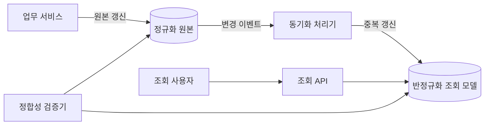
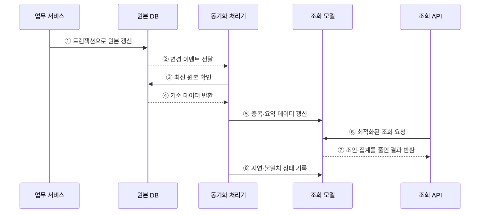

---
sidebar:
  order: 90
  label: "090. 반정규화·성능 트레이드오프 (Denormalization)"
  badge:
    text: "기출 · 70%"
    variant: note
title: "반정규화·성능 트레이드오프 (Denormalization)"
date: "2026-07-27T23:59:59+09:00"
tags:
  - "notes-software"
weight: 90
extra:
  question_no: "090"
  source_status: "기출"
  source_history: "135회"
  priority: 70
  priority_note: "135회 기출, 성능 위한 중복 허용 판단"
---

## 미리 알고가기

- **반정규화(Denormalization)**: 조회 성능을 위해 데이터 중복을 의도적으로 허용하는 설계
- **정규화(Normalization)**: 중복과 갱신 이상을 줄이도록 테이블을 분해하는 설계
- **조인(Join)**: 공통 속성으로 여러 테이블의 행을 결합하는 연산
- **집계(Aggregation)**: 여러 행을 합계·평균·건수 등의 요약값으로 계산하는 연산
- **요약 테이블(Summary Table)**: 반복 조회하는 집계 결과를 미리 저장한 테이블
- **원본 데이터(Source of Truth)**: 불일치 발생 시 최종 기준이 되는 권위 있는 데이터
- **최종 일관성(Eventual Consistency)**: 갱신 직후에는 값이 달라도 시간이 지나면 같아지는 성질
- **p95 지연**: 전체 요청 중 빠른 95%가 완료되는 경계 응답시간

## Ⅰ. 개요

- 반정규화는 **중복 컬럼·통합 테이블·요약 테이블**을 추가해 반복 조인과 집계 비용을 줄이는 설계이다.
- 정규화된 구조에서 실제 조회 병목이 확인되고 중복 데이터의 동기화 수단이 있을 때 적용한다.

### 쉽게 이해하기 (학습용)

- 자주 찾는 내용을 미리 복사해 두고 원본이 바뀔 때 복사본도 맞추는 방식이다.

## Ⅱ. 특징

- **조회 성능 향상**: 조인·집계 횟수와 디스크 접근량을 줄인다.
- **쓰기 비용 증가**: 같은 사실을 여러 위치에 갱신해야 한다.
- **정합성 위험**: 동기화 실패나 지연으로 원본과 복사본이 달라질 수 있다.
- **선별 적용**: 추측이 아닌 실행 계획과 지연 지표로 확인한 병목에만 적용한다.

### 쉽게 이해하기 (학습용)

- 읽기는 빨라지지만 복사본이 늘어날수록 수정 누락을 막기 어려워진다.

## Ⅲ. 아키텍처 및 구성요소

**도표안 A — 구조도**

**도표안 B — sequenceDiagram**

| 구성요소 | 역할 |
|:---|:---|
| 원본 DB | 정규화된 기준 데이터를 트랜잭션으로 관리 |
| 변경 이벤트 | 원본의 변경 사실과 식별자를 전달 |
| 동기화 처리기 | 변경을 중복 컬럼·통합·요약 구조에 반영 |
| 조회 모델 | 읽기 요청에 최적화된 반정규화 데이터 저장 |
| 정합성 검증 | 원본과 조회 모델의 차이·동기화 지연 탐지 |

**동작 원리**

- ① 업무 서비스가 기준 데이터를 먼저 갱신한다.
- ② 원본 DB가 변경 사실을 동기화 처리기에 전달한다.
- ③ 동기화 처리기는 누락과 순서 역전을 막기 위해 최신 원본을 확인한다.
- ④ 원본 DB가 중복 데이터 생성에 필요한 기준값을 반환한다.
- ⑤ 동기화 처리기가 조회 모델의 중복·요약 데이터를 갱신한다.
- ⑥ 조회 API가 반정규화된 조회 모델을 직접 조회한다.
- ⑦ 조회 모델이 반복 조인·집계를 줄인 결과를 반환한다.
- ⑧ 동기화 지연과 원본 불일치를 기록해 허용 범위를 검증한다.

### 쉽게 이해하기 (학습용)

- 원본을 먼저 고친 뒤 복사본을 갱신하고, 조회는 준비된 복사본에서 빠르게 처리한다.

## Ⅳ. 종류 및 비교

| 유형 | 적용 방법 | 효과 | 주요 위험 |
|:---|:---|:---|:---|
| 중복 컬럼 | 자주 조인하는 속성을 다른 테이블에 복제 | 조인 감소 | 속성 갱신 누락 |
| 테이블 통합 | 1:1 또는 빈번한 조인 테이블을 합침 | 단순 조회 | 중복·NULL 증가 |
| 테이블 분할 | 큰 테이블을 수평·수직으로 나눔 | 접근 범위 축소 | 분할 기준과 재결합 복잡성 |
| 요약 테이블 | 집계 결과를 미리 계산해 저장 | 집계 지연 감소 | 최신성 지연 |
| 파생 컬럼 | 계산 결과를 컬럼으로 저장 | 반복 계산 감소 | 계산 규칙 변경·불일치 |

> 반정규화는 정규화를 포기하는 것이 아니라 측정된 읽기 병목에 관리 가능한 중복을 추가하는 것이다.

### 쉽게 이해하기 (학습용)

- 이름·합계처럼 자주 쓰는 값을 미리 저장하면 빨라지지만 바뀔 때마다 함께 고쳐야 한다.

## Ⅴ. 실무 고려사항 및 대책

| 고려사항 | 위험 | 대책 |
|:---|:---|:---|
| 적용 근거 | 효과 없는 중복 증가 | 실행 계획·p95 지연·I/O를 적용 전후 비교 |
| 원본 지정 | 어느 값이 기준인지 불명확 | 단일 원본과 데이터 소유권 명시 |
| 갱신 원자성 | 일부 중복만 갱신 | 동일 트랜잭션, Outbox, 멱등 소비자 적용 |
| 최신성 | 이벤트·배치 지연 | 허용 지연 정의, 지연 시간·대기열 감시 |
| 정합성 | 누락·순서 역전 | 버전 검사, 재처리, 주기적 대사 수행 |
| 운영 복잡성 | 장애 원인과 복구 절차 증가 | 계보 문서화, 재생·재구축 절차 자동화 |

> **적용 사례**: 대시보드의 일별 매출을 요약 테이블에 저장하고, 원본 주문과의 차이 및 동기화 지연을 함께 감시한다.

### 쉽게 이해하기 (학습용)

- “얼마나 빨라졌는가”와 “얼마나 늦거나 틀릴 수 있는가”를 함께 측정해야 한다.

## Ⅵ. 결론

- 반정규화는 조회 성능과 데이터 정합성을 교환하는 설계이다.
- 성능 이득이 동기화·검증·복구 비용보다 크고 허용 최신성을 지킬 수 있을 때만 유지한다.

### 쉽게 이해하기 (학습용)

- 복사로 얻는 속도가 복사본 관리 부담보다 클 때만 사용하는 방법이다.
