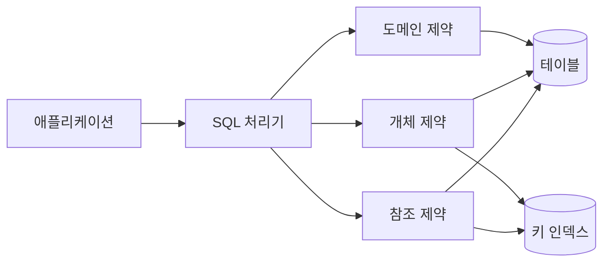
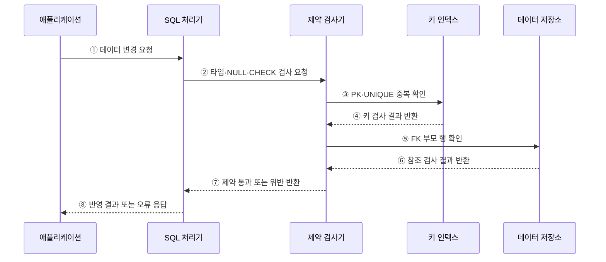

---
sidebar:
  order: 91
  label: "091. 데이터베이스 무결성 제약 조건 (Database Integrity Constraints)"
  badge:
    text: "기출 · 70%"
    variant: note
title: "데이터베이스 무결성 제약 조건 (Database Integrity Constraints)"
date: "2026-07-27T23:59:59+09:00"
tags:
  - "notes-software"
weight: 91
extra:
  question_no: "091"
  source_status: "기출"
  source_history: "128회, 134회"
  priority: 70
  priority_note: "128·134회 반복, 무결성 제약 설계 핵심"
---

## 미리 알고가기

- **무결성 제약 조건(Integrity Constraint)**: 데이터가 지켜야 할 값·키·관계 규칙
- **도메인 무결성(Domain Integrity)**: 속성값을 정의된 형식·범위로 제한하는 성질
- **개체 무결성(Entity Integrity)**: 기본키의 유일성과 NULL 금지로 각 행을 식별하는 성질
- **참조 무결성(Referential Integrity)**: 외래키가 존재하는 부모 키나 NULL만 갖게 하는 성질
- **기본키(Primary Key, PK)**: 각 행을 유일하게 식별하는 키
- **외래키(Foreign Key, FK)**: 다른 테이블의 후보키를 참조하는 속성
- **NULL**: 값이 없거나 알려지지 않았음을 나타내는 상태
- **고아 데이터(Orphan Data)**: 참조할 부모 행이 없어 관계가 끊긴 자식 데이터

## Ⅰ. 개요

- 무결성 제약 조건은 데이터베이스가 **유효한 값·행의 식별·테이블 관계**를 저장 시점에 강제하는 규칙이다.
- 애플리케이션 검증과 별도로 DB에 제약을 두면 여러 입력 경로에 동일한 최종 규칙을 적용할 수 있다.

### 쉽게 이해하기 (학습용)

- 장부 자체에 규칙을 걸어 잘못된 값과 끊어진 관계가 기록되지 않게 한다.

## Ⅱ. 특징

- **선제 차단**: INSERT·UPDATE·DELETE 시점에 위반 데이터를 거부한다.
- **중앙 통제**: 모든 애플리케이션과 관리 도구에 같은 규칙을 적용한다.
- **선언적 관리**: PK·FK·UNIQUE·NOT NULL·CHECK로 허용 조건을 명시한다.
- **처리 비용**: 키 탐색과 조건 검사로 쓰기·대량 적재 비용이 증가할 수 있다.

### 쉽게 이해하기 (학습용)

- DB가 모든 입력을 같은 규칙으로 검사하므로 안전하지만 검사 비용은 든다.

## Ⅲ. 아키텍처 및 구성요소

**도표안 A — 구조도**

**도표안 B — sequenceDiagram**

| 구성요소 | 역할 |
|:---|:---|
| SQL 처리기 | 데이터 변경문을 해석하고 실행 계획 수립 |
| 도메인 제약 | 데이터 타입·DEFAULT·NOT NULL·CHECK 검사 |
| 개체 제약 | PK·UNIQUE로 행의 식별 가능성과 중복 검사 |
| 참조 제약 | FK의 부모 키 존재와 변경·삭제 정책 검사 |
| 키 인덱스 | 유일성·참조 검사를 위한 키 탐색 지원 |

**동작 원리**

- ① 애플리케이션이 행의 삽입·수정·삭제를 요청한다.
- ② SQL 처리기가 입력값의 타입·NULL·CHECK 검사를 요청한다.
- ③ 제약 검사기가 PK·UNIQUE 인덱스에서 중복 키를 찾는다.
- ④ 키 인덱스가 중복 여부를 반환한다.
- ⑤ 외래키가 있으면 참조할 부모 행의 존재를 확인한다.
- ⑥ 데이터 저장소가 부모 행 존재 여부를 반환한다.
- ⑦ 제약 검사기가 전체 통과 또는 위반 정보를 SQL 처리기에 전달한다.
- ⑧ SQL 처리기가 통과한 변경만 반영하고 위반 시 오류를 반환한다.

### 쉽게 이해하기 (학습용)

- 값의 범위, 행의 이름표, 부모와의 연결을 차례로 확인한 뒤 저장한다.

## Ⅳ. 종류 및 비교

| 구분 | 보호 대상 | 대표 제약 | 위반 예 |
|:---|:---|:---|:---|
| 도메인 무결성 | 속성값의 형식·범위 | 타입, NOT NULL, CHECK | 음수 수량 입력 |
| 개체 무결성 | 행의 유일한 식별 | PRIMARY KEY, UNIQUE | 중복·NULL 기본키 |
| 참조 무결성 | 부모·자식 관계 | FOREIGN KEY | 없는 고객의 주문 |
| 사용자 정의 무결성 | 업무 고유 규칙 | CHECK, 트리거, 프로시저 | 종료일이 시작일보다 빠름 |

> 외래키는 참조 대상 열이 기본키가 아니어도 유일성을 보장하는 후보키라면 참조할 수 있다.

### 쉽게 이해하기 (학습용)

- 도메인은 값, 개체는 행의 이름표, 참조는 테이블 사이의 연결을 지킨다.

## Ⅴ. 실무 고려사항 및 대책

| 고려사항 | 위험 | 대책 |
|:---|:---|:---|
| 제약 범위 | DB와 애플리케이션 규칙 불일치 | DB는 불변 규칙, 애플리케이션은 안내·화면 검증 담당 |
| 삭제 정책 | CASCADE로 의도하지 않은 대량 삭제 | RESTRICT·SET NULL·CASCADE를 관계별 명시 |
| 기존 데이터 | 제약 추가 시 과거 데이터가 위반 | 사전 진단·정제 후 단계적으로 검증 활성화 |
| 성능 | FK·UNIQUE 검사로 쓰기 지연 | 참조·유일 키 인덱스와 실행 계획 점검 |
| 배포 순서 | 구버전 애플리케이션과 충돌 | 확장 후 축소 방식의 호환 배포 적용 |
| 오류 처리 | 제약 위반 원인 은폐 | 제약 이름과 업무 오류를 대응해 관측·안내 |

> **적용 사례**: 주문의 고객 ID에 외래키를 두고 고객 삭제는 제한해 존재하지 않는 고객의 주문과 고아 데이터를 차단한다.

### 쉽게 이해하기 (학습용)

- 규칙을 DB에 선언하되 기존 데이터, 삭제 영향, 검사 비용을 함께 확인해야 한다.

## Ⅵ. 결론

- 무결성 제약 조건은 잘못된 데이터가 저장되는 것을 막는 DB의 최종 방어선이다.
- 값·키·관계의 규칙과 위반 처리 정책을 스키마에 명확히 선언하고 변경 시 기존 데이터까지 검증해야 한다.

### 쉽게 이해하기 (학습용)

- 데이터 규칙을 장부 자체가 지키게 하면 어떤 입력 경로에서도 같은 기준을 적용할 수 있다.
