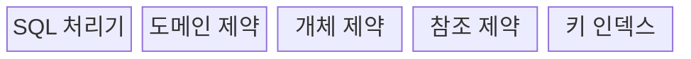
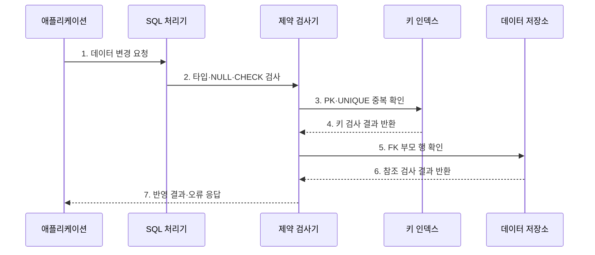

---
sidebar:
  order: 91
  label: "091. 데이터베이스 무결성 제약 조건 (Database Integrity Constraints)"
  badge:
    text: "기출 · 70%"
    variant: note
title: "데이터베이스 무결성 제약 조건 (Database Integrity Constraints)"
date: "2026-07-27T23:59:59+09:00"
tags:
  - "notes-software"
weight: 91
extra:
  question_no: "091"
  source_status: "기출"
  source_history: "128회, 134회"
  priority: 70
  priority_note: "128·134회 반복, 무결성 제약 설계 핵심"
---

## 미리 알고가기

- **무결성 제약 조건(Integrity Constraint)**: 데이터가 지켜야 할 값·키·관계 규칙
- **도메인 무결성(Domain Integrity)**: 속성값을 정의된 형식·범위로 제한하는 성질
- **개체 무결성(Entity Integrity)**: 기본키의 유일성과 NULL 금지로 각 행을 식별하는 성질
- **참조 무결성(Referential Integrity)**: 외래키가 존재하는 부모 키나 NULL만 갖게 하는 성질
- **기본키(Primary Key, PK)**: 각 행을 유일하게 식별하는 키
- **외래키(Foreign Key, FK)**: 다른 테이블의 후보키를 참조하는 속성
- **NULL**: 값이 없거나 알려지지 않았음을 나타내는 상태
- **고아 데이터(Orphan Data)**: 참조할 부모 행이 없어 관계가 끊긴 자식 데이터

## Ⅰ. 개요

- 정의/개념: 저장 시 **값·식별·관계의 유효성을 강제하는 규칙**
- 배경/필요성: 모든 입력 경로에 **동일한 데이터 규칙** 적용

### 쉽게 이해하기 (학습용)

- 장부 자체에 규칙을 걸어 잘못된 값과 끊어진 관계가 기록되지 않게 한다.

## Ⅱ. 특징

- **선제 차단**: 변경 시점에 위반 데이터 거부
- **중앙 통제**: 모든 입력 경로에 같은 규칙 적용
- **선언적 관리**: 키·NULL·CHECK 조건 명시

### 쉽게 이해하기 (학습용)

- DB가 모든 입력을 같은 규칙으로 검사하므로 안전하지만 검사 비용은 든다.

## Ⅲ. 구조 및 구성요소

| 구성요소 | 책임 |
|:---|:---|
| SQL 처리기 | 변경문 해석과 실행 계획 수립 |
| 도메인 제약 | 타입·NULL·CHECK 검사 |
| 개체 제약 | PK·UNIQUE 식별과 중복 검사 |
| 참조 제약 | FK 부모 존재와 변경 정책 검사 |
| 키 인덱스 | 유일성·참조 키 탐색 지원 |

### 쉽게 이해하기 (학습용)

- 값·행·관계 규칙과 키 탐색 장치가 잘못된 저장을 차단한다.

## Ⅳ. 흐름도

**동작 원리**

- **1. 데이터 변경 요청**: 삽입·수정·삭제를 전달
- **2. 타입·NULL·CHECK 검사**: 값 규칙을 확인
- **3. PK·UNIQUE 중복 확인**: 식별 키를 조회
- **4. 키 검사 결과 반환**: 중복 여부를 통지
- **5. FK 부모 행 확인**: 참조 대상을 검색
- **6. 참조 검사 결과 반환**: 관계 유효성을 통지
- **7. 반영 결과·오류 응답**: 통과한 변경만 저장

### 쉽게 이해하기 (학습용)

- 값의 범위, 행의 이름표, 부모와의 연결을 차례로 확인한 뒤 저장한다.

## Ⅴ. 종류 및 비교

| 판단 기준 | 도메인 무결성 | 개체 무결성 | 참조 무결성 |
|:---|:---|:---|:---|
| 적용 기준 | 값의 형식·범위 | 행의 유일 식별 | 부모·자식 관계 |
| 핵심 특징 | 타입·NOT NULL·CHECK | PRIMARY KEY·UNIQUE | FOREIGN KEY |
| 한계 | 복합 업무 규칙 표현 제한 | 키 변경의 연쇄 영향 | 삭제 정책에 따른 대량 영향 |

> 외래키는 참조 대상 열이 기본키가 아니어도 유일성을 보장하는 후보키라면 참조할 수 존재

### 쉽게 이해하기 (학습용)

- 도메인은 값, 개체는 행의 이름표, 참조는 테이블 사이의 연결을 지킨다.

## Ⅵ. 실무 고려사항 및 대책

| 고려사항 | 대책 | 효과 |
|:---|:---|:---|
| 제약 범위 | DB 불변식과 화면 검증 역할 분리 | 규칙 중복과 불일치 감소 |
| 삭제 정책 | 관계별 삭제·갱신 정책 명시 | 의도치 않은 연쇄 삭제 방지 |
| 기존 데이터 | 사전 진단·정제 후 단계 활성화 | 제약 추가 실패 방지 |
| 성능 | 참조·유일 키 인덱스 점검 | 쓰기 검사 지연 감소 |
| 배포 순서 | 확장 후 축소 방식 적용 | 구버전과 스키마 충돌 방지 |

> **적용 사례**: 주문의 고객 ID에 외래키를 두고 고객 삭제는 제한해 존재하지 않는 고객의 주문과 고아 데이터를 차단

### 쉽게 이해하기 (학습용)

- 규칙을 DB에 선언하되 기존 데이터, 삭제 영향, 검사 비용을 함께 확인해야 한다.

## Ⅶ. 결론

- **값·키·관계 규칙과 변경 영향**으로 DB 제약을 설계

### 쉽게 이해하기 (학습용)

- 데이터 규칙을 장부 자체가 지키게 하면 어떤 입력 경로에서도 같은 기준을 적용할 수 있다.
