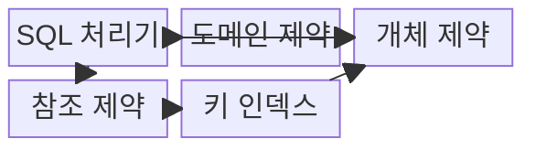
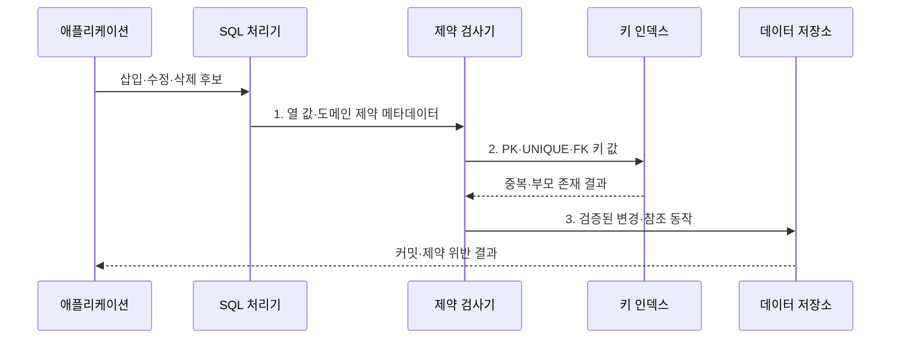

---
sidebar:
  order: 91
  label: "091. 데이터베이스 무결성 제약 조건 (Database Integrity Constraints)"
  badge:
    text: "기출 · 70%"
    variant: note
title: "데이터베이스 무결성 제약 조건 (Database Integrity Constraints)"
date: "2026-08-02T12:00:00+09:00"
tags:
  - "notes-software"
weight: 91
extra:
  question_no: "091"
  source_status: "기출"
  source_history: "128회, 134회"
  priority: 70
  priority_note: "128·134회 반복, 무결성 제약 설계 핵심"
---

## Ⅰ. 개요

핵심 용어

- **값·식별·관계의 유효성을 강제하는 규칙**: 저장할 때 값의 범위와 행의 식별자 및 테이블 관계가 모두 유효하도록 강제하는 규칙이다.

- 정의/개념: 저장 시 **값·식별·관계의 유효성을 강제하는 규칙**
- 배경/필요성: 화면·응용 검증만으로는 우회 입력의 **잘못된 값·고아 데이터를 일관되게 차단하기 어려움**

#### 한줄 요약

- 장부 자체에 규칙을 걸어 잘못된 값과 끊어진 관계가 기록되지 않게 한다.

## Ⅱ. 특징

핵심 용어

- **선제 차단**: 잘못된 데이터가 저장되기 전에 변경 시점에 위반을 거부하는 특성이다.

- **선제 차단**: 변경 시점에 위반 데이터 거부
- **중앙 통제**: 모든 입력 경로에 같은 규칙 적용
- **선언적 관리**: 키·NULL·CHECK 조건 명시

#### 한줄 요약

- DB가 모든 입력을 같은 규칙으로 검사하므로 안전하지만 검사 비용은 든다.

## Ⅲ. 구조 및 구성요소

핵심 용어

- **키 인덱스**: 기본키·유일키·외래키의 중복과 참조 대상을 빠르게 찾도록 지원하는 구조이다.

| 구성요소 | 책임 |
|:---|:---|
| SQL 처리기 | **변경문 해석·실행 계획** 수립 |
| 도메인 제약 | **타입·NOT NULL·CHECK** 검사 |
| 개체 제약 | **PK·UNIQUE 식별·중복** 검사 |
| 참조 제약 | **FK 부모 존재·참조 동작** 검사 |
| 키 인덱스 | **유일성·참조 키 탐색** 지원 |

#### 한줄 요약

- 값·행·관계 규칙과 키 탐색 장치가 잘못된 저장을 차단한다.

## Ⅳ. 흐름도

핵심 용어

- **1. 열 값·도메인 제약 메타데이터**: 타입·NULL·CHECK 규칙을 먼저 확인하는 검증 단계이다.

**동작 원리**

- **1. 열 값·도메인 제약 메타데이터**: 타입·NULL·CHECK 규칙 확인
- **2. PK·UNIQUE·FK 키 값**: 식별 중복과 부모 키 존재 판정
- **3. 검증된 변경·참조 동작**: 모든 제약을 통과한 상태만 저장

#### 한줄 요약

- 값의 범위, 행의 이름표, 부모와의 연결을 차례로 확인한 뒤 저장한다.

## Ⅴ. 종류 및 비교

핵심 용어

- **도메인 무결성**: 속성값이 정해진 형식과 범위를 벗어나지 않도록 보장하는 무결성이다.

| 무결성 유형 | 도메인 무결성 | 개체 무결성 | 참조 무결성 |
|:---|:---|:---|:---|
| 적용 기준 | **값의 형식·범위** | **행의 유일 식별** | **부모·자식 관계** |
| 핵심 특징 | **타입·NOT NULL·CHECK** | **PRIMARY KEY·UNIQUE** | **FOREIGN KEY** |
| 한계 | **복합 업무 규칙** 표현 제한 | **키 변경의 연쇄 영향** | **삭제 정책의 대량 영향** |

> 요약: **외래키**는 유일성을 보장하는 **후보키**도 참조 가능

#### 한줄 요약

- 도메인은 값, 개체는 행의 이름표, 참조는 테이블 사이의 연결을 지킨다.

## Ⅵ. 실무 고려사항 및 대책

핵심 용어

- **기존 데이터**: 새 제약을 적용하기 전에 이미 저장된 위반 데이터를 먼저 정리해야 하는 대상이다.

| 문제 | 대책 | 효과 |
|:---|:---|:---|
| DB 불변식과 화면 편의 검증을 섞어 규칙 중복·불일치 | **DB 불변식·화면 검증 역할** 분리 | **규칙 중복·불일치** 감소 |
| 부모 삭제 동작을 정하지 않아 대량 연쇄 삭제 | **관계별 삭제·갱신 정책** 명시 | **의도치 않은 연쇄 삭제** 방지 |
| 위반 데이터가 남은 상태에서 새 제약 활성화 실패 | **사전 진단·정제·단계 활성화** | **제약 추가 실패** 방지 |
| 참조·유일 키 탐색이 느려 쓰기 검사 지연 | **참조·유일 키 인덱스** 점검 | **쓰기 검사 지연** 감소 |
| 구버전 실행 중 제약을 즉시 강화해 배포 충돌 | **확장-축소 변경** 적용 | **구버전·스키마 충돌** 방지 |

> 적용 사례: 고객 ID 외래키와 삭제 제한으로 고아 주문 데이터 차단

#### 한줄 요약

- 규칙을 DB에 선언하되 기존 데이터, 삭제 영향, 검사 비용을 함께 확인해야 한다.

## Ⅶ. 결론

핵심 용어

- **값·키·관계 규칙과 변경 영향**: 무결성 제약을 설계할 때 함께 검토해야 하는 핵심 판단 기준이다.

- **값·키·관계 규칙과 변경 영향**으로 DB 제약을 설계

#### 한줄 요약

- 데이터 규칙을 장부 자체가 지키게 하면 어떤 입력 경로에서도 같은 기준을 적용할 수 있다.
