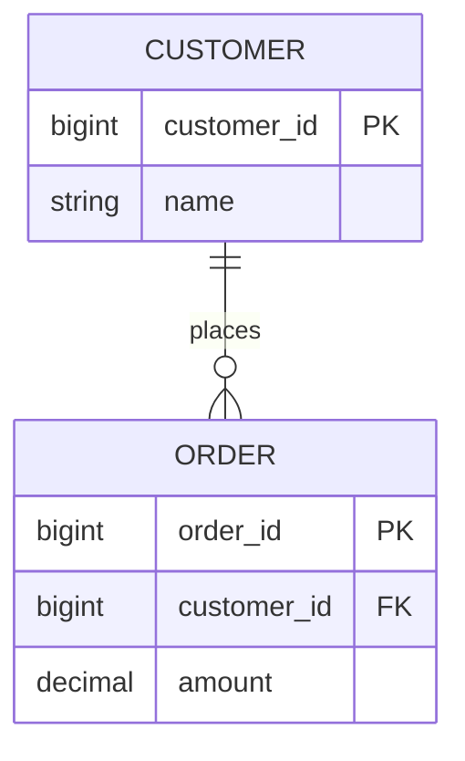
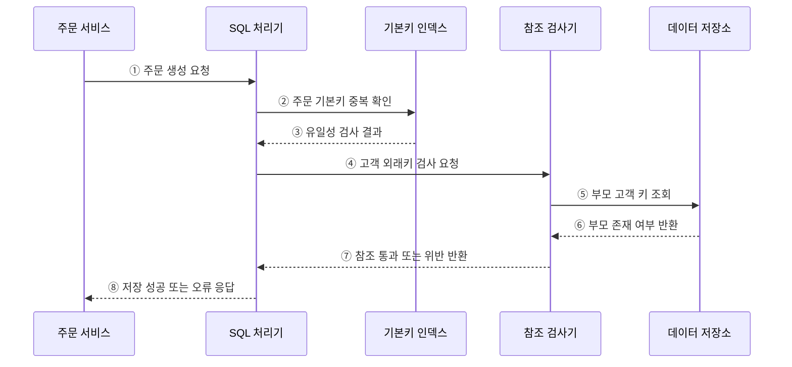

---
sidebar:
  order: 92
  label: "092. 개체 무결성·참조 무결성 (Entity Referential Integrity)"
  badge:
    text: "기출 · 30%"
    variant: note
title: "개체 무결성·참조 무결성 (Entity Referential Integrity)"
date: "2026-07-27T23:59:59+09:00"
tags:
  - "notes-software"
weight: 92
extra:
  question_no: "092"
  source_status: "기출"
  source_history: "128회"
  priority: 30
  priority_note: "128회 기출, 개체·참조 무결성의 하위 구분"
---

## 미리 알고가기

- **개체 무결성(Entity Integrity)**: 기본키의 유일성과 NULL 금지로 각 행을 식별하는 성질
- **참조 무결성(Referential Integrity)**: 외래키가 존재하는 부모 키나 NULL만 갖게 하는 성질
- **후보키(Candidate Key)**: 행을 유일하게 식별하는 최소 속성 집합
- **기본키(Primary Key, PK)**: 후보키 중 대표로 선택한 행 식별자
- **외래키(Foreign Key, FK)**: 부모 테이블의 후보키를 참조하는 속성
- **참조 동작(Referential Action)**: 부모 키 변경·삭제 시 자식 행의 처리 정책
- **고아 데이터(Orphan Data)**: 참조할 부모 행이 없는 자식 데이터
- **NULL**: 값이 없거나 알려지지 않았음을 나타내는 상태

## Ⅰ. 개요

- 개체 무결성은 기본키로 **행의 정체성**을, 참조 무결성은 외래키로 **부모·자식 관계의 유효성**을 보장한다.
- 두 규칙은 중복·NULL 기본키와 존재하지 않는 부모를 가리키는 고아 데이터를 차단한다.

### 쉽게 이해하기 (학습용)

- 각 기록에 겹치지 않는 번호를 주고, 관계는 실제 존재하는 기록에만 연결한다.

## Ⅱ. 특징

- **유일 식별**: 기본키는 중복과 NULL을 허용하지 않는다.
- **유효 참조**: NULL이 아닌 외래키는 참조 대상 후보키 값과 일치해야 한다.
- **관계 통제**: 부모 키의 변경·삭제 시 RESTRICT·CASCADE·SET NULL 등의 동작을 적용한다.
- **선언적 보장**: 애플리케이션 경로와 관계없이 DB가 동일한 관계 규칙을 검사한다.

### 쉽게 이해하기 (학습용)

- 이름표는 하나뿐이어야 하고, 자식 기록은 존재하는 부모에게만 연결되어야 한다.

## Ⅲ. 아키텍처 및 구성요소

**도표안 A — 구조도**

**도표안 B — sequenceDiagram**

| 구성요소 | 역할 |
|:---|:---|
| 후보키 | 행을 유일하게 식별할 수 있는 최소 속성 집합 |
| 기본키 | 대표 후보키로서 중복·NULL 없는 행 식별 보장 |
| 외래키 | 자식 행을 부모의 기본키 또는 대체키와 연결 |
| 참조 대상 키 | 부모 테이블에서 유일성이 보장된 후보키 |
| 참조 동작 | 부모 변경·삭제 시 자식 행의 유지 방법 결정 |

**동작 원리**

- ① 주문 서비스가 고객 식별자를 포함한 주문 생성을 요청한다.
- ② SQL 처리기가 주문 기본키의 중복 여부를 확인한다.
- ③ 기본키 인덱스가 유일성 검사 결과를 반환한다.
- ④ SQL 처리기가 고객 외래키의 유효성 검사를 요청한다.
- ⑤ 참조 검사기가 부모 고객 테이블에서 대상 키를 찾는다.
- ⑥ 데이터 저장소가 부모 고객의 존재 여부를 반환한다.
- ⑦ 참조 검사기가 통과 또는 외래키 위반을 반환한다.
- ⑧ SQL 처리기는 두 제약을 통과한 주문만 저장한다.

### 쉽게 이해하기 (학습용)

- 주문 번호가 겹치지 않고 고객 번호가 실제 고객을 가리킬 때만 주문을 저장한다.

## Ⅳ. 종류 및 비교

| 구분 | 개체 무결성 | 참조 무결성 |
|:---|:---|:---|
| 보호 대상 | 개별 행의 정체성 | 부모·자식 관계 |
| 구현 수단 | PRIMARY KEY | FOREIGN KEY |
| 핵심 조건 | 기본키 중복·NULL 금지 | 외래키는 부모 키와 일치하거나 NULL |
| 위반 예 | 같은 주문 번호 두 건 | 없는 고객을 가리키는 주문 |
| 변경 정책 | 식별자 안정성 확보 | RESTRICT·CASCADE·SET NULL 등 선택 |

| 참조 동작 | 부모 변경·삭제 시 처리 | 적합한 상황 | 주의점 |
|:---|:---|:---|:---|
| RESTRICT / NO ACTION | 참조 중이면 거부 | 자식 보존이 필수인 관계 | 부모 삭제가 막힐 수 있음 |
| CASCADE | 자식에도 변경·삭제 전파 | 수명주기가 같은 종속 데이터 | 대량 연쇄 영향 |
| SET NULL | 자식 외래키를 NULL로 변경 | 관계 해제를 허용하는 경우 | 외래키가 NULL을 허용해야 함 |
| SET DEFAULT | 자식 외래키를 기본값으로 변경 | 유효한 기본 부모가 있는 경우 | DBMS 지원과 기본값 유효성 확인 |

### 쉽게 이해하기 (학습용)

- 개체 무결성은 기록의 이름표를, 참조 무결성은 기록 사이의 연결을 지킨다.

## Ⅴ. 실무 고려사항 및 대책

| 고려사항 | 위험 | 대책 |
|:---|:---|:---|
| 키 선택 | 변경 가능한 업무값을 기본키로 사용 | 안정적·최소인 후보키 선택, 대체키 분리 |
| NULL 의미 | 선택 관계와 미확정 상태 혼동 | 외래키 NULL 허용 조건을 업무 규칙으로 정의 |
| 삭제 동작 | CASCADE의 예상 밖 대량 삭제 | 영향 건수 제한·감사·소프트 삭제 검토 |
| 인덱스 | 부모 삭제·자식 조회 시 잠금·지연 | 부모 후보키와 자식 외래키 인덱스 점검 |
| 데이터 이관 | 적재 순서로 일시적 참조 위반 | 부모 우선 적재, 사후 대사와 검증 수행 |
| 분산 경계 | 다른 DB의 FK를 직접 강제하기 어려움 | 소유권·보상·대사 작업으로 관계 검증 |

> **적용 사례**: 고객 삭제 시 주문까지 지우지 않고 삭제를 제한하거나 고객을 비활성화해 거래 기록을 보존한다.

### 쉽게 이해하기 (학습용)

- 부모를 지울 때 자식을 막을지, 함께 지울지, 연결만 끊을지를 업무 의미에 맞게 정해야 한다.

## Ⅵ. 결론

- 개체 무결성은 행을 식별하고 참조 무결성은 행 사이의 유효한 관계를 유지한다.
- 후보키의 안정성, 외래키의 NULL 허용, 부모 변경·삭제 동작을 함께 설계해야 한다.

### 쉽게 이해하기 (학습용)

- 겹치지 않는 이름표와 끊어지지 않는 연결이 신뢰할 수 있는 관계형 데이터의 기본이다.
