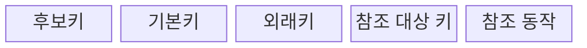
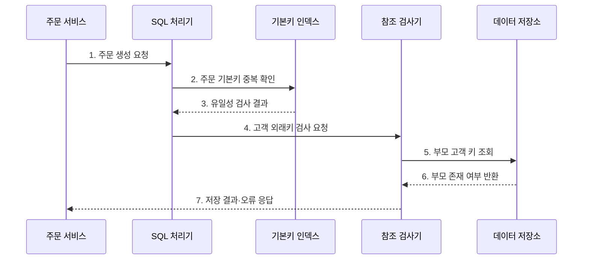

---
sidebar:
  order: 92
  label: "092. 개체 무결성·참조 무결성 (Entity Referential Integrity)"
  badge:
    text: "기출 · 30%"
    variant: note
title: "개체 무결성·참조 무결성 (Entity Referential Integrity)"
date: "2026-07-27T23:59:59+09:00"
tags:
  - "notes-software"
weight: 92
extra:
  question_no: "092"
  source_status: "기출"
  source_history: "128회"
  priority: 30
  priority_note: "128회 기출, 개체·참조 무결성의 하위 구분"
---

## 미리 알고가기

- **개체 무결성(Entity Integrity)**: 기본키의 유일성과 NULL 금지로 각 행을 식별하는 성질
- **참조 무결성(Referential Integrity)**: 외래키가 존재하는 부모 키나 NULL만 갖게 하는 성질
- **후보키(Candidate Key)**: 행을 유일하게 식별하는 최소 속성 집합
- **기본키(Primary Key, PK)**: 후보키 중 대표로 선택한 행 식별자
- **외래키(Foreign Key, FK)**: 부모 테이블의 후보키를 참조하는 속성
- **참조 동작(Referential Action)**: 부모 키 변경·삭제 시 자식 행의 처리 정책
- **고아 데이터(Orphan Data)**: 참조할 부모 행이 없는 자식 데이터
- **NULL**: 값이 없거나 알려지지 않았음을 나타내는 상태

## Ⅰ. 개요

- 정의/개념: 기본키·외래키로 **식별·관계 유효성 보장**
- **배경/필요성**: 중복 식별자와 고아 데이터 차단

### 쉽게 이해하기 (학습용)

- 각 기록에 겹치지 않는 번호를 주고, 관계는 실제 존재하는 기록에만 연결한다.

## Ⅱ. 특징

- **유일 식별**: 기본키의 중복·NULL 금지
- **유효 참조**: 외래키와 부모 후보키 일치
- **관계 통제**: 부모 변경·삭제 동작 선언

### 쉽게 이해하기 (학습용)

- 이름표는 하나뿐이어야 하고, 자식 기록은 존재하는 부모에게만 연결되어야 한다.

## Ⅲ. 구조 및 구성요소

| 구성요소 | 책임 |
|:---|:---|
| 후보키 | 행을 식별하는 최소 속성 집합 |
| 기본키 | 중복·NULL 없는 대표 식별자 |
| 외래키 | 자식과 부모 후보키 연결 |
| 참조 대상 키 | 부모에서 유일성이 보장된 키 |
| 참조 동작 | 부모 변경 시 자식 처리 결정 |

### 쉽게 이해하기 (학습용)

- 행의 이름표와 부모 연결, 변경 시 처리 규칙을 함께 정의한다.

## Ⅳ. 흐름도

**동작 원리**

- **1. 주문 생성 요청**: 고객 식별자를 전달한다.
- **2. 주문 기본키 중복 확인**: 식별자를 검사한다.
- **3. 유일성 검사 결과**: 중복 여부를 반환한다.
- **4. 고객 외래키 검사 요청**: 관계를 검증한다.
- **5. 부모 고객 키 조회**: 참조 대상을 찾는다.
- **6. 부모 존재 여부 반환**: 유효 관계를 알린다.
- **7. 저장 결과·오류 응답**: 통과한 주문만 저장한다.

### 쉽게 이해하기 (학습용)

- 주문 번호가 겹치지 않고 고객 번호가 실제 고객을 가리킬 때만 주문을 저장한다.

## Ⅴ. 종류 및 비교

| 판단 기준 | 개체 무결성 | 참조 무결성 |
|:---|:---|:---|
| 적용 기준 | 행의 유일한 식별 | 부모·자식 관계 유지 |
| 핵심 특징 | 기본키 중복·NULL 금지 | 외래키와 부모 후보키 일치 |
| 한계 | 키 변경의 연쇄 영향 | 삭제 정책의 대량 영향 |

### 쉽게 이해하기 (학습용)

- 개체 무결성은 기록의 이름표를, 참조 무결성은 기록 사이의 연결을 지킨다.

## Ⅵ. 실무 고려사항 및 대책

| 고려사항 | 대책 | 효과 |
|:---|:---|:---|
| 키 선택 | 안정적 후보키와 대체키 분리 | 연쇄 키 변경 방지 |
| NULL 의미 | 허용 조건을 업무 규칙으로 정의 | 선택·미확정 상태 구분 |
| 삭제 동작 | 영향 제한·감사·소프트 삭제 검토 | 예상 밖 연쇄 삭제 방지 |
| 인덱스 | 부모·자식 키 인덱스 점검 | 잠금·조회 지연 감소 |
| 데이터 이관 | 부모 우선 적재와 사후 대사 | 일시적 참조 위반 방지 |

> **적용 사례**: 고객 삭제 시 주문까지 지우지 않고 삭제를 제한하거나 고객을 비활성화해 거래 기록을 보존한다.

### 쉽게 이해하기 (학습용)

- 부모를 지울 때 자식을 막을지, 함께 지울지, 연결만 끊을지를 업무 의미에 맞게 정해야 한다.

## Ⅶ. 결론

- **키 안정성·NULL 의미·삭제 영향**으로 관계 제약을 정한다.

### 쉽게 이해하기 (학습용)

- 겹치지 않는 이름표와 끊어지지 않는 연결이 신뢰할 수 있는 관계형 데이터의 기본이다.
