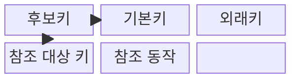
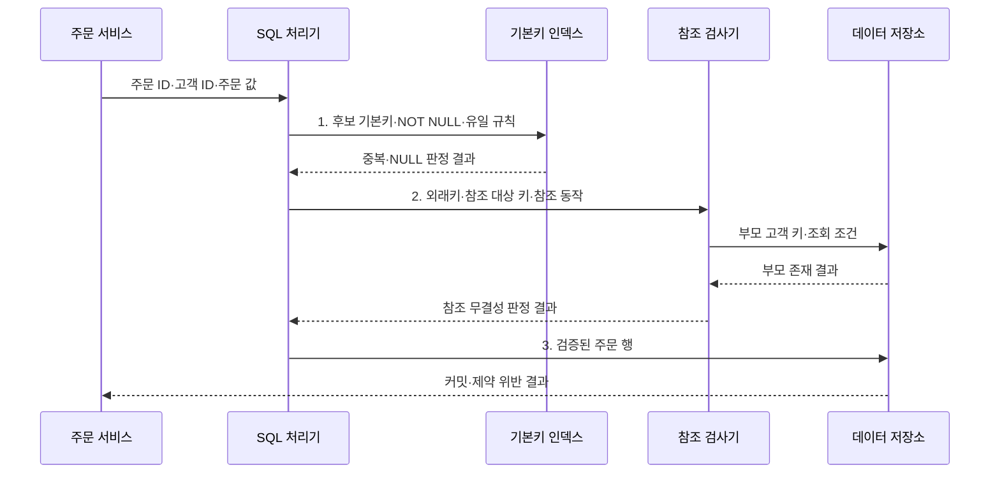

---
sidebar:
  order: 92
  label: "092. 개체 무결성·참조 무결성 (Entity Referential Integrity)"
  badge:
    text: "기출 · 30%"
    variant: note
title: "개체 무결성·참조 무결성 (Entity Referential Integrity)"
date: "2026-08-02T12:00:00+09:00"
tags:
  - "notes-software"
weight: 92
extra:
  question_no: "092"
  source_status: "기출"
  source_history: "128회"
  priority: 30
  priority_note: "128회 기출, 개체·참조 무결성의 하위 구분"
---

## Ⅰ. 개요

핵심 용어

- **식별자와 참조 관계를 보장하는 규칙**: 기본키와 외래키로 행의 고유성과 테이블 사이의 연결을 보장하는 규칙이다.

- 정의/개념: 기본키·외래키로 **식별자와 참조 관계를 보장하는 규칙**
- 배경/필요성: 응용 검증만으로는 동시 입력의 **중복 식별자·고아 참조를 일관되게 차단하기 어려움**

#### 한줄 요약

- 각 기록에 겹치지 않는 번호를 주고, 관계는 실제 존재하는 기록에만 연결한다.

## Ⅱ. 특징

핵심 용어

- **유일 식별**: 기본키의 중복과 NULL을 금지해 모든 행을 하나씩 구분하는 특성이다.

- **유일 식별**: 기본키의 중복·NULL 금지
- **유효 참조**: 외래키와 부모 후보키 일치
- **관계 통제**: 부모 변경·삭제 동작 선언

#### 한줄 요약

- 이름표는 하나뿐이어야 하고, 자식 기록은 존재하는 부모에게만 연결되어야 한다.

## Ⅲ. 구조 및 구성요소

핵심 용어

- **참조 동작**: 부모 키가 변경되거나 삭제될 때 자식 행을 처리하는 정책이다.

| 구성요소 | 책임 |
|:---|:---|
| 후보키 | 행을 식별하는 **최소 속성 집합** |
| 기본키 | **중복·NULL 없는 대표 식별자** |
| 외래키 | 자식과 **부모 후보키 연결** |
| 참조 대상 키 | 부모에서 **유일성이 보장된 키** |
| 참조 동작 | 부모 변경 시 **자식 처리 정책** 결정 |

#### 한줄 요약

- 행의 이름표와 부모 연결, 변경 시 처리 규칙을 함께 정의한다.

## Ⅳ. 흐름도

핵심 용어

- **1. 후보 기본키·NOT NULL·유일 규칙**: 저장 전에 행 식별자가 비어 있거나 중복되는지 판정하는 단계이다.

**동작 원리**

- **1. 후보 기본키·NOT NULL·유일 규칙**: 행 식별자의 유효성 판정
- **2. 외래키·참조 대상 키·참조 동작**: 부모 존재와 변경 정책 확인
- **3. 검증된 주문 행**: 개체·참조 무결성을 만족한 데이터만 저장

#### 한줄 요약

- 주문 번호가 겹치지 않고 고객 번호가 실제 고객을 가리킬 때만 주문을 저장한다.

## Ⅴ. 종류 및 비교

핵심 용어

- **개체 무결성**: 기본키의 유일성과 NULL 금지로 각 행의 정체성을 보장하는 규칙이다.

| 관계 제약 유형 | 개체 무결성 | 참조 무결성 |
|:---|:---|:---|
| 적용 기준 | **행의 유일한 식별** | **부모·자식 관계 유지** |
| 핵심 특징 | **기본키 중복·NULL 금지** | **외래키·부모 후보키 일치** |
| 한계 | **키 변경의 연쇄 영향** | **삭제 정책의 대량 영향** |

#### 한줄 요약

- 개체 무결성은 기록의 이름표를, 참조 무결성은 기록 사이의 연결을 지킨다.

## Ⅵ. 실무 고려사항 및 대책

핵심 용어

- **부모를 지울 때**: 자식 행을 제한·연쇄 삭제·NULL 처리할지 업무 의미에 따라 결정해야 하는 시점이다.

| 문제 | 대책 | 효과 |
|:---|:---|:---|
| 변경 가능한 업무 값을 기본키로 써 연쇄 수정 발생 | **안정 후보키·대체키** 분리 | **연쇄 키 변경** 방지 |
| NULL을 선택·미확정·해당 없음으로 혼용 | **NULL 허용 조건·업무 의미** 정의 | **선택·미확정 상태** 구분 |
| 부모 삭제의 자식 영향을 검토하지 않아 대량 삭제 | **영향 제한·감사·소프트 삭제** 검토 | **예상 밖 연쇄 삭제** 방지 |
| 부모·자식 키 인덱스 부족으로 검사와 잠금 지연 | **부모·자식 키 인덱스** 점검 | **잠금·조회 지연** 감소 |
| 자식 데이터를 먼저 이관해 일시적 참조 위반 | **부모 우선 적재·사후 대사** | **일시적 참조 위반** 방지 |

> **적용 사례**: 고객 삭제 시 주문까지 지우지 않고 삭제를 제한하거나 고객을 비활성화해 거래 기록을 보존

#### 한줄 요약

- 부모를 지울 때 자식을 막을지, 함께 지울지, 연결만 끊을지를 업무 의미에 맞게 정해야 한다.

## Ⅶ. 결론

핵심 용어

- **키 안정성·NULL 의미·삭제 영향**: 관계 제약을 설계할 때 함께 판단해야 하는 세 가지 기준이다.

- **키 안정성·NULL 의미·삭제 영향**으로 관계 제약을 결정

#### 한줄 요약

- 겹치지 않는 이름표와 끊어지지 않는 연결이 신뢰할 수 있는 관계형 데이터의 기본이다.
