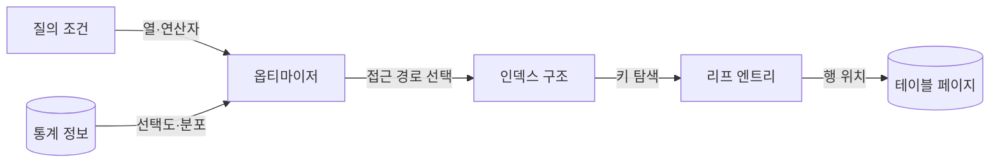
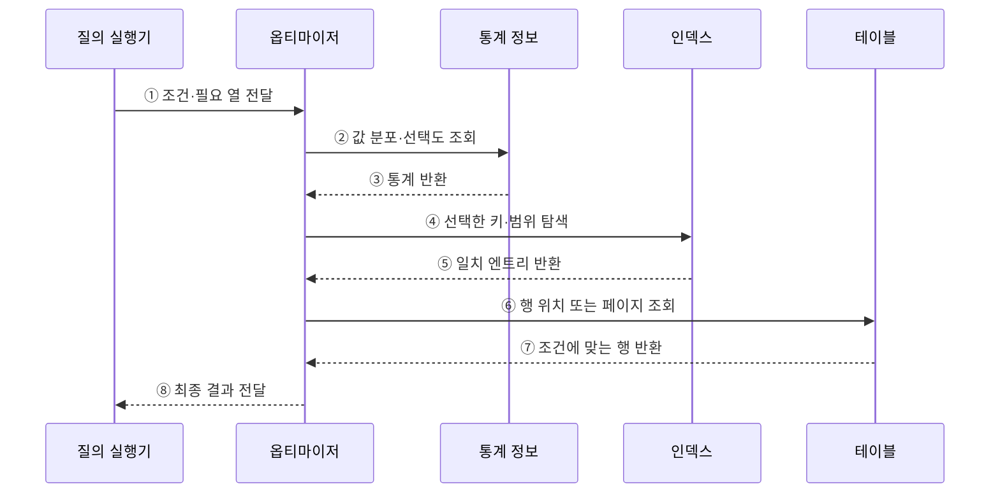

---
sidebar:
  order: 93
  label: "093. 인덱스 구조 — B+Tree·해시·복합 (Index Structure)"
  badge:
    text: "기출 · 70%"
    variant: note
title: "인덱스 구조 — B+Tree·해시·복합 (Index Structure)"
date: "2026-07-27T23:59:59+09:00"
tags:
  - "notes-software"
weight: 93
extra:
  question_no: "093"
  source_status: "기출"
  source_history: "122회, 135회, 137회"
  priority: 70
  priority_note: "122·135·137회 반복, 인덱스 선택 핵심"
---

## 미리 알고가기

- **인덱스(Index)**: 검색 키와 행 위치를 저장해 테이블 전체 탐색을 줄이는 보조 자료구조
- **선택도(Selectivity)**: 조건이 전체 행을 얼마나 적은 결과로 좁히는지를 나타내는 정도
- **B+트리(B+Tree)**: 내부 노드에는 탐색 키를, 연결된 리프 노드에는 모든 키와 행 위치를 저장하는 균형 탐색 트리
- **해시 인덱스(Hash Index)**: 키의 해시값을 버킷에 대응해 등치 조건의 행 위치를 찾는 구조
- **복합 인덱스(Composite Index)**: 여러 열을 지정 순서로 결합해 만든 인덱스
- **선두 열(Leading Column)**: 복합 인덱스에서 가장 먼저 정렬되어 탐색 시작 범위를 결정하는 열
- **페이지 분할(Page Split)**: 꽉 찬 인덱스 페이지를 둘로 나누고 키를 재배치하는 작업
- **실행 계획(Execution Plan)**: 질의를 처리하도록 선택된 접근 경로·조인 순서·연산자
- **데이터베이스(Database, DB)**: 구조화된 데이터를 저장·조회·관리하는 시스템

## Ⅰ. 개요

- 인덱스는 검색 키와 행 위치를 별도 구조로 저장해 **행 접근 범위**를 줄인다.
- 전체 테이블 탐색보다 읽기량을 줄일 수 있지만 저장 공간과 쓰기 유지 비용이 추가된다.

### 쉽게 이해하기 (학습용)

- 책 전체를 넘기지 않고 색인에서 단어를 찾아 해당 쪽으로 이동하는 구조와 같다.

## Ⅱ. 특징

- **B+트리**는 등치·범위 탐색과 정렬 순서 활용에 적합하다.
- **해시 인덱스**는 해시값으로 버킷을 찾아 등치 탐색에 특화된다.
- **복합 인덱스**는 열의 순서와 질의 조건이 맞아야 효과가 크다.
- 인덱스 선택은 규칙이 아니라 통계와 비용을 이용한 옵티마이저 판단이다.

### 쉽게 이해하기 (학습용)

- 정렬된 색인은 구간을 찾고 해시는 같은 값만 빠르게 찾으며, 복합 색인은 앞 열부터 조건이 맞아야 효과가 크다.

## Ⅲ. 아키텍처 및 구성요소

**도표안 A — 구조도**

**도표안 B — sequenceDiagram**

| 구성요소 | 역할 |
|:---|:---|
| 질의 조건 | 검색 열·연산자·정렬·필요 열 제공 |
| 통계 정보 | 행 수·값 분포·선택도 추정 자료 제공 |
| 옵티마이저 | 인덱스 탐색과 전체 탐색의 예상 비용 비교 |
| 인덱스 구조 | 정렬 키 또는 해시 버킷으로 후보 행 탐색 |
| 리프 엔트리 | 키와 행 위치 또는 포함 열 연결 |

**동작 원리**

- ① 질의 실행기가 검색 조건과 필요한 열을 옵티마이저에 전달한다.
- ② 옵티마이저가 조건값의 분포와 선택도를 조회한다.
- ③ 통계 정보가 예상 행 수와 비용 계산 자료를 반환한다.
- ④ 인덱스 접근이 유리하면 적합한 키나 범위를 탐색한다.
- ⑤ 인덱스가 조건에 일치하는 엔트리를 반환한다.
- ⑥ 옵티마이저가 엔트리의 행 위치로 테이블을 조회한다.
- ⑦ 테이블이 조건에 맞는 원본 행을 반환한다.
- ⑧ 옵티마이저가 결과를 질의 실행기에 전달한다.

### 쉽게 이해하기 (학습용)

- 안내자가 자료 분포를 보고 색인이 더 빠를 때만 색인을 거쳐 실제 자료를 찾는다.

## Ⅳ. 종류 및 비교

| 구조 | 적합한 조건 | 핵심 원리 | 한계 |
|:---|:---|:---|:---|
| B+트리 | 등치·범위·정렬 | 균형 트리와 연결된 리프 탐색 | 페이지 분할·쓰기 비용 |
| 해시 인덱스 | 정확한 등치 조건 | 해시값으로 버킷 직접 탐색 | 범위·정렬 활용이 어려움 |
| 복합 인덱스 | 반복되는 다중 열 조건 | 지정 열 순서의 사전식 정렬 | 선두 열과 조건 순서에 민감 |
| 커버링 인덱스 | 조회 열이 제한된 질의 | 인덱스만으로 결과 반환 | 크기·갱신 비용 증가 |
| 부분 인덱스 | 일부 행만 자주 조회 | 조건을 만족하는 행만 색인 | 조건 밖 질의에는 사용 불가 |

> 복합 인덱스는 일반적으로 선두 열부터 이어지는 조건에 유리하지만 실제 사용 여부는 DBMS와 실행 계획에 따라 달라진다.

### 쉽게 이해하기 (학습용)

- 범위는 정렬 색인, 정확히 같은 값은 해시, 자주 함께 찾는 열은 조회 순서에 맞춘 복합 색인을 쓴다.

## Ⅴ. 실무 고려사항 및 대책

| 고려사항 | 위험 | 대책 |
|:---|:---|:---|
| 선택도 | 결과가 많은 조건에 인덱스 강제 | 실제 값 분포와 실행 계획 확인 |
| 열 순서 | 복합 인덱스 활용 범위 축소 | 등치·범위·정렬 조건 순서로 검증 |
| 쓰기 부하 | 인덱스마다 INSERT·UPDATE 비용 증가 | 미사용·중복 인덱스 제거 |
| 커버링 | 과도한 포함 열로 인덱스 비대 | 빈도 높은 핵심 질의에만 적용 |
| 통계 정보 | 오래된 통계로 잘못된 계획 선택 | 자동·수동 통계 갱신과 계획 감시 |
| 페이지 분할 | 무작위 키 삽입으로 단편화·지연 | 키 특성·채움 비율·재구성 정책 점검 |

> **적용 사례**: 고객별 최신 주문 조회에는 `(customer_id, ordered_at DESC)` 복합 인덱스를 검토하고 실행 계획과 쓰기 비용을 함께 측정한다.

### 쉽게 이해하기 (학습용)

- 조회가 빨라져도 쓰기가 지나치게 느려지면 좋은 인덱스가 아니므로 양쪽 비용을 함께 재야 한다.

## Ⅵ. 결론

- 인덱스는 질의의 연산자·선택도·정렬·열 순서에 맞춰 행 탐색량을 줄이는 보조 구조이다.
- 실행 계획으로 읽기 이득을 확인하고 저장 공간·쓰기 비용보다 효과가 큰 인덱스만 유지한다.

### 쉽게 이해하기 (학습용)

- 자주 찾는 방식에 맞는 색인을 만들고, 실제로 빨라지는지 확인한 뒤 남긴다.
