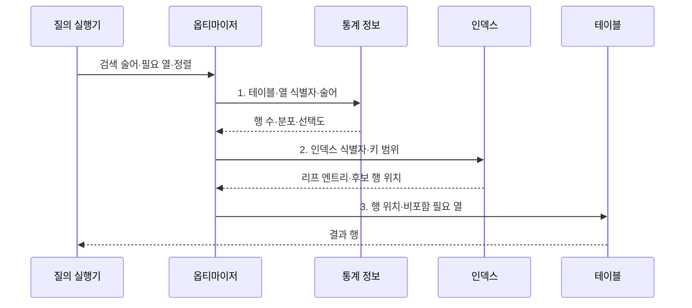

---
sidebar:
  order: 93
  label: "093. 인덱스 구조: B+Tree·해시·복합 (Index Structure)"
  badge:
    text: "기출 · 70%"
    variant: note
title: "인덱스 구조: B+Tree·해시·복합 (Index Structure)"
date: "2026-07-31T10:33:16+09:00"
tags:
  - "notes-software"
weight: 93
extra:
  question_no: "093"
  source_status: "기출"
  source_history: "122회, 135회, 137회"
  priority: 70
  priority_note: "122·135·137회 반복, 인덱스 선택 핵심"
---

## 미리 알고가기

- **인덱스(Index)**: 검색 키와 행 위치를 저장해 테이블 전체 탐색을 줄이는 보조 자료구조
- **선택도(Selectivity)**: 조건이 전체 행을 얼마나 적은 결과로 좁히는지를 나타내는 정도
- **B+트리(B+Tree)**: 내부 노드에는 탐색 키를, 연결된 리프 노드에는 모든 키와 행 위치를 저장하는 균형 탐색 트리
- **해시 인덱스(Hash Index)**: 키의 해시값을 버킷에 대응해 등치 조건의 행 위치를 찾는 구조
- **복합 인덱스(Composite Index)**: 여러 열을 지정 순서로 결합해 만든 인덱스
- **선두 열(Leading Column)**: 복합 인덱스에서 가장 먼저 정렬되어 탐색 시작 범위를 결정하는 열
- **페이지 분할(Page Split)**: 꽉 찬 인덱스 페이지를 둘로 나누고 키를 재배치하는 작업
- **실행 계획(Execution Plan)**: 질의를 처리하도록 선택된 접근 경로·조인 순서·연산자
- **데이터베이스(Database, DB)**: 구조화된 데이터를 저장·조회·관리하는 시스템
- **통계 정보(Statistics)**: 행 수·값 분포·고유값 수 등 실행 비용 추정에 쓰는 자료
- **옵티마이저(Optimizer)**: 통계로 여러 접근 경로의 예상 비용을 비교해 계획을 선택하는 구성요소
- **리프 엔트리(Leaf Entry)**: 인덱스 리프에 저장된 검색 키·행 위치·포함 열의 묶음
- **술어(Predicate)**: 행을 선택하도록 열과 값의 조건을 표현한 논리식
- **커버링 인덱스(Covering Index)**: 질의에 필요한 열을 모두 포함해 테이블 추가 접근을 없애는 인덱스
- **포함 열(Included Column)**: 탐색 키는 아니지만 커버링을 위해 리프 엔트리에 저장한 열
- **데이터베이스 관리 시스템(Database Management System, DBMS)**: 데이터 저장·질의·제약·복구를 관리하는 소프트웨어

> **키워드:** 인덱스 구조: B+Tree·해시·복합 (Index Structure)

## Ⅰ. 개요

- 정의/개념: 검색 키와 행 위치로 **접근 범위를 줄이는 자료구조**
- 배경/필요성: 전체 탐색은 데이터 증가에 따라 **페이지 읽기·지연 급증**

### 쉽게 이해하기 (학습용)

- 책 전체를 넘기지 않고 색인에서 단어를 찾아 해당 쪽으로 이동하는 구조와 같다.

## Ⅱ. 특징

- **B+트리**: 등치·범위 탐색과 정렬 활용
- **해시**: 버킷 기반 등치 탐색에 특화
- **복합 인덱스**: 열 순서와 질의 조건 일치

### 쉽게 이해하기 (학습용)

- 정렬된 색인은 구간을 찾고 해시는 같은 값만 빠르게 찾으며, 복합 색인은 앞 열부터 조건이 맞아야 효과가 크다.

## Ⅲ. 구조 및 구성요소

| 구성요소 | 책임 |
|:---|:---|
| 질의 조건 | **열·연산자·정렬·필요 열** 제공 |
| 통계 정보 | **행 수·값 분포·선택도** 자료 제공 |
| 옵티마이저 | **접근 경로 예상 비용** 비교 |
| 인덱스 구조 | **정렬 키·해시 버킷**으로 후보 탐색 |
| 리프 엔트리 | **키·행 위치·포함 열** 연결 |

### 쉽게 이해하기 (학습용)

- 질의 조건과 통계로 색인 사용 비용을 계산해 행 위치를 찾는다.

## Ⅳ. 흐름도

**동작 원리**

- **1. 테이블·열 식별자·술어**: 값 분포 통계로 예상 행 수 계산
- **2. 인덱스 식별자·키 범위**: 최소 비용의 탐색 키·범위 선택
- **3. 행 위치·비포함 필요 열**: 커버하지 못한 열만 테이블에서 조회

### 쉽게 이해하기 (학습용)

- 안내자가 자료 분포를 보고 색인이 더 빠를 때만 색인을 거쳐 실제 자료를 찾는다.

## Ⅴ. 종류 및 비교

| 인덱스 유형 | B+트리 | 해시 인덱스 | 복합 인덱스 |
|:---|:---|:---|:---|
| 적용 기준 | **등치·범위·정렬** | 정확한 **등치 조건** | 반복 **다중 열 조건** |
| 핵심 특징 | **균형 트리·연결 리프** | **해시 버킷 직접 탐색** | **지정 열 순서 정렬** |
| 한계 | **페이지 분할·쓰기 비용** | **범위·정렬 활용 제한** | **선두 열 조건**에 민감 |

> 요약: 복합 인덱스는 **선두 열 조건·DBMS 실행 계획**으로 사용 결정

### 쉽게 이해하기 (학습용)

- 범위는 정렬 색인, 정확히 같은 값은 해시, 자주 함께 찾는 열은 조회 순서에 맞춘 복합 색인을 쓴다.

## Ⅵ. 실무 고려사항 및 대책

| 고려사항 | 대책 | 효과 |
|:---|:---|:---|
| 낮은 선택도 조건에 인덱스를 강제해 무작위 읽기 증가 | **값 분포·실행 계획** 확인 | **저선택도 인덱스 강제** 방지 |
| 복합 인덱스 열 순서가 술어·정렬과 불일치 | **등치·범위·정렬 순서**로 검증 | **복합 인덱스 활용** 확대 |
| 미사용·중복 인덱스가 모든 쓰기의 유지 비용 증가 | **미사용·중복 인덱스** 제거 | **변경 유지 비용** 감소 |
| 모든 필요 열을 포함해 인덱스 크기와 쓰기 비용 증가 | **핵심 질의만 포함 열** 적용 | **인덱스 비대** 방지 |
| 오래된 통계로 예상 행 수와 실제 분포가 불일치 | **통계 갱신·실행 계획 감시** | **잘못된 접근 경로** 방지 |

> **적용 사례**: 고객별 최신 주문 조회에는 `(customer_id, ordered_at DESC)` 복합 인덱스를 검토하고 실행 계획과 쓰기 비용을 함께 측정

### 쉽게 이해하기 (학습용)

- 조회가 빨라져도 쓰기가 지나치게 느려지면 좋은 인덱스가 아니므로 양쪽 비용을 함께 재야 한다.

## Ⅶ. 결론

- **연산자·선택도·열 순서·쓰기 비용**으로 인덱스를 결정

### 쉽게 이해하기 (학습용)

- 자주 찾는 방식에 맞는 색인을 만들고, 실제로 빨라지는지 확인한 뒤 남긴다.
