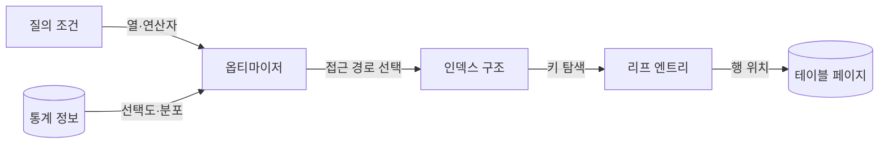
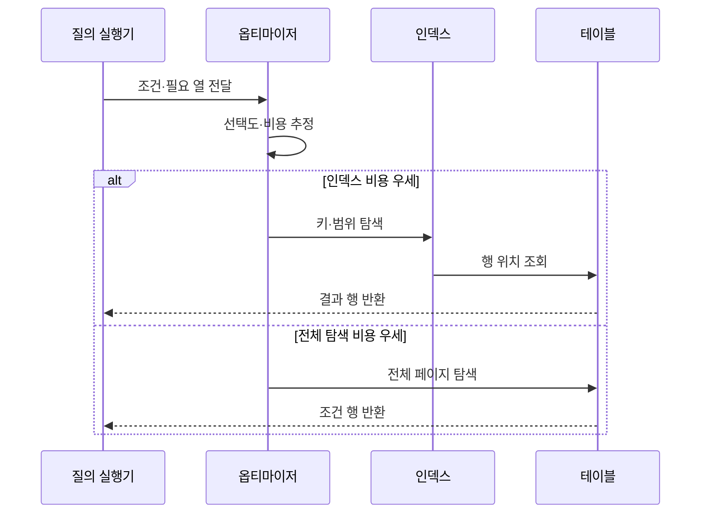

---
sidebar:
  order: 93
  label: "093. 인덱스 구조 — B+Tree·해시·복합 (Index Structure)"
  badge:
    text: "기출 · 70%"
    variant: note
title: "인덱스 구조 — B+Tree·해시·복합 (Index Structure)"
date: "2026-07-27T23:59:59+09:00"
tags:
  - "notes-software"
weight: 93
extra:
  question_no: "093"
  source_status: "기출"
  source_history: "122회, 135회, 137회"
  priority: 70
  priority_note: "122·135·137회 반복, 인덱스 선택 핵심"
---

## 미리 알고가기

- **인덱스(Index)**: 검색 키와 행 위치를 저장해 테이블 전체 탐색을 줄이는 보조 자료구조
- **선택도(Selectivity)**: 조건이 전체 행을 얼마나 적은 결과로 좁히는지를 나타내는 정도
- **B+트리(B+Tree)**: ‘비 플러스 트리’로 읽고 B-Tree의 변형을 더하기표로 구분한 명칭이며, 내부 노드는 탐색 키를, 연결된 리프 노드는 모든 키와 행 위치를 저장함
- **해시 인덱스(Hash Index)**: 키의 해시값을 버킷에 대응해 등치 조건의 행 위치를 찾는 구조
- **복합 인덱스(Composite Index)**: 여러 열을 지정 순서로 결합해 만든 인덱스
- **선두 열(Leading Column)**: 복합 인덱스에서 가장 먼저 정렬되어 탐색 시작 범위를 결정하는 열
- **페이지 분할(Page Split)**: 꽉 찬 인덱스 페이지를 둘로 나누고 키를 재배치하는 작업
- **실행 계획(Execution Plan)**: 질의를 처리하도록 선택된 접근 경로·조인 순서·연산자
- **데이터베이스(Database, DB)**: ‘디비’로 읽고 영문 머리글자를 딴 약어이며, 구조화 데이터를 저장·조회·관리하는 시스템

## Ⅰ. 개요

- **정의/개념**: 검색 키로 **행 접근 범위를 축소**하는 보조 구조
- **기존 한계**: 전체 테이블 탐색의 **읽기량·응답시간 증가**

### 쉽게 이해하기 (학습용)

- 책 전체를 넘기지 않고 색인에서 단어를 찾아 해당 쪽으로 이동하는 구조와 같다.

## Ⅱ. 특징

- B+트리의 **점·범위 탐색·정렬 지원**
- 해시의 **등치 탐색 특화**
- 복합 인덱스의 **열 순서 기반 탐색**

### 쉽게 이해하기 (학습용)

- 정렬된 색인은 구간을 찾고 해시는 같은 값만 빠르게 찾으며, 복합 색인은 앞 열부터 조건이 맞아야 효과가 크다.

## Ⅲ. 아키텍처 및 구성요소

| 구성요소 | 책임 |
|:---|:---|
| 질의 조건 | **검색 열·연산 범위** 제공 |
| 통계 정보 | **선택도·값 분포** 제공 |
| 옵티마이저 | 인덱스의 **사용 여부 판정** |
| 인덱스 구조 | 키의 **정렬·해시 탐색** |
| 리프 엔트리 | 키와 **행 위치 연결** |

> 요약: 통계 기반 접근 경로가 인덱스 탐색과 행 조회를 연결

### 쉽게 이해하기 (학습용)

- 안내자가 질문과 자료 분포를 보고 적합한 색인을 고르면 색인의 마지막 항목이 실제 자료 위치를 알려 준다.

## Ⅳ. 원리 및 절차 흐름

| 절차 | 설명 |
|:---|:---|
| 조건 전달 | **검색 열·연산자** 확인 |
| 비용 추정 | 선택도 기반 **예상 읽기량 비교** |
| 키·범위 탐색 | 구조에 맞는 **인덱스 접근** |
| 행 위치 조회 | 리프 엔트리로 **원본 행 접근** |
| 전체 페이지 탐색 | 저선택도 조건의 **순차 읽기** |

> 요약: 예상 읽기량이 적은 인덱스 또는 전체 탐색 선택

### 쉽게 이해하기 (학습용)

- 결과가 적으면 색인을 거쳐 찾고 대부분의 자료가 필요하면 책장을 처음부터 읽는 편이 효율적이다.

## Ⅴ. 종류 및 비교

| 인덱스 구조 | B+트리 | 해시 인덱스 | 복합 인덱스 |
|:---|:---|:---|:---|
| 적용 기준 | **범위·정렬·등치 조건** | 고선택도 **등치 조건** | 반복되는 **다중 열 조건** |
| 핵심 특징 | 연결 리프의 **순차 범위 탐색** | 해시 버킷의 **직접 등치 탐색** | 선두 열부터 **사전식 정렬** |
| 한계 | 페이지 분할·**쓰기 비용** | 범위·정렬 **탐색 불가** | 열 순서 불일치·**활용 제한** |

> 요약: 연산자와 조건 열 순서가 인덱스 구조 선택 기준

### 쉽게 이해하기 (학습용)

- 범위는 정렬 색인, 정확히 같은 값은 해시, 자주 함께 찾는 열은 조회 순서에 맞춘 복합 색인을 쓴다.

## Ⅵ. 실무 사례

1. 주문 일자 범위 조회는 **일자 B+트리 인덱스** 적용
2. 고객·상태 조회는 **고객-상태 복합 인덱스** 적용

### 쉽게 이해하기 (학습용)

- 기간별 주문은 정렬된 날짜 색인으로 찾고, 고객별 주문 상태는 고객과 상태 순으로 묶은 색인으로 찾는다.

## Ⅶ. 결론

- 범위는 **B+트리**, 등치는 **해시**, 다중 조건은 **복합 순서**

### 쉽게 이해하기 (학습용)

- 어떤 연산으로 어느 열을 찾는지 먼저 확인한 뒤 탐색에 맞는 구조와 열 순서를 선택한다.
