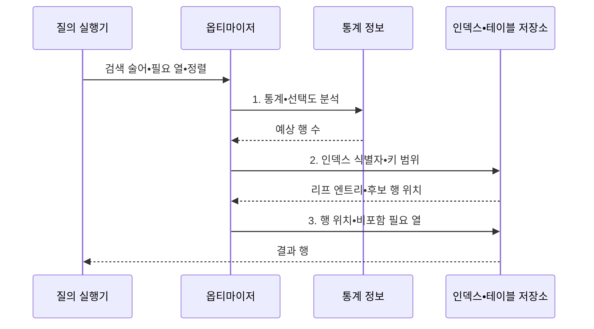

---
sidebar:
  order: 93
  label: "093. 인덱스 구조: B+Tree•해시•복합 (Index Structure)"
  badge:
    text: "기출 • 70%"
    variant: note
title: "인덱스 구조: B+Tree•해시•복합 (Index Structure)"
date: "2026-08-04T14:18:59+09:00"
tags:
  - "notes-software"
weight: 93
extra:
  question_no: "093"
  source_status: "기출"
  source_history: "122회, 135회, 137회"
  priority: 70
  priority_note: "122•135•137회 반복, 인덱스 선택 핵심"
---

## Ⅰ. 개요

핵심 용어

- **인덱스(Index)**: 검색 키와 행 위치를 연결해 전체 테이블 탐색 대신 필요한 범위만 읽게 하는 보조 자료구조이다.

- 정의/개념: 검색 키와 행 위치로 **접근 범위를 줄이는 자료구조**
- 배경/필요성: 전체 탐색은 데이터 증가에 따라 **페이지 읽기•지연 급증**

#### 한줄 요약

- 책 전체를 넘기지 않고 색인에서 단어를 찾아 해당 쪽으로 이동하는 구조와 같다.

## Ⅱ. 특징

핵심 용어

- **B+트리**: 정렬된 키 구조로 등치 탐색과 범위 탐색을 모두 지원하는 인덱스이다.
- **해시 인덱스(Hash Index)**: 키의 해시값으로 버킷을 찾아 정확한 등치 조건을 빠르게 탐색하는 인덱스이다.
- **복합 인덱스(Composite Index)**: 여러 열을 지정한 순서로 결합해 반복되는 다중 열 조건과 정렬을 지원하는 인덱스이다.

- **B+트리**: 등치•범위 탐색과 정렬 활용
- **해시**: 버킷 기반 등치 탐색에 특화
- **복합 인덱스**: 열 순서와 질의 조건 일치

#### 한줄 요약

- 정렬된 색인은 구간을 찾고 해시는 같은 값만 빠르게 찾으며, 복합 색인은 앞 열부터 조건이 맞아야 효과가 크다.

## Ⅲ. 구조 및 구성요소

핵심 용어

- **질의 조건**: 검색할 열과 연산자, 정렬 순서, 결과에 필요한 열을 나타내는 입력이다.
- **통계 정보**: 행 수와 값 분포 및 선택도를 요약해 예상 결과 건수를 계산하는 자료이다.
- **옵티마이저**: 통계 정보로 접근 경로의 예상 비용을 비교해 계획을 선택하는 구성요소이다.
- **인덱스 구조**: 정렬 키나 해시 버킷을 이용해 조건에 맞을 후보 행을 좁히는 구조이다.
- **리프 엔트리(Leaf Entry)**: 인덱스의 말단에서 검색 키와 행 위치 및 포함 열을 저장하는 항목이다.

| 구성요소 | 책임 |
|:---|:---|
| 질의 조건 | **열•연산자•정렬•필요 열** 제공 |
| 통계 정보 | **행 수•값 분포•선택도** 자료 제공 |
| 옵티마이저 | **접근 경로 예상 비용** 비교 |
| 인덱스 구조 | **정렬 키•해시 버킷** 으로 후보 탐색 |
| 리프 엔트리 | **키•행 위치•포함 열** 연결 |

#### 한줄 요약

- 질의 조건과 통계로 색인 사용 비용을 계산해 행 위치를 찾는다.

## Ⅳ. 흐름도

핵심 용어

- **1. 통계•선택도 분석**: 테이블과 열의 값 분포 및 술어를 이용해 조건을 통과할 예상 행 수를 계산하는 단계이다.
- **2. 인덱스 식별자•키 범위**: 비용이 가장 낮은 인덱스와 실제로 탐색할 시작•종료 키를 정한 정보이다.
- **3. 행 위치•비포함 필요 열**: 인덱스에 없는 결과 열을 테이블에서 추가로 가져오기 위한 위치와 열 목록이다.

**동작 원리**

- **1. 통계•선택도 분석**: 테이블•열의 값 분포와 술어로 예상 행 수 계산
- **2. 인덱스 식별자•키 범위**: 최소 비용의 탐색 키•범위 선택
- **3. 행 위치•비포함 필요 열**: 커버하지 못한 열만 테이블에서 조회

#### 한줄 요약

- 안내자가 자료 분포를 보고 색인이 더 빠를 때만 색인을 거쳐 실제 자료를 찾는다.

## Ⅴ. 종류 및 비교

핵심 용어

| 인덱스 유형 | B+트리 | 해시 인덱스 | 복합 인덱스 |
|:---|:---|:---|:---|
| 적용 기준 | **등치•범위•정렬** | 정확한 **등치 조건** | 반복 **다중 열 조건** |
| 핵심 특징 | **균형 트리•연결 리프** | **해시 버킷 직접 탐색** | **지정 열 순서 정렬** |
| 한계 | **페이지 분할•쓰기 비용** | **범위•정렬 활용 제한** | **선두 열 조건** 에 민감 |

> 요약: 복합 인덱스는 **선두 열 조건•DBMS 실행 계획** 으로 사용 결정

#### 한줄 요약

- 범위는 정렬 색인, 정확히 같은 값은 해시, 자주 함께 찾는 열은 조회 순서에 맞춘 복합 색인을 쓴다.

## Ⅵ. 실무 고려사항 및 대책

핵심 용어

- **선택도**: 조건이 전체 행을 얼마나 좁히는지 나타내며 인덱스 효율을 좌우하는 기준이다.
- **값 분포(Value Distribution)**: 열의 조건값별 빈도를 나타내는 통계다.
- **실행 계획(Execution Plan)**: 옵티마이저가 선택한 실제 접근 경로다.
- **등치 조건(Equality Predicate)**: 열값이 같은지 비교하는 질의 조건이다.
- **범위 조건(Range Predicate)**: 열값이 구간 안에 있는지 비교하는 조건이다.
- **정렬 순서(Sort Order)**: 결과 행을 나열할 열과 방향이다.
- **미사용 인덱스(Unused Index)**: 실제 질의 실행에 쓰이지 않는 인덱스다.
- **중복 인덱스(Redundant Index)**: 다른 인덱스와 같은 선두 열과 기능을 가진 인덱스다.
- **핵심 질의만 포함 열**: 테이블 재접근을 줄일 가치가 큰 조회에 한해 결과 열을 인덱스 리프에 추가하는 원칙이다.
- **통계 갱신(Statistics Update)**: 현재 데이터 분포로 통계를 다시 만드는 활동이다.
- **실행 계획 감시(Plan Monitoring)**: 예상 행 수와 실제 행 수의 편차를 관찰하는 활동이다.

| 문제 | 대책 | 효과 |
|:---|:---|:---|
| 낮은 선택도 조건에 인덱스를 강제해 무작위 읽기 증가 | **값 분포•실행 계획** 확인 | **저선택도 인덱스 강제** 방지 |
| 복합 인덱스 열 순서가 술어•정렬과 불일치 | **등치•범위•정렬 순서** 로 검증 | **복합 인덱스 활용** 확대 |
| 미사용•중복 인덱스가 모든 쓰기의 유지 비용 증가 | **미사용•중복 인덱스** 제거 | **변경 유지 비용** 감소 |
| 모든 필요 열을 포함해 인덱스 크기와 쓰기 비용 증가 | **핵심 질의만 포함 열** 적용 | **인덱스 비대** 방지 |
| 오래된 통계로 예상 행 수와 실제 분포가 불일치 | **통계 갱신•실행 계획 감시** | **잘못된 접근 경로** 방지 |

> **적용 사례**: 고객별 최신 주문 조회에는 `(customer_id, ordered_at DESC)` 복합 인덱스를 검토하고 실행 계획과 쓰기 비용을 함께 측정

#### 한줄 요약

- 조회가 빨라져도 쓰기가 지나치게 느려지면 좋은 인덱스가 아니므로 양쪽 비용을 함께 재야 한다.

## Ⅶ. 결론

핵심 용어

- **연산자(Operator)**: 질의 조건이 사용하는 비교 연산의 유형이다.
- **열 순서(Column Order)**: 복합 인덱스에서 키 열을 배치한 순서다.
- **쓰기 비용(Write Cost)**: 데이터 변경 때 인덱스를 함께 갱신하는 비용이다.

- **연산자•선택도•열 순서•쓰기 비용** 으로 인덱스를 결정

#### 한줄 요약

- 자주 찾는 방식에 맞는 색인을 만들고, 실제로 빨라지는지 확인한 뒤 남긴다.
