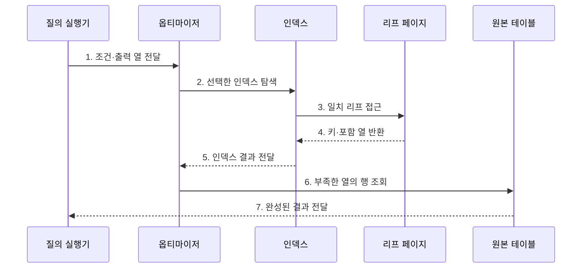

---
sidebar:
  order: 94
  label: "094. 클러스터드 인덱스·커버링 인덱스 (Clustered Covering Index)"
  badge:
    text: "기출 · 70%"
    variant: note
title: "클러스터드 인덱스·커버링 인덱스 (Clustered Covering Index)"
date: "2026-07-27T23:59:59+09:00"
tags:
  - "notes-software"
weight: 94
extra:
  question_no: "094"
  source_status: "기출"
  source_history: "137회"
  priority: 70
  priority_note: "137회 기출, 클러스터·커버링 인덱스 설계"
---

## 미리 알고가기

- **클러스터드 인덱스(Clustered Index)**: 인덱스 키 순서에 따라 테이블 행을 조직하는 인덱스
- **커버링 인덱스(Covering Index)**: 특정 질의에 필요한 열을 모두 포함해 테이블 재조회를 없애는 인덱스
- **리프 페이지(Leaf Page)**: 트리의 최하위 페이지로서 키와 실제 행 또는 행 위치를 저장한다.
- **포함 열(Included Column)**: 탐색 키 정렬에는 참여하지 않고 인덱스에서 결과를 제공하도록 리프에 저장한 열
- **입출력(Input/Output, I/O)**: ‘아이오’로 읽고 영문 머리글자를 딴 약어이며, 저장장치와 메모리 사이의 읽기·쓰기 동작
- **테이블 재조회(Table Lookup)**: 인덱스에서 찾은 행 위치로 원본 테이블을 다시 읽는 동작
- **임의 접근(Random Access)**: 연속되지 않은 여러 저장 위치를 직접 찾아 읽는 방식
- **페이지 분할(Page Split)**: 꽉 찬 페이지를 둘로 나누고 행·키를 재배치하는 작업
- **조각화(Fragmentation)**: 논리적 키 순서와 물리적 페이지 배치가 어긋난 상태

## Ⅰ. 개요

- 정의/개념: 행 정렬이나 열 포함으로 **페이지 읽기를 줄이는 인덱스**
- 배경/필요성: 범위 탐색과 **테이블 재조회 비용** 축소

### 쉽게 이해하기 (학습용)

- 클러스터드는 자료를 색인 순서로 놓고, 커버링은 색인에 질문의 답까지 적어 원본 책을 다시 펼치지 않게 한다.

## Ⅱ. 특징

- **클러스터드**: 인접 키를 가까운 페이지에 배치
- **커버링**: 필요한 열을 인덱스에서 반환
- **쓰기 비용**: 분할·키 변경·포함 열 갱신 증가

### 쉽게 이해하기 (학습용)

- 가까운 값을 한곳에 두면 범위를 빨리 읽고 필요한 답을 색인에 넣으면 원본 조회가 줄지만, 변경할 자료는 늘어난다.

## Ⅲ. 구조 및 구성요소

| 구성요소 | 책임 |
|:---|:---|
| 인덱스 키 | 정렬 순서와 탐색 범위 결정 |
| 포함 열 | 결과에 필요한 비탐색 열 제공 |
| 리프 페이지 | 키·행 위치·포함 열 저장 |
| 옵티마이저 | 커버링과 재조회 비용 판단 |
| 원본 테이블 | 인덱스에 없는 열 제공 |

### 쉽게 이해하기 (학습용)

- 인덱스 키와 포함 열로 원본 테이블 접근을 줄일지 판단한다.

## Ⅳ. 흐름도

**동작 원리**

- **1. 조건·출력 열 전달**: 질의 요구를 전달
- **2. 선택한 인덱스 탐색**: 비용이 낮은 키를 선택
- **3. 일치 리프 접근**: 조건 범위를 검색
- **4. 키·포함 열 반환**: 인덱스 값을 조회
- **5. 인덱스 결과 전달**: 커버 여부를 확인
- **6. 부족한 열의 행 조회**: 원본을 추가 접근
- **7. 완성된 결과 전달**: 모든 출력 열을 반환

### 쉽게 이해하기 (학습용)

- 색인에 답이 모두 있으면 6·7단계의 원본 조회를 생략하고 바로 결과를 돌려준다.

## Ⅴ. 종류 및 비교

| 판단 기준 | 클러스터드 인덱스 | 커버링 인덱스 |
|:---|:---|:---|
| 적용 기준 | 범위·정렬 페이지 축소 | 원본 재조회 제거 |
| 핵심 특징 | 키 순서에 따른 행 조직 | 질의에 필요한 열 포함 |
| 한계 | 중간 삽입·페이지 분할 | 크기·쓰기·캐시 비용 증가 |

> 커버링은 고정된 인덱스 유형이 아니라 “이 인덱스가 이 질의를 모두 충족하는가”라는 질의 상대적 성질상태

### 쉽게 이해하기 (학습용)

- 클러스터드는 책을 색인순으로 꽂는 방식이고, 커버링은 색인 자체에 필요한 답을 모두 적는 방식이다.

## Ⅵ. 실무 고려사항 및 대책

| 고려사항 | 대책 | 효과 |
|:---|:---|:---|
| 클러스터 키 | 좁고 안정적인 증가 키 검토 | 보조 인덱스 비대 감소 |
| 범위 패턴 | 주요 질의 실행 계획 비교 | 행 조직과 조회 순서 일치 |
| 포함 열 | 빈도 높은 질의의 필수 열만 포함 | 저장·쓰기 증가 통제 |
| 페이지 분할 | 채움 비율·분할·재구성 감시 | 조각화와 삽입 지연 감소 |
| DBMS 차이 | 제품별 저장 구조 확인 | 용어와 실제 동작 혼선 방지 |

> **적용 사례**: 고객별 최신 주문 목록에는 고객·주문일 키와 화면 출력 열을 포함한 인덱스를 검토하되, 원본 재조회 감소와 쓰기 증가를 함께 측결정

### 쉽게 이해하기 (학습용)

- 원본 조회가 줄어든 만큼 인덱스 크기와 수정 비용이 늘지 않았는지 확인해야 한다.

## Ⅶ. 결론

- **범위 읽기·재조회·쓰기 비용**으로 인덱스 방식을 결정

### 쉽게 이해하기 (학습용)

- 행을 가까이 둘지, 답을 색인에 담을지 정하고 실제 읽기 감소로 효과를 확인한다.
