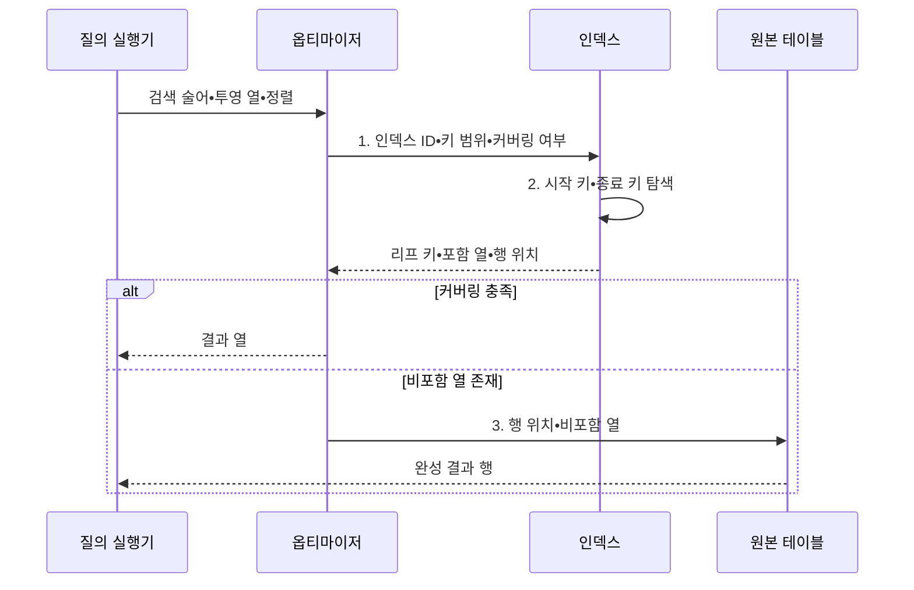

---
sidebar:
  order: 94
  label: "094. 클러스터드 인덱스•커버링 인덱스 (Clustered Covering Index)"
  badge:
    text: "기출 • 70%"
    variant: note
title: "클러스터드 인덱스•커버링 인덱스 (Clustered Covering Index)"
date: "2026-08-03T09:18:33+09:00"
tags:
  - "notes-software"
weight: 94
extra:
  question_no: "094"
  source_status: "기출"
  source_history: "137회"
  priority: 70
  priority_note: "137회 기출, 클러스터•커버링 인덱스 설계"
---

## Ⅰ. 개요

핵심 용어

- **클러스터드 인덱스(Clustered Index)**: 인덱스 키 순서에 따라 실제 행을 가까운 페이지에 배치해 범위 읽기를 줄이는 인덱스이다.
- **커버링 인덱스(Covering Index)**: 특정 질의에 필요한 열을 모두 포함해 원본 테이블 재조회를 없애는 인덱스이다.

- 정의/개념: 행 정렬이나 열 포함으로 **페이지 읽기를 줄이는 인덱스**
- 배경/필요성: 행 분산•비포함 열은 **범위 임의 접근•테이블 재조회 증가**

#### 한줄 요약

- 클러스터드는 자료를 색인 순서로 놓고, 커버링은 색인에 질문의 답까지 적어 원본 책을 다시 펼치지 않게 한다.

## Ⅱ. 특징

핵심 용어

- **클러스터드**: 인접 키의 행을 가까운 페이지에 배치해 범위 읽기를 줄이는 방식이다.
- **커버링**: 질의의 조건•정렬•결과 열을 인덱스만으로 제공해 원본 행 접근을 생략하는 성질이다.
- **쓰기 비용**: 행 재배치와 페이지 분할 및 포함 열 갱신 때문에 변경 작업에 추가되는 부담이다.

- **클러스터드**: 인접 키를 가까운 페이지에 배치
- **커버링**: 필요한 열을 인덱스에서 반환
- **쓰기 비용**: 분할•키 변경•포함 열 갱신 증가

#### 한줄 요약

- 가까운 값을 한곳에 두면 범위를 빨리 읽고 필요한 답을 색인에 넣으면 원본 조회가 줄지만, 변경할 자료는 늘어난다.

## Ⅲ. 구조 및 구성요소

핵심 용어

- **인덱스 키**: 인덱스의 정렬 순서와 탐색 가능한 범위를 결정하는 열 집합이다.
- **포함 열**: 탐색 키는 아니지만 원본 테이블 재조회를 줄이려고 리프에 저장하는 열이다.
- **리프 페이지**: 인덱스 말단에서 키와 행 위치 및 포함 열을 저장하는 페이지이다.
- **옵티마이저**: 인덱스만으로 결과를 반환할지 원본 테이블을 다시 읽을지 예상 비용으로 판단하는 구성요소이다.

| 구성요소 | 책임 |
|:---|:---|
| 인덱스 키 | **정렬 순서•탐색 범위** 결정 |
| 포함 열 | 결과에 필요한 **비탐색 열** 제공 |
| 리프 페이지 | **키•행 위치•포함 열** 저장 |
| 옵티마이저 | **커버링•테이블 재조회 비용** 판단 |
| 원본 테이블 | 인덱스에 없는 **비포함 열** 제공 |

#### 한줄 요약

- 인덱스 키와 포함 열로 원본 테이블 접근을 줄일지 판단한다.

## Ⅳ. 흐름도

핵심 용어

- **1. 인덱스 ID•키 범위•커버링 여부**: 사용할 인덱스와 탐색 구간 및 필요한 열을 모두 포함하는지를 나타내는 정보이다.
- **2. 시작 키•종료 키 탐색**: 검색 조건의 경계에 해당하는 리프 위치를 찾아 연속 엔트리를 읽는 단계이다.
- **3. 행 위치•비포함 열**: 커버링되지 않은 결과 열을 원본 테이블에서 추가로 읽기 위한 정보이다.

**동작 원리**

- **1. 인덱스 ID•키 범위•커버링 여부**: 행 조직•재조회 비용 비교
- **2. 시작 키•종료 키 탐색**: 조건에 맞는 연속 리프 엔트리 확인
- **3. 행 위치•비포함 열**: 커버하지 못한 열만 원본에서 추가 조회

#### 한줄 요약

- 색인에 답이 모두 있으면 원본 테이블을 다시 읽지 않고 결과를 반환한다.

## Ⅴ. 종류 및 비교

핵심 용어

- **커버링 인덱스**: 질의에 필요한 열을 모두 포함해 원본 테이블 재조회를 없애는 인덱스이다.
- **클러스터드 인덱스**: 키 순서에 따라 실제 행을 조직해 범위•정렬 조회의 페이지 접근을 줄이는 인덱스이다.
- **질의 상대적 성질**: 같은 인덱스도 한 질의에는 모든 필요 열을 포함하지만 다른 질의에는 부족할 수 있다는 커버링의 특성이다.

| 인덱스 설계 관점 | 클러스터드 인덱스 | 커버링 인덱스 |
|:---|:---|:---|
| 적용 기준 | **범위•정렬 페이지** 축소 | **원본 테이블 재조회** 제거 |
| 핵심 특징 | **키 순서 기반 행 조직** | 질의의 **필요 열 전체 포함** |
| 한계 | **중간 삽입•페이지 분할** | **크기•쓰기•캐시 비용** 증가 |

> 요약: 커버링은 인덱스 고정 유형이 아닌 **질의 상대적 성질**

#### 한줄 요약

- 클러스터드는 책을 색인순으로 꽂는 방식이고, 커버링은 색인 자체에 필요한 답을 모두 적는 방식이다.

## Ⅵ. 실무 고려사항 및 대책

핵심 용어

- **좁고 안정적인 증가 키**: 크기가 작고 값이 거의 바뀌지 않으며 순차적으로 늘어 중간 삽입을 줄이는 클러스터 키이다.
- **주요 질의 실행 계획**: 실제 핵심 조회가 선택한 접근 경로와 예상•실제 행 수를 보여 주는 검증 자료이다.
- **고빈도 질의의 필수 열**: 자주 실행되는 핵심 조회가 조건•정렬•결과 반환에 반드시 사용하는 열이다.
- **채움 비율•분할•재구성**: 페이지의 여유 공간을 조절하고 분할•조각화 상태를 감시해 인덱스를 다시 정돈하는 관리 항목이다.
- **제품별 저장 구조**: DBMS마다 클러스터드 인덱스가 실제 행 조직이나 별도 구조로 구현되는 차이이다.

| 문제 | 대책 | 효과 |
|:---|:---|:---|
| 넓고 자주 바뀌는 클러스터 키가 보조 인덱스까지 비대화 | **좁고 안정적인 증가 키** 검토 | **보조 인덱스 비대** 감소 |
| 행 조직 순서가 주요 범위•정렬 질의와 불일치 | **주요 질의 실행 계획** 비교 | **행 조직•조회 순서** 일치 |
| 낮은 빈도 열까지 포함해 저장•쓰기 비용 증가 | **고빈도 질의의 필수 열** 만 포함 | **저장•쓰기 증가** 통제 |
| 중간 삽입이 페이지 분할•조각화•지연을 유발 | **채움 비율•분할•재구성** 감시 | **조각화•삽입 지연** 감소 |
| DBMS마다 클러스터드 저장 의미가 달라 설계 오판 | **제품별 저장 구조** 확인 | **용어•실제 동작 혼선** 방지 |

> **적용 사례**: 고객별 최신 주문 목록에는 고객•주문일 키와 화면 출력 열을 포함한 인덱스를 검토하되, 원본 재조회 감소와 쓰기 증가를 함께 측정

#### 한줄 요약

- 원본 조회가 줄어든 만큼 인덱스 크기와 수정 비용이 늘지 않았는지 확인해야 한다.

## Ⅶ. 결론

핵심 용어

- **클러스터드**: 범위 조회와 정렬에서 읽어야 할 페이지 수를 줄이는 데 적합한 인덱스이다.
- **커버링**: 특정 질의에 필요한 열을 모두 인덱스에서 제공해 원본 테이블 재조회를 제거하는 성질이다.

- 범위•정렬 페이지 축소는 **클러스터드**, 재조회 제거는 **커버링**

#### 한줄 요약

- 행을 가까이 둘지, 답을 색인에 담을지 정하고 실제 읽기 감소로 효과를 확인한다.
