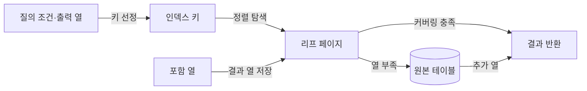
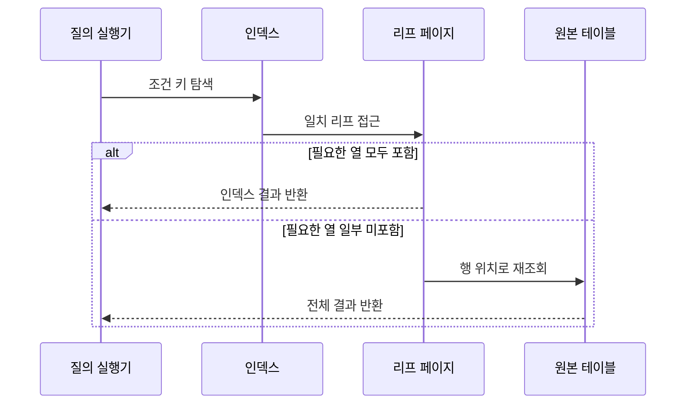

---
sidebar:
  order: 94
  label: "094. 클러스터드 인덱스·커버링 인덱스 (Clustered Covering Index)"
  badge:
    text: "기출 · 70%"
    variant: note
title: "클러스터드 인덱스·커버링 인덱스 (Clustered Covering Index)"
date: "2026-07-27T23:59:59+09:00"
tags:
  - "notes-software"
weight: 94
extra:
  question_no: "094"
  source_status: "기출"
  source_history: "137회"
  priority: 70
  priority_note: "137회 기출, 클러스터·커버링 인덱스 설계"
---

## 미리 알고가기

- **클러스터드 인덱스(Clustered Index)**: 인덱스 키 순서가 테이블 행의 물리적 저장 순서를 결정하는 인덱스
- **커버링 인덱스(Covering Index)**: 질의의 조건·출력 열을 모두 포함해 원본 테이블 재조회를 없애는 인덱스
- **리프 페이지(Leaf Page)**: 트리의 최하위 페이지로서 키와 실제 행 또는 행 위치를 저장함
- **포함 열(Included Column)**: 탐색 키 정렬에는 참여하지 않고 인덱스에서 결과를 제공하도록 리프에 저장한 열
- **입출력(Input/Output, I/O)**: ‘아이오’로 읽고 영문 머리글자를 딴 약어이며, 저장장치와 메모리 사이의 읽기·쓰기 동작
- **테이블 재조회(Table Lookup)**: 인덱스에서 찾은 행 위치로 원본 테이블을 다시 읽는 동작
- **임의 접근(Random Access)**: 연속되지 않은 여러 저장 위치를 직접 찾아 읽는 방식
- **페이지 분할(Page Split)**: 꽉 찬 페이지를 둘로 나누고 행·키를 재배치하는 작업
- **조각화(Fragmentation)**: 논리적 키 순서와 물리적 페이지 배치가 어긋난 상태

## Ⅰ. 개요

- 정의/개념: 행 배치·질의 열 포함으로 **페이지 읽기를 절감**
- 기존 한계: 범위 조회·테이블 재조회의 **임의 읽기 증가**

### 쉽게 이해하기 (학습용)

- 클러스터드는 자료를 색인 순서로 놓고, 커버링은 색인에 질문의 답까지 적어 원본 책을 다시 펼치지 않게 한다.

## Ⅱ. 특징

- 클러스터드의 **연속 범위 행 저장**
- 커버링의 **인덱스 단독 질의 처리**
- 갱신 시 **페이지 분할·쓰기 증폭**

### 쉽게 이해하기 (학습용)

- 가까운 값을 한곳에 두면 범위를 빨리 읽고 필요한 답을 색인에 넣으면 원본 조회가 줄지만, 변경할 자료는 늘어난다.

## Ⅲ. 아키텍처 및 구성요소

| 구성요소 | 책임 |
|:---|:---|
| 질의 조건·출력 열 | **탐색·반환 요구** 제공 |
| 인덱스 키 | **정렬 순서·탐색 범위** 결정 |
| 포함 열 | 비정렬 **출력 열 제공** |
| 리프 페이지 | 키·행·포함 열의 **실제 저장** |
| 원본 테이블 | 미포함 열의 **재조회 제공** |

> 요약: 키와 포함 열이 원본 테이블 재조회 여부를 결정

### 쉽게 이해하기 (학습용)

- 색인의 찾는 항목과 답 항목이 질문을 모두 충족하면 원본 자료실까지 갈 필요가 없다.

## Ⅳ. 원리 및 절차 흐름

| 절차 | 설명 |
|:---|:---|
| 조건 키 탐색 | 정렬 키의 **점·범위 접근** |
| 리프 접근 | 일치 키와 **포함 열 읽기** |
| 포함 여부 판정 | 필요한 열의 **인덱스 충족 확인** |
| 인덱스 결과 반환 | 커버링 질의의 **재조회 제거** |
| 원본 행 재조회 | 미포함 열의 **추가 임의 읽기** |

> 요약: 필요한 열이 리프에 모두 있으면 테이블 재조회 제거

### 쉽게 이해하기 (학습용)

- 색인에 답이 모두 있으면 바로 반환하고 부족한 항목이 있을 때만 원본 자료를 다시 찾는다.

## Ⅴ. 종류 및 비교

| 인덱스 설계 | 클러스터드 인덱스 | 커버링 인덱스 |
|:---|:---|:---|
| 적용 기준 | 넓은 **범위·정렬 조회** | 반복되는 **조건·출력 고정 질의** |
| 핵심 특징 | 키 순서의 **실제 행 배치** | 필요 열의 **리프 완전 포함** |
| 한계 | 단일 배치 순서·**페이지 분할** | 인덱스 비대화·**쓰기 비용 증가** |

> 요약: 행의 연속 배치와 테이블 재조회 제거 목적을 구분

### 쉽게 이해하기 (학습용)

- 연속 범위를 자주 읽으면 행 배치를 맞추고, 같은 열만 반복 조회하면 그 열을 색인에 포함한다.

## Ⅵ. 실무 사례

1. 주문 일자 범위 보고서는 **일자 클러스터드 인덱스** 적용
2. 주문 목록 질의는 **상태 키·금액 포함 열**로 재조회 제거

### 쉽게 이해하기 (학습용)

- 기간 보고서는 날짜순으로 붙여 읽고, 목록 화면은 상태로 찾은 색인에서 금액까지 바로 반환한다.

## Ⅶ. 결론

- 범위 읽기는 **클러스터드**, 재조회 제거는 **커버링**

### 쉽게 이해하기 (학습용)

- 연속 페이지 접근과 원본 테이블 접근 중 어느 비용을 줄일지에 따라 설계를 선택한다.
