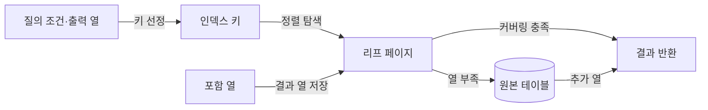
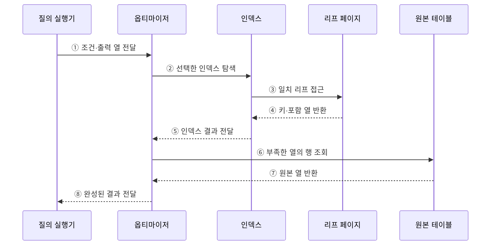

---
sidebar:
  order: 94
  label: "094. 클러스터드 인덱스·커버링 인덱스 (Clustered Covering Index)"
  badge:
    text: "기출 · 70%"
    variant: note
title: "클러스터드 인덱스·커버링 인덱스 (Clustered Covering Index)"
date: "2026-07-27T23:59:59+09:00"
tags:
  - "notes-software"
weight: 94
extra:
  question_no: "094"
  source_status: "기출"
  source_history: "137회"
  priority: 70
  priority_note: "137회 기출, 클러스터·커버링 인덱스 설계"
---

## 미리 알고가기

- **클러스터드 인덱스(Clustered Index)**: 인덱스 키 순서에 따라 테이블 행을 조직하는 인덱스
- **커버링 인덱스(Covering Index)**: 특정 질의에 필요한 열을 모두 포함해 테이블 재조회를 없애는 인덱스
- **리프 페이지(Leaf Page)**: 트리의 최하위 페이지로서 키와 실제 행 또는 행 위치를 저장함
- **포함 열(Included Column)**: 탐색 키 정렬에는 참여하지 않고 인덱스에서 결과를 제공하도록 리프에 저장한 열
- **입출력(Input/Output, I/O)**: ‘아이오’로 읽고 영문 머리글자를 딴 약어이며, 저장장치와 메모리 사이의 읽기·쓰기 동작
- **테이블 재조회(Table Lookup)**: 인덱스에서 찾은 행 위치로 원본 테이블을 다시 읽는 동작
- **임의 접근(Random Access)**: 연속되지 않은 여러 저장 위치를 직접 찾아 읽는 방식
- **페이지 분할(Page Split)**: 꽉 찬 페이지를 둘로 나누고 행·키를 재배치하는 작업
- **조각화(Fragmentation)**: 논리적 키 순서와 물리적 페이지 배치가 어긋난 상태

## Ⅰ. 개요

- 클러스터드 인덱스는 행을 키 순서로 조직해 범위 읽기를 줄이고, 커버링 인덱스는 질의에 필요한 열을 모두 담아 테이블 재조회를 줄인다.
- 두 개념은 서로 배타적인 인덱스 종류가 아니라 각각 **행 조직 방식**과 **특정 질의의 충족 여부**를 나타낸다.

### 쉽게 이해하기 (학습용)

- 클러스터드는 자료를 색인 순서로 놓고, 커버링은 색인에 질문의 답까지 적어 원본 책을 다시 펼치지 않게 한다.

## Ⅱ. 특징

- **클러스터드**: 가까운 키의 행을 인접 페이지에 배치해 범위·정렬 조회에 유리하다.
- **커버링**: 탐색 키와 포함 열만 읽어 특정 질의를 인덱스에서 끝낸다.
- **희소 자원**: 테이블의 행 조직 순서는 하나이므로 클러스터드 인덱스도 일반적으로 하나만 둘 수 있다.
- **쓰기 비용**: 키 변경·중간 삽입·포함 열 갱신은 페이지 분할과 쓰기량을 늘릴 수 있다.

### 쉽게 이해하기 (학습용)

- 가까운 값을 한곳에 두면 범위를 빨리 읽고 필요한 답을 색인에 넣으면 원본 조회가 줄지만, 변경할 자료는 늘어난다.

## Ⅲ. 아키텍처 및 구성요소

**도표안 A — 구조도**

**도표안 B — sequenceDiagram**

| 구성요소 | 역할 |
|:---|:---|
| 인덱스 키 | 정렬 순서와 탐색 범위 결정 |
| 포함 열 | 탐색 순서에는 참여하지 않고 결과 열 제공 |
| 리프 페이지 | 키와 행 또는 행 위치·포함 열 저장 |
| 옵티마이저 | 커버링 여부와 테이블 재조회 비용 판단 |
| 원본 테이블 | 인덱스에 없는 열과 원본 행 제공 |

**동작 원리**

- ① 질의 실행기가 조건과 출력 열을 옵티마이저에 전달한다.
- ② 옵티마이저가 비용이 낮은 인덱스의 키 탐색을 요청한다.
- ③ 인덱스가 조건에 일치하는 리프 페이지에 접근한다.
- ④ 리프 페이지가 탐색 키와 포함 열을 인덱스에 반환한다.
- ⑤ 인덱스가 일치 엔트리를 옵티마이저에 전달한다.
- ⑥ 필요한 열이 부족하면 옵티마이저가 원본 행을 조회한다.
- ⑦ 원본 테이블이 부족한 열을 반환한다.
- ⑧ 옵티마이저가 완성된 결과를 질의 실행기에 전달한다.

### 쉽게 이해하기 (학습용)

- 색인에 답이 모두 있으면 ⑥·⑦의 원본 조회를 생략하고 바로 결과를 돌려준다.

## Ⅳ. 종류 및 비교

| 구분 | 클러스터드 인덱스 | 커버링 인덱스 |
|:---|:---|:---|
| 의미 | 테이블 행의 조직 방식 | 특정 질의에 대한 충족 속성 |
| 목적 | 범위·정렬 읽기의 페이지 접근 축소 | 원본 테이블 재조회 제거 |
| 리프 내용 | DBMS에 따라 실제 행 또는 데이터 페이지 | 질의에 필요한 키·출력 열 |
| 개수 | 일반적으로 테이블당 하나 | 여러 인덱스가 각 질의를 커버 가능 |
| 주요 비용 | 중간 삽입·키 변경·페이지 분할 | 인덱스 크기·쓰기·캐시 사용 증가 |

> 커버링은 고정된 인덱스 유형이 아니라 “이 인덱스가 이 질의를 모두 충족하는가”라는 질의 상대적 성질이다.

### 쉽게 이해하기 (학습용)

- 클러스터드는 책을 색인순으로 꽂는 방식이고, 커버링은 색인 자체에 필요한 답을 모두 적는 방식이다.

## Ⅴ. 실무 고려사항 및 대책

| 고려사항 | 위험 | 대책 |
|:---|:---|:---|
| 클러스터 키 | 넓고 변하는 키로 모든 보조 인덱스 비대 | 좁고 안정적이며 증가 경향인 키 검토 |
| 범위 패턴 | 실제 조회 순서와 행 조직 불일치 | 주요 범위·정렬 질의의 실행 계획 비교 |
| 포함 열 | 과도한 커버링으로 저장·쓰기 증가 | 빈도 높은 질의의 필수 열만 포함 |
| 페이지 분할 | 중간 삽입으로 지연·조각화 증가 | 채움 비율과 분할·재구성 지표 감시 |
| 가시성 규칙 | MVCC 확인 때문에 인덱스 전용 조회 제한 | DBMS 실행 계획과 실제 테이블 접근 확인 |
| DBMS 차이 | 용어와 저장 구조를 동일하게 가정 | 제품별 clustered/IOT/heap 구현 확인 |

> **적용 사례**: 고객별 최신 주문 목록에는 고객·주문일 키와 화면 출력 열을 포함한 인덱스를 검토하되, 원본 재조회 감소와 쓰기 증가를 함께 측정한다.

### 쉽게 이해하기 (학습용)

- 원본 조회가 줄어든 만큼 인덱스 크기와 수정 비용이 늘지 않았는지 확인해야 한다.

## Ⅵ. 결론

- 클러스터드 인덱스는 행 배치로 범위 읽기를, 커버링 인덱스는 열 포함으로 테이블 재조회를 줄인다.
- 주요 질의의 페이지 읽기 감소가 인덱스 저장·갱신 비용보다 클 때 적용한다.

### 쉽게 이해하기 (학습용)

- 행을 가까이 둘지, 답을 색인에 담을지 정하고 실제 읽기 감소로 효과를 확인한다.
