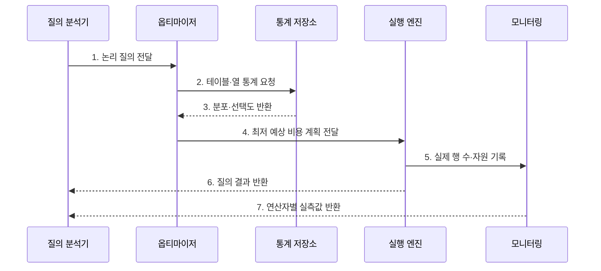

---
sidebar:
  order: 95
  label: "095. 실행 계획·쿼리 최적화 (Query Execution Plan Optimization)"
  badge:
    text: "기출 · 50%"
    variant: note
title: "실행 계획·쿼리 최적화 (Query Execution Plan Optimization)"
date: "2026-07-27T23:59:59+09:00"
tags:
  - "notes-software"
weight: 95
extra:
  question_no: "095"
  source_status: "기출"
  source_history: "137회"
  priority: 50
  priority_note: "137회 기출, 실행계획 기반 병목 개선"
---

## 미리 알고가기

- **구조화 질의 언어(Structured Query Language, SQL)**: ‘에스큐엘’로 읽고 영문 머리글자를 딴 약어이며, 관계형 데이터의 정의·조회·변경을 표현하는 언어
- **실행 계획(Execution Plan)**: 질의를 처리하도록 선택된 접근 경로·조인 순서·연산자
- **옵티마이저(Optimizer)**: 통계와 비용 모델로 후보 실행 계획을 비교·선택하는 데이터베이스 구성요소
- **카디널리티 추정(Cardinality Estimation)**: 조건과 연산자를 통과할 행 수를 예측하는 작업
- **비용 모델(Cost Model)**: 중앙 처리·입출력·메모리의 예상 사용량을 수치화해 계획을 비교하는 모델
- **계획 회귀(Plan Regression)**: 통계·데이터·설정 변경 후 이전보다 느린 실행 계획이 선택되는 현상
- **옵티마이저 힌트(Optimizer Hint)**: 특정 접근 경로나 조인 방식을 우선하도록 옵티마이저에 주는 지시
- **키셋 페이지 나누기(Keyset Pagination)**: 마지막 정렬 키 이후 범위를 조건으로 다음 페이지를 조회하는 방식
- **오프셋(Offset)**: 결과 앞부분에서 건너뛸 행 수
- **95백분위 지연(95th Percentile Latency, p95)**: ‘피 구십오’로 읽고 p는 percentile의 첫 글자이며, 요청의 95%가 완료되는 지연값

## Ⅰ. 개요

- 정의/개념: 통계와 비용으로 **SQL 실행 계획을 선택하는 최적화**
- 배경/필요성: 잘못된 비용 추정에 따른 **실행 병목** 완화

### 쉽게 이해하기 (학습용)

- 예상 교통량으로 길을 고른 뒤 실제 이동 시간과 비교해 더 빠른 경로를 찾는 작업과 같다.

## Ⅱ. 특징

- **비용 기반 선택**: 행 수와 자원 사용량 추정
- **다차원 탐색**: 접근·조인·정렬·집계 결정
- **실측 검증**: 예상·실제 행과 자원량 비교

### 쉽게 이해하기 (학습용)

- 데이터 분포 예상이 틀리면 나쁜 경로를 고르므로 계획의 예상값과 실제 처리량을 함께 봐야 한다.

## Ⅲ. 구조 및 구성요소

| 구성요소 | 책임 |
|:---|:---|
| 질의 분석기 | SQL을 논리 연산으로 변환 |
| 통계 정보 | 행 수·분포·고유값 수 제공 |
| 옵티마이저 | 후보 계획의 비용 비교 |
| 실행 계획 | 접근·조인·연산자 명시 |
| 실행 엔진·모니터링 | 실제 행·시간·읽기량 수집 |

### 쉽게 이해하기 (학습용)

- 통계로 실행 경로를 고르고 실제 처리량과 예상값을 비교한다.

## Ⅳ. 흐름도

**동작 원리**

- **1. 논리 질의 전달**: SQL을 연산으로 변환
- **2. 테이블·열 통계 요청**: 분포 자료를 요구
- **3. 분포·선택도 반환**: 예상 행 수를 제공
- **4. 최저 예상 비용 계획 전달**: 실행 경로를 선택
- **5. 실제 행 수·자원 기록**: 연산자별 값을 기록
- **6. 질의 결과 반환**: 처리 결과를 전달
- **7. 연산자별 실측값 반환**: 추정 오차를 확인

### 쉽게 이해하기 (학습용)

- 지도 통계로 경로를 고르고 실제 운행 기록이 예상과 다르면 통계와 경로를 다시 점검한다.

## Ⅴ. 종류 및 비교

| 판단 기준 | 인덱스 탐색 | 전체 탐색 | 키셋 페이지 |
|:---|:---|:---|:---|
| 적용 기준 | 높은 선택도 조건 | 결과 비율이 큰 조건 | 깊은 순차 페이지 |
| 핵심 특징 | 키로 후보 페이지 축소 | 전체 페이지 연속 읽기 | 마지막 키 이후 조회 |
| 한계 | 임의 읽기·재조회 증가 | 불필요 행 읽기 증가 | 임의 페이지 이동 제한 |

> 비용은 절대 실행시간이 아니라 DBMS 비용 모델이 후보 계획을 비교하기 위한 상대 추정값상태

### 쉽게 이해하기 (학습용)

- 어떤 길이 항상 빠른 것이 아니라 데이터 양과 분포에 맞는 길을 선택해야 한다.

## Ⅵ. 실무 고려사항 및 대책

| 고려사항 | 대책 | 효과 |
|:---|:---|:---|
| 재현 | 운영 유사 통계·파라미터 사용 | 환경별 계획 차이 감소 |
| 카디널리티 | 통계 갱신과 상관관계 점검 | 예상·실제 행 차이 축소 |
| 바인드 값 | 스니핑·커서·재컴파일 정책 검토 | 값별 계획 불안정 완화 |
| 계획 회귀 | 계획 이력·탐지·롤백 준비 | 배포 후 지연 복구 |
| 힌트 | 원인 교정 후 예외로 사용 | 특정 계획 고착 방지 |

> **적용 사례**: 고객별 주문 조회에서 예상 10행이 실제 10만 행이면 인덱스 추가 전에 통계·조건 상관관계와 조인 순서를 먼저 교결정

### 쉽게 이해하기 (학습용)

- 느린 단계만 바꾸지 말고 왜 예상보다 많은 데이터가 흘렀는지부터 찾는다.

## Ⅶ. 결론

- **추정 오차·실측 비용·회귀 위험**으로 실행 계획을 교결정

### 쉽게 이해하기 (학습용)

- 예상과 실제가 어긋난 지점을 찾아 데이터 통계나 실행 경로를 바로잡는다.
