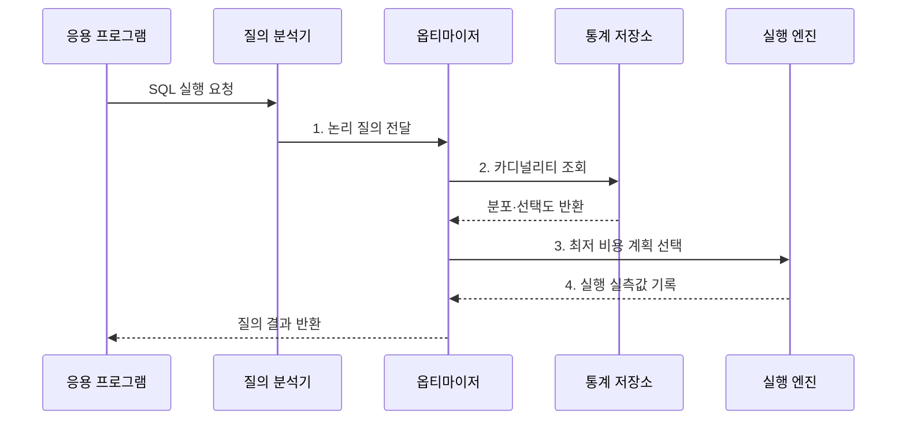

---
sidebar:
  order: 95
  label: "095. 실행 계획·쿼리 최적화 (Query Execution Plan Optimization)"
  badge:
    text: "기출 · 50%"
    variant: note
title: "실행 계획·쿼리 최적화 (Query Execution Plan Optimization)"
date: "2026-08-02T12:00:00+09:00"
tags:
  - "notes-software"
weight: 95
extra:
  question_no: "095"
  source_status: "기출"
  source_history: "137회"
  priority: 50
  priority_note: "137회 기출, 실행계획 기반 병목 개선"
---

## Ⅰ. 개요

핵심 용어

- **SQL 실행 계획을 선택하는 최적화**: 통계와 비용 모델로 후보 경로를 비교해 질의 실행 방법을 정하는 과정이다.

- 정의/개념: 통계와 비용으로 **SQL 실행 계획을 선택하는 최적화**
- 배경/필요성: 분포를 잘못 추정하면 **비효율 계획** 선택

#### 한줄 요약

- 예상 교통량으로 길을 고른 뒤 실제 이동 시간과 비교해 더 빠른 경로를 찾는 작업과 같다.

## Ⅱ. 특징

핵심 용어

- **비용 기반 선택**: 예상 행 수와 자원 사용량을 비용으로 환산해 실행 계획을 고르는 특성이다.

- **비용 기반 선택**: 행 수와 자원 사용량 추정
- **다차원 탐색**: 접근·조인·정렬·집계 결정
- **실측 검증**: 예상·실제 행과 자원량 비교

#### 한줄 요약

- 데이터 분포 예상이 틀리면 나쁜 경로를 고르므로 계획의 예상값과 실제 처리량을 함께 봐야 한다.

## Ⅲ. 구조 및 구성요소

핵심 용어

- **통계**: 행 수와 값 분포로 옵티마이저의 비용 추정을 뒷받침하는 정보이다.

| 구성요소 | 책임 |
|:---|:---|
| 질의 분석기 | SQL을 **논리 연산으로 변환** |
| 통계 정보 | **행 수·분포·고유값 수** 제공 |
| 옵티마이저 | **후보 계획 비용** 비교 |
| 실행 계획 | **접근·조인·연산자** 명시 |
| 실행 엔진·모니터링 | **실제 행·시간·읽기량** 수집 |

#### 한줄 요약

- 통계로 실행 경로를 고르고 실제 처리량과 예상값을 비교한다.

## Ⅳ. 흐름도

핵심 용어

- **2. 카디널리티 조회**: 통계와 선택도로 각 연산을 통과할 중간 행 수를 예측하는 단계이다.

**동작 원리**

- **1. 논리 질의 전달**: SQL을 관계 연산 트리로 구성
- **2. 카디널리티 조회**: 통계·선택도로 중간 행 수 예측
- **3. 최저 비용 계획 선택**: 접근·조인 순서의 비용 비교
- **4. 실행 실측값 기록**: 연산자별 행 수·시간·자원 수집

#### 한줄 요약

- 지도 통계로 경로를 고르고 실제 운행 기록이 예상과 다르면 통계와 경로를 다시 점검한다.

## Ⅴ. 종류 및 비교

핵심 용어

- **인덱스 탐색**: 인덱스 키로 대상 범위를 좁혀 필요한 데이터만 읽는 접근 방식이다.

| 판단 기준 | 인덱스 탐색 | 전체 탐색 | 키셋 페이지 |
|:---|:---|:---|:---|
| 적용 기준 | 높은 **선택도 조건** | 결과 비율이 큰 **조건** | 깊은 **순차 페이지** |
| 핵심 특징 | 키로 **후보 페이지 축소** | **전체 페이지** 연속 읽기 | **마지막 키 이후** 조회 |
| 한계 | **임의 읽기·재조회** 증가 | **불필요 행 읽기** 증가 | **임의 페이지 이동** 제한 |

> 비용은 절대 실행시간이 아니라 DBMS 비용 모델이 후보 계획을 비교하기 위한 상대 추정값

#### 한줄 요약

- 어떤 길이 항상 빠른 것이 아니라 데이터 양과 분포에 맞는 길을 선택해야 한다.

## Ⅵ. 실무 고려사항 및 대책

핵심 용어

- **예상보다 많은 데이터**: 실행 계획이 느릴 때 어느 단계의 추정이 어긋났는지 찾게 하는 단서이다.

| 문제 | 대책 | 효과 |
|:---|:---|:---|
| 운영과 검증 환경의 통계 차이 | **운영 유사 통계·파라미터** 사용 | **환경별 계획 차이** 감소 |
| 열 간 상관관계를 무시한 행 수 오차 | **통계 갱신·상관관계** 점검 | **예상·실제 행 차이** 축소 |
| 바인드 값 엿보기에 따른 계획 편향 | **커서·재컴파일 정책** 검토 | **값별 계획 불안정** 완화 |
| 배포 후 계획 회귀 발생 | **계획 이력·탐지·롤백** 준비 | **배포 후 지연** 복구 |
| 힌트로 특정 계획이 장기 고착 | 원인 교정 후 **힌트 예외 적용** | **데이터 변화 대응력** 확보 |

> **적용 사례**: 예상 10행이 실제 10만 행이면 인덱스보다 통계·조건 상관관계를 먼저 교정

#### 한줄 요약

- 느린 단계만 바꾸지 말고 왜 예상보다 많은 데이터가 흘렀는지부터 찾는다.

## Ⅶ. 결론

핵심 용어

- **통계 보정**: 예상 행 수와 실제 행 수의 차이가 클 때 우선 적용할 개선 방법이다.

- 추정 오차가 크면 **통계 보정**, 계획 회귀면 **롤백** 선택

#### 한줄 요약

- 예상과 실제가 어긋난 지점을 찾아 데이터 통계나 실행 경로를 바로잡는다.
