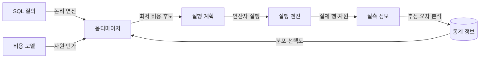
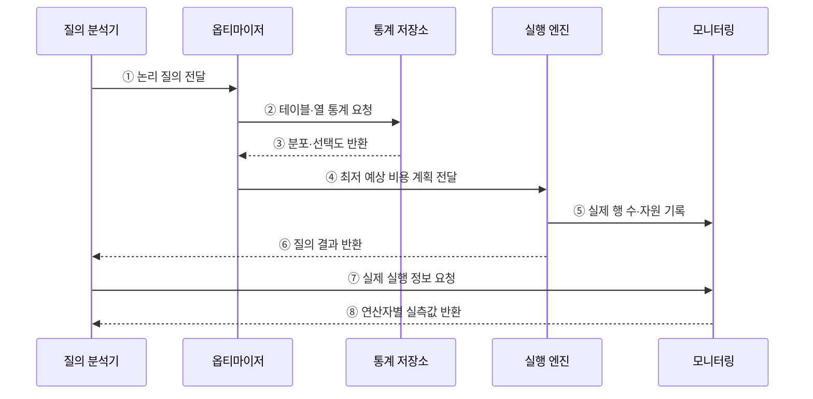

---
sidebar:
  order: 95
  label: "095. 실행 계획·쿼리 최적화 (Query Execution Plan Optimization)"
  badge:
    text: "기출 · 50%"
    variant: note
title: "실행 계획·쿼리 최적화 (Query Execution Plan Optimization)"
date: "2026-07-27T23:59:59+09:00"
tags:
  - "notes-software"
weight: 95
extra:
  question_no: "095"
  source_status: "기출"
  source_history: "137회"
  priority: 50
  priority_note: "137회 기출, 실행계획 기반 병목 개선"
---

## 미리 알고가기

- **구조화 질의 언어(Structured Query Language, SQL)**: ‘에스큐엘’로 읽고 영문 머리글자를 딴 약어이며, 관계형 데이터의 정의·조회·변경을 표현하는 언어
- **실행 계획(Execution Plan)**: 질의를 처리하도록 선택된 접근 경로·조인 순서·연산자
- **옵티마이저(Optimizer)**: 통계와 비용 모델로 후보 실행 계획을 비교·선택하는 데이터베이스 구성요소
- **카디널리티 추정(Cardinality Estimation)**: 조건과 연산자를 통과할 행 수를 예측하는 작업
- **비용 모델(Cost Model)**: 중앙 처리·입출력·메모리의 예상 사용량을 수치화해 계획을 비교하는 모델
- **계획 회귀(Plan Regression)**: 통계·데이터·설정 변경 후 이전보다 느린 실행 계획이 선택되는 현상
- **옵티마이저 힌트(Optimizer Hint)**: 특정 접근 경로나 조인 방식을 우선하도록 옵티마이저에 주는 지시
- **키셋 페이지 나누기(Keyset Pagination)**: 마지막 정렬 키 이후 범위를 조건으로 다음 페이지를 조회하는 방식
- **오프셋(Offset)**: 결과 앞부분에서 건너뛸 행 수
- **95백분위 지연(95th Percentile Latency, p95)**: ‘피 구십오’로 읽고 p는 percentile의 첫 글자이며, 요청의 95%가 완료되는 지연값

## Ⅰ. 개요

- 실행 계획은 SQL을 처리할 접근 경로·조인 순서·연산자를 표현한다.
- 쿼리 최적화는 통계와 비용 모델로 후보 계획을 선택하고 실측 결과로 **추정 오류와 병목 원인**을 교정하는 작업이다.

### 쉽게 이해하기 (학습용)

- 예상 교통량으로 길을 고른 뒤 실제 이동 시간과 비교해 더 빠른 경로를 찾는 작업과 같다.

## Ⅱ. 특징

- **비용 기반 선택**: 카디널리티와 자원 사용량을 추정해 후보 계획을 비교한다.
- **다차원 탐색**: 접근 경로·조인 순서·조인 방식·정렬·집계 방식을 함께 결정한다.
- **추정 의존성**: 오래된 통계와 열 간 상관관계 누락은 잘못된 계획을 유발한다.
- **실측 검증**: 예상 행 수와 실제 행 수, 읽기량, 메모리, 시간을 연산자별로 비교한다.

### 쉽게 이해하기 (학습용)

- 데이터 분포 예상이 틀리면 나쁜 경로를 고르므로 계획의 예상값과 실제 처리량을 함께 봐야 한다.

## Ⅲ. 아키텍처 및 구성요소

**도표안 A — 구조도**

**도표안 B — sequenceDiagram**

| 구성요소 | 역할 |
|:---|:---|
| 질의 분석기 | SQL을 필터·조인·정렬 등의 논리 연산으로 변환 |
| 통계 정보 | 행 수·값 분포·히스토그램·고유값 수 제공 |
| 옵티마이저 | 후보 계획의 카디널리티와 비용을 추정·비교 |
| 실행 계획 | 접근 경로·조인 순서·물리 연산자 명시 |
| 실행 엔진·모니터링 | 계획 수행과 실제 행·시간·읽기량 수집 |

**동작 원리**

- ① 질의 분석기가 SQL을 논리 연산으로 변환해 옵티마이저에 전달한다.
- ② 옵티마이저가 대상 테이블과 열의 통계를 요청한다.
- ③ 통계 저장소가 분포와 선택도 추정 자료를 반환한다.
- ④ 옵티마이저가 예상 비용이 가장 낮은 실행 계획을 실행 엔진에 전달한다.
- ⑤ 실행 엔진이 연산자별 실제 행 수와 자원 사용량을 기록한다.
- ⑥ 실행 엔진이 질의 결과를 질의 분석기에 반환한다.
- ⑦ 질의 분석기가 실제 실행 계획과 측정값을 요청한다.
- ⑧ 모니터링이 연산자별 실제 행 수·시간·읽기량을 반환한다.

### 쉽게 이해하기 (학습용)

- 지도 통계로 경로를 고르고 실제 운행 기록이 예상과 다르면 통계와 경로를 다시 점검한다.

## Ⅳ. 종류 및 비교

| 최적화 대상 | 선택 대안 | 판단 기준 | 대표 위험 |
|:---|:---|:---|:---|
| 접근 경로 | 인덱스 탐색 / 전체 탐색 | 선택도·페이지 읽기·재조회 | 저선택도 인덱스의 임의 읽기 |
| 조인 순서 | 작은 중간 결과 우선 등 | 입력 행 수·필터 적용 시점 | 중간 결과 폭증 |
| 조인 방식 | 중첩 루프 / 해시 / 병합 | 입력 크기·정렬·메모리 | 해시 유출·반복 탐색 |
| 정렬·집계 | 인덱스 순서 / 정렬 / 해시 | 결과 크기·메모리·순서 요구 | 디스크 임시 영역 사용 |
| 페이지 처리 | OFFSET / 키셋 | 깊이·임의 이동·정렬 키 | 큰 OFFSET의 반복 폐기 |

> 비용은 절대 실행시간이 아니라 DBMS 비용 모델이 후보 계획을 비교하기 위한 상대 추정값이다.

### 쉽게 이해하기 (학습용)

- 어떤 길이 항상 빠른 것이 아니라 데이터 양과 분포에 맞는 길을 선택해야 한다.

## Ⅴ. 실무 고려사항 및 대책

| 고려사항 | 위험 | 대책 |
|:---|:---|:---|
| 재현 | 개발 환경에서만 계획 확인 | 운영과 유사한 통계·파라미터·데이터 분포 사용 |
| 카디널리티 | 예상·실제 행 수의 큰 차이 | 통계 갱신, 확장 통계, 조건·상관관계 점검 |
| 바인드 값 | 값별 분포 차이로 계획 불안정 | 파라미터 스니핑·커서·재컴파일 정책 검토 |
| 계획 회귀 | 배포·통계 갱신 후 갑작스러운 지연 | 계획 이력·기준선·회귀 탐지와 롤백 준비 |
| 힌트 | 특정 현재 계획에 고착 | 원인 교정을 우선하고 힌트는 검증된 예외로 사용 |
| 부하 영향 | 분석 질의로 운영 부하 증가 | 읽기 전용 복제본·샘플링·실행 제한 활용 |

> **적용 사례**: 고객별 주문 조회에서 예상 10행이 실제 10만 행이면 인덱스 추가 전에 통계·조건 상관관계와 조인 순서를 먼저 교정한다.

### 쉽게 이해하기 (학습용)

- 느린 단계만 바꾸지 말고 왜 예상보다 많은 데이터가 흘렀는지부터 찾는다.

## Ⅵ. 결론

- 쿼리 최적화는 실행 계획의 예상값과 실측값을 비교해 비용 증가의 원인을 제거하는 작업이다.
- 통계·인덱스·질의·스키마 중 원인에 맞는 요소를 고치고 계획 회귀까지 감시해야 한다.

### 쉽게 이해하기 (학습용)

- 예상과 실제가 어긋난 지점을 찾아 데이터 통계나 실행 경로를 바로잡는다.
