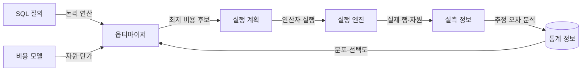
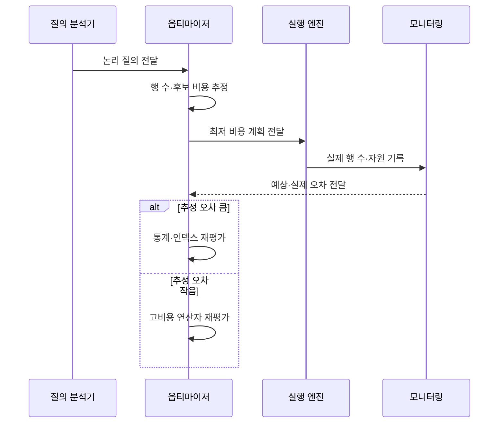

---
sidebar:
  order: 95
  label: "095. 실행 계획·쿼리 최적화 (Query Execution Plan Optimization)"
  badge:
    text: "기출 · 50%"
    variant: note
title: "실행 계획·쿼리 최적화 (Query Execution Plan Optimization)"
date: "2026-07-27T23:59:59+09:00"
tags:
  - "notes-software"
weight: 95
extra:
  question_no: "095"
  source_status: "기출"
  source_history: "137회"
  priority: 50
  priority_note: "137회 기출, 실행계획 기반 병목 개선"
---

## 미리 알고가기

- **구조화 질의 언어(Structured Query Language, SQL)**: ‘에스큐엘’로 읽고 영문 머리글자를 딴 약어이며, 관계형 데이터의 정의·조회·변경을 표현하는 언어
- **실행 계획(Execution Plan)**: 질의를 처리하도록 선택된 접근 경로·조인 순서·연산자
- **옵티마이저(Optimizer)**: 통계와 비용 모델로 후보 실행 계획을 비교·선택하는 데이터베이스 구성요소
- **카디널리티 추정(Cardinality Estimation)**: 조건과 연산자를 통과할 행 수를 예측하는 작업
- **비용 모델(Cost Model)**: 중앙 처리·입출력·메모리의 예상 사용량을 수치화해 계획을 비교하는 모델
- **계획 회귀(Plan Regression)**: 통계·데이터·설정 변경 후 이전보다 느린 실행 계획이 선택되는 현상
- **옵티마이저 힌트(Optimizer Hint)**: 특정 접근 경로나 조인 방식을 우선하도록 옵티마이저에 주는 지시
- **키셋 페이지 나누기(Keyset Pagination)**: 마지막 정렬 키 이후 범위를 조건으로 다음 페이지를 조회하는 방식
- **오프셋(Offset)**: 결과 앞부분에서 건너뛸 행 수
- **95백분위 지연(95th Percentile Latency, p95)**: ‘피 구십오’로 읽고 p는 percentile의 첫 글자이며, 요청의 95%가 완료되는 지연값

## Ⅰ. 개요

- 정의/개념: 통계·비용·실측으로 **질의 실행 경로를 개선**
- 기존 한계: 잘못된 행 수 추정의 **과다 읽기·부적합 조인**

### 쉽게 이해하기 (학습용)

- 예상 교통량으로 길을 고른 뒤 실제 이동 시간과 비교해 더 빠른 경로를 찾는 작업과 같다.

## Ⅱ. 특징

- 통계 기반의 **카디널리티·비용 추정**
- 접근 경로·조인 순서의 **후보 계획 비교**
- 예상·실제 행 수의 **오차 원인 교정**

### 쉽게 이해하기 (학습용)

- 데이터 분포 예상이 틀리면 나쁜 경로를 고르므로 계획의 예상값과 실제 처리량을 함께 봐야 한다.

## Ⅲ. 아키텍처 및 구성요소

| 구성요소 | 책임 |
|:---|:---|
| SQL 질의 | **논리적 처리 요구** 표현 |
| 통계 정보 | 열 값의 **분포·선택도 제공** |
| 비용 모델 | 후보별 **예상 자원량 계산** |
| 실행 계획 | **접근·조인·정렬 순서** 명시 |
| 실행 엔진 | 계획 연산자의 **실제 수행** |
| 실측 정보 | 예상·실제의 **행 수 비교** |

> 요약: 통계로 선택한 계획을 실제 실행 정보로 검증

### 쉽게 이해하기 (학습용)

- 경로 설계자가 지도 통계로 길을 고르고 운행 기록이 예상과 다른 구간을 다시 조사한다.

## Ⅳ. 원리 및 절차 흐름

| 절차 | 설명 |
|:---|:---|
| 논리 질의 전달 | 필터·조인·정렬의 **요구 분석** |
| 행 수·비용 추정 | 후보 계획의 **자원량 계산** |
| 계획 실행 | 선택된 **접근·조인 연산 수행** |
| 실측 기록 | 연산자별 **실제 행·시간·읽기량** 수집 |
| 추정 오차 분석 | 통계·상관관계의 **오류 식별** |
| 계획 개선 | 통계·인덱스·질의의 **원인 교정** |

> 요약: 느린 연산자가 아니라 비용 증가 원인을 실측으로 교정

### 쉽게 이해하기 (학습용)

- 가장 오래 걸린 단계만 보는 것이 아니라 예상보다 많은 행이 들어온 이유를 찾아 통계나 접근 경로를 고친다.

## Ⅴ. 종류 및 비교

| 접근 방식 | 인덱스 탐색 | 전체 테이블 탐색 | 키셋 페이지 나누기 |
|:---|:---|:---|:---|
| 적용 기준 | 고선택도 **소수 행 조회** | 저선택도 **대량 행 조회** | 깊은 페이지의 **순차 조회** |
| 핵심 특징 | 키 범위의 **선택적 페이지 접근** | 전체 페이지의 **순차 읽기** | 마지막 키 이후의 **범위 탐색** |
| 한계 | 재조회 증가·**임의 읽기** | 불필요 행·**전체 읽기** | 임의 페이지·**정렬 키 제약** |

> 요약: 결과 비율과 페이지 탐색 방식으로 접근 경로 선택

### 쉽게 이해하기 (학습용)

- 몇 건이면 색인을 쓰고 대부분이면 순서대로 읽으며, 긴 목록의 다음 쪽은 마지막 번호 뒤에서 시작한다.

## Ⅵ. 실무 사례

1. 고객별 주문 조회는 **복합 인덱스**로 테이블 재조회 축소

### 쉽게 이해하기 (학습용)

- 자주 쓰는 고객·상태 조건을 색인에 맞추고 다음 목록은 마지막으로 본 번호 뒤부터 읽는다.

## Ⅶ. 결론

- 추정 오차는 **통계**, 과다 읽기는 **인덱스·질의 구조** 개선

### 쉽게 이해하기 (학습용)

- 예상 행 수가 틀리면 통계를 고치고 실제 읽기량이 많으면 접근 경로와 질의를 바꾼다.
