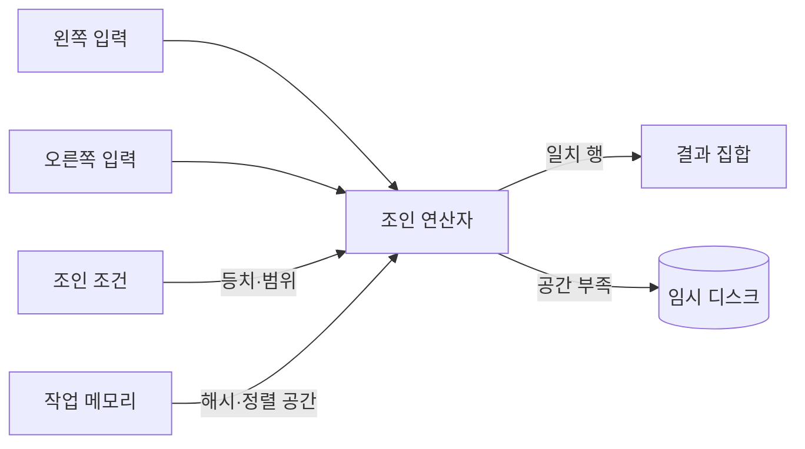
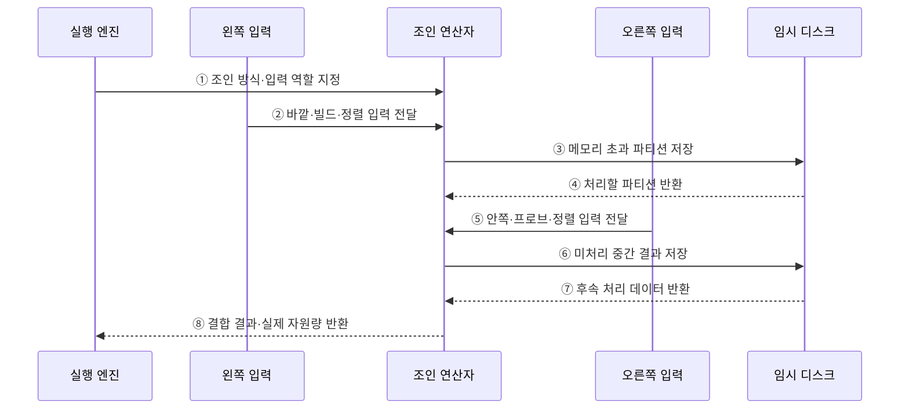

---
sidebar:
  order: 96
  label: "096. 조인 알고리즘 — NLJ·Hash Join·Merge Join (Join Algorithms)"
  badge:
    text: "기출 · 70%"
    variant: note
title: "096. 조인 알고리즘 — NLJ·Hash Join·Merge Join (Join Algorithms)"
date: "2026-07-27T23:59:59+09:00"
tags:
  - "notes-software"
weight: 96
extra:
  question_no: "096"
  source_status: "기출"
  source_history: "137회"
  priority: 70
  priority_note: "137회 기출, 조인 방식별 비용 선택 중요"
---

## 미리 알고가기

- **중첩 반복 조인(Nested Loops Join, NLJ)**: ‘엔엘제이’로 읽고 영문 머리글자를 딴 약어이며, 바깥 입력의 각 행마다 안쪽 입력에서 일치 행을 탐색함
- **해시 조인(Hash Join)**: 작은 입력으로 해시 테이블을 만들고 다른 입력의 등치 키로 일치 행을 찾음
- **병합 조인(Merge Join)**: 조인 키로 정렬된 두 입력을 순서대로 비교하며 일치 행을 결합함
- **바깥·안쪽 입력(Outer·Inner Input)**: 중첩 반복 조인에서 반복을 시작하는 입력과 각 반복마다 탐색하는 입력
- **빌드·프로브 입력(Build·Probe Input)**: 해시 테이블을 만드는 입력과 그 테이블에서 일치 키를 찾는 입력
- **해시 버킷(Hash Bucket)**: 같은 해시값의 키와 행을 모아 두는 저장 영역
- **디스크 유출(Spill to Disk)**: 작업 메모리 부족으로 해시·정렬 중간 결과를 임시 디스크에 쓰는 현상
- **카디널리티(Cardinality)**: 연산자에 입력되거나 출력되는 행의 수
- **입출력(Input/Output, I/O)**: ‘아이오’로 읽고 영문 머리글자를 딴 약어이며, 저장장치의 읽기·쓰기 동작

## Ⅰ. 개요

- 조인 알고리즘은 두 입력에서 조인 조건이 일치하는 행을 찾아 결합하는 물리적 처리 방식이다.
- 옵티마이저는 입력 크기·조인 조건·정렬 상태·인덱스·메모리를 고려해 중첩 반복·해시·병합 조인 중 비용이 낮은 방식을 선택한다.

### 쉽게 이해하기 (학습용)

- 한 명씩 명단을 찾거나, 색인표를 만들거나, 정렬된 두 명단을 나란히 읽는 방법 중 적합한 것을 고른다.

## Ⅱ. 특징

- **중첩 반복 조인**은 바깥 입력의 각 행마다 안쪽 입력을 찾는다.
- **해시 조인**은 작은 입력으로 해시 테이블을 만들고 다른 입력으로 탐색한다.
- **병합 조인**은 조인 키로 정렬된 두 입력을 순서대로 비교한다.
- 같은 SQL도 통계·메모리·인덱스에 따라 선택되는 방식이 달라질 수 있다.

### 쉽게 이해하기 (학습용)

- 결과 건수, 조인 조건, 정렬 여부, 작업 메모리에 따라 가장 적은 읽기와 비교를 만드는 방식이 달라진다.

## Ⅲ. 아키텍처 및 구성요소

**도표안 A — 구조도**

**도표안 B — sequenceDiagram**

| 구성요소 | 역할 |
|:---|:---|
| 입력 | 조인할 왼쪽·오른쪽 행 집합 |
| 조인 조건 | 등치·범위 등 행 결합 규칙 |
| 입력 역할 | NLJ의 바깥·안쪽, 해시의 빌드·프로브 지정 |
| 작업 메모리 | 해시 테이블·정렬·중간 결과 저장 |
| 임시 디스크 | 메모리 부족 시 파티션·정렬 결과 저장 |

**동작 원리**

- ① 실행 엔진이 선택된 조인 방식과 입력 역할을 조인 연산자에 지정한다.
- ② 왼쪽 입력이 바깥·빌드·정렬 입력 역할의 행을 전달한다.
- ③ 작업 메모리를 넘으면 조인 연산자가 일부 파티션을 임시 디스크에 저장한다.
- ④ 임시 디스크가 현재 처리할 파티션을 반환한다.
- ⑤ 오른쪽 입력이 안쪽·프로브·정렬 입력 역할의 행을 전달한다.
- ⑥ 메모리에 담지 못한 중간 결과를 임시 디스크에 저장한다.
- ⑦ 임시 디스크에서 후속 처리할 데이터를 다시 읽는다.
- ⑧ 조인 연산자가 결합 결과와 실제 메모리·유출량을 실행 엔진에 반환한다.

### 쉽게 이해하기 (학습용)

- 두 명단을 작업대에서 맞추다가 공간이 부족하면 일부를 임시 보관소에 두고 나누어 처리한다.

## Ⅳ. 종류 및 비교

| 방식 | 적합한 조건 | 처리 원리 | 주요 한계 |
|:---|:---|:---|:---|
| 중첩 반복 조인(NLJ) | 작은 바깥 입력, 효율적인 안쪽 탐색 | 바깥 행마다 안쪽 입력 탐색 | 바깥 행 증가 시 반복 읽기 폭증 |
| 해시 조인 | 큰 입력의 등치 조인 | 작은 입력으로 해시 생성 후 프로브 | 등치 조건 중심, 메모리 부족 시 유출 |
| 병합 조인 | 정렬된 입력, 등치·일부 범위 조인 | 두 정렬 입력을 순차 비교 | 미정렬 입력의 사전 정렬 비용 |

> “작은 입력”은 테이블 전체 크기가 아니라 앞선 필터를 통과해 조인 연산자에 실제 들어오는 행 수를 뜻한다.

### 쉽게 이해하기 (학습용)

- 소량은 하나씩 찾고, 대량 등치는 해시표로 찾고, 정렬된 명단은 나란히 읽는다.

## Ⅴ. 실무 고려사항 및 대책

| 고려사항 | 위험 | 대책 |
|:---|:---|:---|
| 입력 행 추정 | 잘못된 카디널리티로 부적합한 조인 선택 | 예상·실제 행 수 비교, 통계·조건 교정 |
| 입력 순서 | 큰 입력의 반복 탐색 또는 해시 빌드 | 필터 적용 시점과 빌드·바깥 입력 확인 |
| 인덱스 | NLJ 안쪽 탐색의 임의 읽기 폭증 | 조인 키 인덱스와 커버링 효과 검증 |
| 작업 메모리 | 해시·정렬의 디스크 유출 | 유출량 감시, 동시성 포함 메모리 조정 |
| 데이터 편향 | 특정 키에 행이 몰려 파티션 불균형 | 히스토그램·확장 통계·편향 처리 검토 |
| 병렬 실행 | 교환·재분배 비용이 이득 초과 | 병렬도와 네트워크·분배 비용 함께 측정 |

> **적용 사례**: 고객 한 명의 주문 조회는 인덱스 NLJ가 유리할 수 있지만 전체 고객 정산은 해시 조인의 순차 읽기가 유리할 수 있다.

### 쉽게 이해하기 (학습용)

- 같은 테이블도 한 고객을 찾을 때와 모든 고객을 처리할 때 알맞은 결합 방식이 다르다.

## Ⅵ. 결론

- 조인 알고리즘은 실제 입력 행 수·조건·정렬·인덱스·메모리에 따라 선택해야 한다.
- 실행 계획의 예상값과 실제 유출·읽기량을 비교해 통계와 접근 경로를 교정한다.

### 쉽게 이해하기 (학습용)

- 결합 방법을 외우기보다 들어오는 데이터 양과 준비 상태에 맞는 방법을 고른다.
