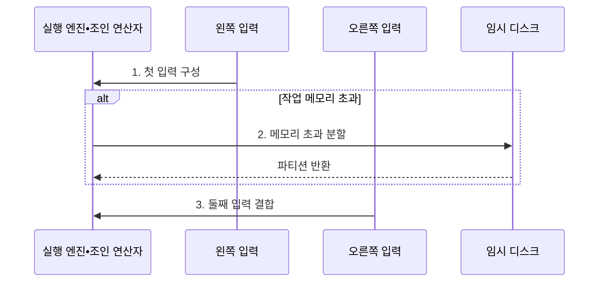

---
sidebar:
  order: 96
  label: "096. 조인 알고리즘: NLJ•Hash Join•Merge Join (Join Algorithms)"
  badge:
    text: "기출 • 70%"
    variant: note
title: "096. 조인 알고리즘: NLJ•Hash Join•Merge Join (Join Algorithms)"
date: "2026-08-03T09:19:05+09:00"
tags:
  - "notes-software"
weight: 96
extra:
  question_no: "096"
  source_status: "기출"
  source_history: "137회"
  priority: 70
  priority_note: "137회 기출, 조인 방식별 비용 선택 중요"
---

## Ⅰ. 개요

핵심 용어

- **조인 알고리즘(Join Algorithm)**: 조인 조건이 일치하는 두 입력 행을 실제로 찾아 결합하는 실행 방법이다.

- 정의/개념: 조건이 일치하는 두 입력 행을 결합하는 **실행 알고리즘**
- 배경/필요성: 단일 조인 방식은 **입력 규모 변화** 에 취약

#### 한줄 요약

- 한 명씩 찾기, 색인표 만들기, 정렬된 명단 함께 읽기 중 조건에 맞는 방법을 고른다.

## Ⅱ. 특징

핵심 용어

- **중첩 반복**: 바깥 입력의 각 행마다 안쪽 입력에서 일치 행을 탐색하는 방식이다.
- **해시 조인(Hash Join)**: 한 입력으로 해시 테이블을 만들고 다른 입력의 키로 일치 버킷을 탐색하는 방식이다.
- **병합 조인(Merge Join)**: 조인 키로 정렬된 두 입력을 동시에 순차 이동하며 일치 행을 결합하는 방식이다.

- **중첩 반복**: 바깥 행마다 안쪽 입력 탐색
- **해시 조인**: 빌드 해시로 프로브 입력 탐색
- **병합 조인**: 정렬된 두 입력을 순차 비교

#### 한줄 요약

- 결과 건수, 조인 조건, 정렬 여부, 작업 메모리에 따라 가장 적은 읽기와 비교를 만드는 방식이 달라진다.

## Ⅲ. 구조 및 구성요소

핵심 용어

- **조인 조건**: 두 입력 행을 결합할 등치•범위 비교 규칙이다.
- **입력 역할**: 알고리즘에 따라 왼쪽•오른쪽 입력을 바깥•안쪽 또는 빌드•프로브로 지정한 역할이다.
- **작업 메모리**: 해시 테이블•정렬 데이터•중간 결과를 보관하는 실행 공간이다.
- **임시 디스크**: 작업 메모리를 넘은 해시 파티션이나 정렬 중간 결과를 보관하는 저장 공간이다.

| 구성요소 | 책임 |
|:---|:---|
| 입력 | 조인할 **왼쪽•오른쪽 행** 제공 |
| 조인 조건 | **등치•범위 결합 규칙** 정의 |
| 입력 역할 | **바깥•안쪽•빌드•프로브** 지정 |
| 작업 메모리 | **해시•정렬•중간 결과** 저장 |
| 임시 디스크 | **메모리 초과 결과** 보관 |

#### 한줄 요약

- 두 입력의 역할과 조건, 작업 공간을 정해 조인 방식을 실행한다.

## Ⅳ. 흐름도

핵심 용어

- **1. 첫 입력 구성**: 선택한 조인 방식에 맞게 바깥•빌드•정렬 입력을 준비하는 단계이다.
- **2. 메모리 초과 분할**: 작업 공간을 넘은 데이터를 파티션으로 나눠 임시 디스크에 저장하는 단계이다.
- **3. 둘째 입력 결합**: 안쪽 인덱스 탐색이나 해시 프로브 또는 정렬 병합으로 일치 행을 찾는 단계이다.

**동작 원리**

- **1. 첫 입력 구성**: 바깥•빌드•정렬 입력 준비
- **2. 메모리 초과 분할**: 넘친 파티션을 임시 디스크에 저장
- **3. 둘째 입력 결합**: 안쪽 탐색•프로브•병합으로 매칭

#### 한줄 요약

- 두 명단을 작업대에서 맞추다가 공간이 부족하면 일부를 임시 보관소에 두고 나누어 처리한다.

## Ⅴ. 종류 및 비교

핵심 용어

- **해시 조인**: 큰 입력의 등치 조건에서 해시 테이블로 일치 행을 찾는 방식이다.
- **중첩 반복 조인(Nested Loop Join, NLJ)**: 바깥 입력의 각 행마다 안쪽 입력을 탐색해 일치 행을 찾는 방식이다.
- **병합 조인**: 정렬된 두 입력을 조인 키 순서로 나란히 읽으며 등치•범위 조건을 결합하는 방식이다.

| 판단 기준 | 중첩 반복 조인 | 해시 조인 | 병합 조인 |
|:---|:---|:---|:---|
| 적용 기준 | **작은 바깥•빠른 안쪽 탐색** | 큰 입력의 **등치 조인** | **정렬 입력•범위 조인** |
| 핵심 특징 | **바깥 행마다 안쪽 탐색** | **해시 생성 후 프로브** | **두 입력 순차 비교** |
| 한계 | **반복 읽기** 폭증 | **메모리 부족 시 유출** | **미정렬 입력의 정렬 비용** |

> “작은 입력”은 테이블 전체 크기가 아니라 앞선 필터를 통과해 조인 연산자에 실제 들어오는 행 수를 뜻

#### 한줄 요약

- 소량은 하나씩 찾고, 대량 등치는 해시표로 찾고, 정렬된 명단은 나란히 읽는다.

## Ⅵ. 실무 고려사항 및 대책

핵심 용어

- **예상•실제 행 비교와 통계 교정**: 조인 입력의 추정값과 실행값을 대조하고 분포 정보를 갱신해 알고리즘 오선택을 줄이는 활동이다.
- **필터 시점•입력 순서**: 조인 전에 행을 줄이는 위치와 어느 입력을 바깥•빌드로 둘지 정하는 실행 조건이다.
- **커버링 인덱스**: NLJ의 안쪽 탐색에 필요한 열을 모두 포함해 반복 원본 조회를 줄이는 인덱스이다.
- **유출량 감시•메모리 조정**: 임시 디스크로 넘어간 데이터 양을 관찰하고 동시 작업을 고려해 작업 메모리를 조절하는 활동이다.
- **히스토그램•확장 통계**: 값 빈도와 열 간 상관관계를 표현해 편향된 키의 행 수 추정을 개선하는 통계이다.

| 문제 | 대책 | 효과 |
|:---|:---|:---|
| 입력 행 추정 오차로 방식 오선택 | **예상•실제 행 비교** 와 통계 교정 | **잘못된 조인 선택** 방지 |
| 큰 입력을 바깥•빌드로 배치 | 필터 시점과 **입력 순서** 확인 | **반복 탐색•해시 크기** 감소 |
| 안쪽 입력의 반복 임의 읽기 | 조인 키의 **커버링 인덱스** 검증 | **NLJ 임의 읽기** 감소 |
| 작업 메모리 부족으로 디스크 유출 | **유출량 감시•메모리** 조정 | **디스크 유출** 감소 |
| 키 편향으로 파티션 부하 집중 | **히스토그램•확장 통계** 적용 | **파티션 불균형** 완화 |

> **적용 사례**: 고객 한 명의 주문 조회는 인덱스 NLJ, 전체 고객 정산은 해시 조인이 유리

#### 한줄 요약

- 같은 테이블도 한 고객을 찾을 때와 모든 고객을 처리할 때 알맞은 결합 방식이 다르다.

## Ⅶ. 결론

핵심 용어

- **NLJ**: 소량의 바깥 입력과 빠른 안쪽 인덱스 탐색에 적합한 조인 방식이다.
- **해시 조인**: 큰 입력의 등치 조건에서 한쪽 해시 테이블을 만든 뒤 다른 쪽을 프로브하는 방식이다.
- **병합 조인**: 두 입력이 조인 키로 정렬됐을 때 순차 비교로 결합하는 방식이다.

- 소량•인덱스는 **NLJ**, 대량 등치는 **해시**, 정렬 입력은 **병합** 선택

#### 한줄 요약

- 결합 방법을 외우기보다 들어오는 데이터 양과 준비 상태에 맞는 방법을 고른다.
