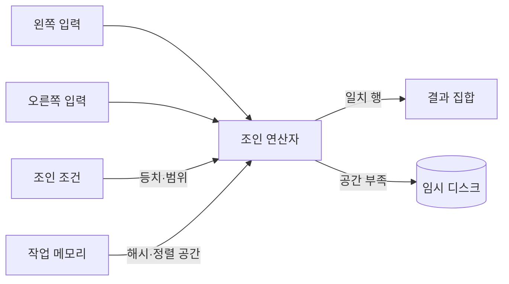
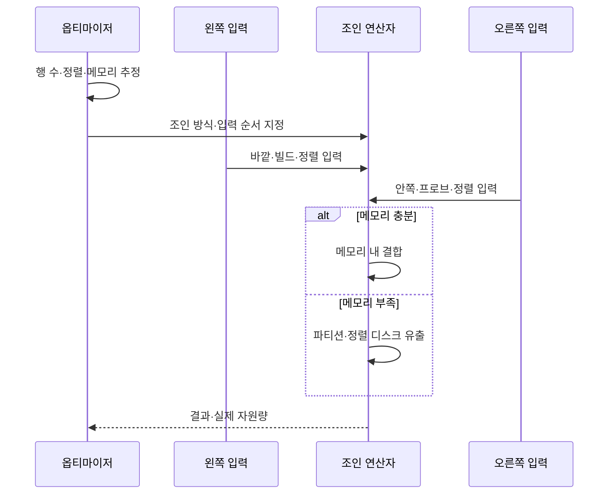

---
sidebar:
  order: 96
  label: "096. 조인 알고리즘 — NLJ·Hash Join·Merge Join (Join Algorithms)"
  badge:
    text: "기출 · 70%"
    variant: note
title: "096. 조인 알고리즘 — NLJ·Hash Join·Merge Join (Join Algorithms)"
date: "2026-07-27T23:59:59+09:00"
tags:
  - "notes-software"
weight: 96
extra:
  question_no: "096"
  source_status: "기출"
  source_history: "137회"
  priority: 70
  priority_note: "137회 기출, 조인 방식별 비용 선택 중요"
---

## 미리 알고가기

- **중첩 반복 조인(Nested Loops Join, NLJ)**: ‘엔엘제이’로 읽고 영문 머리글자를 딴 약어이며, 바깥 입력의 각 행마다 안쪽 입력에서 일치 행을 탐색함
- **해시 조인(Hash Join)**: 작은 입력으로 해시 테이블을 만들고 다른 입력의 등치 키로 일치 행을 찾음
- **병합 조인(Merge Join)**: 조인 키로 정렬된 두 입력을 순서대로 비교하며 일치 행을 결합함
- **바깥·안쪽 입력(Outer·Inner Input)**: 중첩 반복 조인에서 반복을 시작하는 입력과 각 반복마다 탐색하는 입력
- **빌드·프로브 입력(Build·Probe Input)**: 해시 테이블을 만드는 입력과 그 테이블에서 일치 키를 찾는 입력
- **해시 버킷(Hash Bucket)**: 같은 해시값의 키와 행을 모아 두는 저장 영역
- **디스크 유출(Spill to Disk)**: 작업 메모리 부족으로 해시·정렬 중간 결과를 임시 디스크에 쓰는 현상
- **카디널리티(Cardinality)**: 연산자에 입력되거나 출력되는 행의 수
- **입출력(Input/Output, I/O)**: ‘아이오’로 읽고 영문 머리글자를 딴 약어이며, 저장장치의 읽기·쓰기 동작

## Ⅰ. 개요

- 정의/개념: 조인 조건의 일치 행을 **서로 다른 방식으로 결합**
- 기존 한계: 단일 결합 방식은 **입력 크기·정렬·메모리 편차**에 취약

### 쉽게 이해하기 (학습용)

- 한 명씩 명단을 찾거나, 색인표를 만들거나, 정렬된 두 명단을 나란히 읽는 방법 중 적합한 것을 고른다.

## Ⅱ. 특징

- NLJ의 **소량 바깥 입력·인덱스 탐색**
- 해시 조인의 **대량 등치 결합**
- 병합 조인의 **정렬 입력·순차 결합**

### 쉽게 이해하기 (학습용)

- 결과 건수, 조인 조건, 정렬 여부, 작업 메모리에 따라 가장 적은 읽기와 비교를 만드는 방식이 달라진다.

## Ⅲ. 아키텍처 및 구성요소

| 구성요소 | 책임 |
|:---|:---|
| 왼쪽·오른쪽 입력 | 조인할 **행 집합 제공** |
| 조인 조건 | **등치·범위 결합 규칙** 제공 |
| 조인 연산자 | 반복·해시·병합의 **결합 수행** |
| 작업 메모리 | **해시 테이블·정렬 버퍼** 제공 |
| 임시 디스크 | 메모리 부족의 **중간 결과 저장** |

> 요약: 입력·조건·메모리가 조인 연산자의 비용을 결정

### 쉽게 이해하기 (학습용)

- 두 명단과 짝을 찾는 규칙, 작업 책상의 크기에 따라 어떤 결합 도구를 쓸지 정한다.

## Ⅳ. 원리 및 절차 흐름

| 절차 | 설명 |
|:---|:---|
| 비용 추정 | 입력 행·정렬·**메모리 요구 계산** |
| 방식·순서 지정 | 최저 비용의 **연산자·입력 역할 선택** |
| 입력 전달 | 방식별 **바깥·빌드·정렬 입력** 구성 |
| 메모리 내 결합 | 해시·비교의 **메모리 처리** |
| 디스크 유출 | 부족 공간의 **임시 분할·정렬** |
| 실측 반환 | 실제 행·유출량의 **계획 검증** |

> 요약: 추정 입력과 메모리로 방식을 선택하고 실측으로 검증

### 쉽게 이해하기 (학습용)

- 명단 크기와 정렬 상태를 예상해 작업법을 정하고 책상이 부족해 바닥까지 썼는지 결과로 확인한다.

## Ⅴ. 종류 및 비교

| 조인 방식 | 중첩 반복 조인 | 해시 조인 | 병합 조인 |
|:---|:---|:---|:---|
| 적용 기준 | 소량 바깥 행·**안쪽 인덱스** | 대량 입력·**등치 조건** | 정렬 입력·**등치·범위 조건** |
| 핵심 특징 | 바깥 행별 **안쪽 반복 탐색** | 빌드 해시의 **프로브 탐색** | 두 정렬 입력의 **순차 병합** |
| 한계 | 바깥 행 증가·**반복 읽기 폭증** | 메모리 부족·**디스크 유출** | 사전 정렬·**정렬 비용** |

> 요약: 입력량·조건·정렬·메모리로 조인 방식 선택

### 쉽게 이해하기 (학습용)

- 소수 행은 반복 탐색, 대량 등치는 해시표, 이미 정렬됐거나 범위 결합이면 병합이 유리하다.

## Ⅵ. 실무 사례

1. 단일 고객 주문 조회는 **고객 인덱스 NLJ** 적용

### 쉽게 이해하기 (학습용)

- 고객 한 명의 주문은 색인으로 반복 탐색하고, 대량 거래는 작은 코드표를 해시로 만들어 한 번에 맞춘다.

## Ⅶ. 결론

- 조인의 I/O와 메모리 비용을 최소화하기 위해 **입력 행 수·인덱스·등치 여부·정렬 상태·메모리 여유**를 검토하고, NLJ·해시·정렬 병합 조인 중 적합한 방식을 선택한다

### 쉽게 이해하기 (학습용)

- 조인 이름을 고정하지 말고 실제 입력 행 수와 정렬 상태, 메모리 여유를 기준으로 선택한다.
