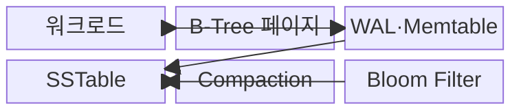
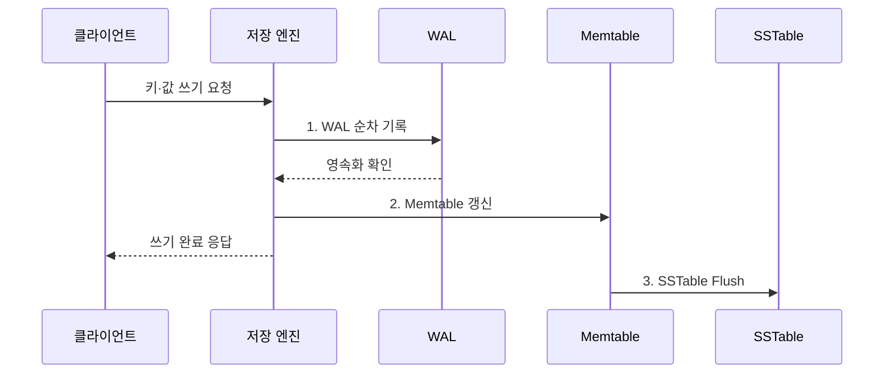

---
sidebar:
  order: 97
  label: "097. B-Tree vs LSM-Tree 비교 (B-Tree vs LSM-Tree)"
  badge:
    text: "기출 · 50%"
    variant: note
title: "B-Tree vs LSM-Tree 비교 (B-Tree vs LSM-Tree)"
date: "2026-08-02T12:00:00+09:00"
tags:
  - "notes-software"
weight: 97
extra:
  question_no: "097"
  source_status: "기출"
  source_history: "137회"
  priority: 50
  priority_note: "137회 기출, 쓰기·읽기 구조 절충 비교"
---

## Ⅰ. 개요

핵심 용어

- **제자리 갱신과 순차 병합**: B-Tree와 LSM-Tree의 저장·갱신 방식을 구분하는 핵심 차이이다.

- 정의/개념: **제자리 갱신과 순차 병합**을 대비한 저장 구조 비교
- 배경/필요성: 단일 저장 구조는 **읽기·쓰기 편향**에 취약

#### 한줄 요약

- B-Tree는 장부를 즉시 제자리에 고치고 LSM-Tree는 메모지에 모아 순서대로 저장한 뒤 나중에 합친다.

## Ⅱ. 특징

핵심 용어

- **컴팩션**: 여러 정렬 파일을 병합하며 중복과 삭제 표식을 정리하는 작업이다.

- **B-Tree**: 균형 트리와 제자리 페이지 갱신
- **LSM-Tree**: 메모리 흡수 후 정렬 파일 기록
- **컴팩션**: 중복 정리와 쓰기 증폭 발생

#### 한줄 요약

- 즉시 정리하면 읽기 경로가 짧고 몰아서 정리하면 쓰기가 효율적이지만 나중에 찾고 합치는 비용이 생긴다.

## Ⅲ. 구조 및 구성요소

핵심 용어

- **WAL·Memtable**: 변경을 복구 로그에 먼저 기록하고 메모리 정렬 구조에 누적하는 구성요소이다.

| 구성요소 | 책임 |
|:---|:---|
| B-Tree 페이지 | **정렬 탐색·갱신·분할** 수행 |
| 워크로드 | **읽기·쓰기 비율·지연 목표** 제공 |
| WAL·Memtable | **변경 복구·메모리 누적** |
| SSTable | **키순 불변 파일** 저장 |
| Compaction | **파일 병합·중복 정리** |
| Bloom Filter | **없는 키의 파일 읽기** 차단 |

#### 한줄 요약

- 즉시 고치는 페이지와 모아 병합하는 파일 구조의 구성 차이다.

## Ⅳ. 흐름도

핵심 용어

- **1. WAL 순차 기록**: 메모리 테이블 갱신 전에 복구 로그를 영속화하는 단계이다.

**동작 원리**

- **1. WAL 순차 기록**: Memtable보다 먼저 복구 로그 보존
- **2. Memtable 갱신**: 메모리 정렬 구조에 최신 값 반영
- **3. SSTable Flush**: 한도 도달 시 정렬 파일로 영속화

#### 한줄 요약

- LSM-Tree는 변경을 복구 장부와 메모리에 먼저 적고, 모이면 정렬 파일로 내려 쓴다.

## Ⅴ. 종류 및 비교

핵심 용어

- **B-Tree**: 정렬된 페이지를 제자리 갱신해 점 조회와 범위 조회에 안정적인 구조이다.

| 판단 기준 | B-Tree | LSM-Tree |
|:---|:---|:---|
| 적용 기준 | **점·범위 읽기·안정 지연** | 높은 **순차 쓰기 처리량** |
| 핵심 특징 | **정렬 페이지 제자리 갱신** | **WAL·Memtable 후 파일 병합** |
| 한계 | **페이지 분할·임의 쓰기** | **컴팩션·읽기·공간 증폭** |

> 선택 기준: 데이터 크기·캐시·저장장치·정책을 반영한 **읽기·쓰기 실측**

#### 한줄 요약

- B-Tree는 해당 장부를 바로 고치고, LSM-Tree는 새 조각을 빠르게 만든 뒤 나중에 합친다.

## Ⅵ. 실무 고려사항 및 대책

핵심 용어

- **컴팩션 적체로 쓰기 정체 발생**: 파일 병합이 쓰기 유입을 따라가지 못해 새 쓰기가 대기하는 문제이다.

| 문제 | 대책 | 효과 |
|:---|:---|:---|
| 평균 비율이 피크 부하를 은폐 | **점·범위·갱신·피크** 부하 측정 | **워크로드 오판** 방지 |
| 증폭 증가로 장치 수명·용량 저하 | **읽기·쓰기·공간 증폭** 계측 | **장치 수명·용량** 통제 |
| 컴팩션 적체로 쓰기 정체 발생 | **대역폭·백로그 경보** 조정 | **꼬리 지연** 감소 |
| 캐시와 쓰기 버퍼의 메모리 경쟁 | **캐시·쓰기 버퍼 예산** 분리 | **메모리 경쟁** 완화 |
| 긴 로그 재생으로 RTO 초과 | **체크포인트·플러시·RTO** 검증 | **재시작 지연** 통제 |

> **적용 사례**: 거래 원장의 점·범위 조회에는 B-Tree를, 고속 시계열 적재에는 LSM-Tree를 후보로 두되 실제 증폭과 p99 지연으로 선택

#### 한줄 요약

- 평균 속도뿐 아니라 정리 작업 중 가장 느린 응답과 저장장치 부담까지 비교해야 한다.

## Ⅶ. 결론

핵심 용어

- **LSM-Tree**: 쓰기 집중 워크로드에서 순차 기록과 후속 병합을 활용하는 저장 구조이다.

- 점·범위 읽기는 **B-Tree**, 쓰기 집중은 **LSM-Tree** 선택

#### 한줄 요약

- 바로 고칠지 모아 합칠지 결정하고, 찾기·쓰기·정리 비용을 모두 재어 선택한다.
