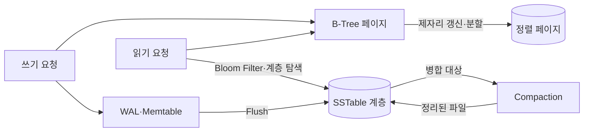
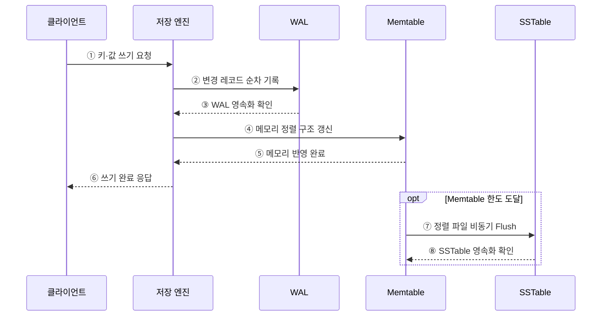

---
sidebar:
  order: 97
  label: "097. B-Tree vs LSM-Tree 비교 (B-Tree vs LSM-Tree)"
  badge:
    text: "기출 · 50%"
    variant: note
title: "B-Tree vs LSM-Tree 비교 (B-Tree vs LSM-Tree)"
date: "2026-07-27T23:59:59+09:00"
tags:
  - "notes-software"
weight: 97
extra:
  question_no: "097"
  source_status: "기출"
  source_history: "137회"
  priority: 50
  priority_note: "137회 기출, 쓰기·읽기 구조 절충 비교"
---

## 미리 알고가기

- **B-트리(B-Tree)**: ‘비 트리’로 읽고 Bayer·McCreight가 제안한 균형 트리의 관례 명칭이며, 정렬된 페이지를 제자리 갱신해 일정한 높이의 탐색 경로를 제공함
- **로그 구조 병합 트리(Log-Structured Merge-Tree, LSM-Tree)**: ‘엘에스엠 트리’로 읽고 영문 핵심 글자를 딴 약어이며, 쓰기를 메모리에 모아 정렬 파일로 내리고 계층별 병합함
- **쓰기 전 로그(Write-Ahead Log, WAL)**: ‘더블유에이엘’로 읽고 영문 머리글자를 딴 약어이며, 데이터 반영 전에 변경을 순차 기록해 장애 복구를 지원함
- **정렬 문자열 테이블(Sorted String Table, SSTable)**: ‘에스에스테이블’로 읽고 영문 핵심 글자를 딴 명칭이며, 키순으로 정렬된 불변 파일
- **메모리 테이블(Memtable)**: LSM-Tree가 새 쓰기를 키순으로 모아 두는 메모리 자료구조
- **블룸 필터(Bloom Filter)**: Burton Bloom의 성을 딴 확률 자료구조이며, 키가 특정 파일에 없음을 빠르게 판별해 불필요한 읽기를 줄임
- **컴팩션(Compaction)**: 여러 정렬 파일을 병합해 중복·삭제 표식을 정리하고 계층을 유지하는 작업
- **읽기·쓰기·공간 증폭**: 한 번의 논리 연산이 추가 읽기·재기록·중복 공간을 발생시키는 비율
- **쓰기 정체(Write Stall)**: 컴팩션이 쓰기 유입을 따라가지 못해 새 쓰기가 대기하는 현상

## Ⅰ. 개요

- B-Tree는 정렬된 페이지를 찾아 갱신하고, LSM-Tree는 쓰기를 메모리에 모아 불변 정렬 파일로 내린 뒤 병합한다.
- 두 구조는 읽기·쓰기·공간 증폭과 지연 안정성 사이에서 서로 다른 절충을 선택한다.

### 쉽게 이해하기 (학습용)

- B-Tree는 장부를 즉시 제자리에 고치고 LSM-Tree는 메모지에 모아 순서대로 저장한 뒤 나중에 합친다.

## Ⅱ. 특징

- **B-Tree**는 균형 트리의 짧은 탐색 경로와 정렬된 범위 읽기를 제공한다.
- **LSM-Tree**는 WAL과 Memtable로 쓰기를 흡수한 뒤 SSTable로 순차 기록한다.
- **컴팩션**은 LSM-Tree의 중복 버전과 삭제 표식을 정리하지만 쓰기 증폭과 지연 변동을 만든다.
- 캐시·블룸 필터·컴팩션 정책에 따라 실제 성능은 단순한 읽기/쓰기 비율 이상으로 달라진다.

### 쉽게 이해하기 (학습용)

- 즉시 정리하면 읽기 경로가 짧고 몰아서 정리하면 쓰기가 효율적이지만 나중에 찾고 합치는 비용이 생긴다.

## Ⅲ. 아키텍처 및 구성요소

**도표안 A — 구조도**

**도표안 B — sequenceDiagram**

| 구성요소 | 역할 |
|:---|:---|
| B-Tree 페이지 | 정렬 키 탐색과 페이지 내 갱신·분할 수행 |
| WAL | 데이터 반영 전 변경을 순차 기록해 복구 보장 |
| Memtable | 최신 쓰기를 메모리의 정렬 구조에 누적 |
| SSTable | 키순으로 정렬된 불변 파일 저장 |
| Compaction | SSTable 병합과 중복 버전·삭제 표식 정리 |
| Bloom Filter | 키가 없는 SSTable의 불필요한 읽기 차단 |

**동작 원리**

- ① 클라이언트가 LSM 기반 저장 엔진에 키·값 쓰기를 요청한다.
- ② 저장 엔진이 복구를 위해 변경 레코드를 WAL에 먼저 기록한다.
- ③ WAL이 영속 저장 완료를 저장 엔진에 알린다.
- ④ 저장 엔진이 같은 변경을 Memtable의 정렬 구조에 반영한다.
- ⑤ Memtable이 메모리 반영 완료를 저장 엔진에 알린다.
- ⑥ 저장 엔진이 내구성 정책을 충족한 쓰기 완료를 응답한다.
- ⑦ Memtable이 한도에 도달하면 불변 상태로 전환해 SSTable로 비동기 Flush한다.
- ⑧ SSTable 저장이 완료되면 해당 불변 Memtable을 해제할 수 있다.

### 쉽게 이해하기 (학습용)

- LSM-Tree는 변경을 복구 장부와 메모리에 먼저 적고, 모이면 정렬 파일로 내려 쓴다.

## Ⅳ. 종류 및 비교

| 비교 항목 | B-Tree | LSM-Tree |
|:---|:---|:---|
| 쓰기 경로 | 대상 페이지 탐색·갱신 | WAL·Memtable 후 순차 Flush |
| 읽기 경로 | 루트에서 리프까지 단일 트리 탐색 | Memtable과 여러 SSTable 후보 탐색 |
| 범위 조회 | 정렬된 리프 순차 읽기에 유리 | 여러 계층 결과의 병합 필요 |
| 쓰기 증폭 | 페이지 갱신·분할·로그 | 반복 컴팩션으로 파일 재작성 |
| 공간 증폭 | 빈 공간·페이지 단편화 | 중복 버전·삭제 표식·컴팩션 여유 공간 |
| 지연 위험 | 페이지 분할·캐시 미스 | Flush·Compaction·쓰기 정체 |

> LSM-Tree가 항상 쓰기에, B-Tree가 항상 읽기에 빠른 것은 아니다. 데이터 크기·캐시·저장장치·정책에 따라 실측해야 한다.

### 쉽게 이해하기 (학습용)

- B-Tree는 해당 장부를 바로 고치고, LSM-Tree는 새 조각을 빠르게 만든 뒤 나중에 합친다.

## Ⅴ. 실무 고려사항 및 대책

| 고려사항 | 위험 | 대책 |
|:---|:---|:---|
| 워크로드 | 평균 읽기·쓰기 비율만으로 오판 | 점·범위·갱신·삭제 비율과 피크 부하 측정 |
| 증폭 | 장치 처리량·수명·용량 초과 | 읽기·쓰기·공간 증폭을 함께 계측 |
| 컴팩션 | 백로그와 쓰기 정체로 꼬리 지연 증가 | 계층·크기 정책, 대역폭, 백로그 경보 조정 |
| 메모리 | 캐시·Memtable 경쟁 | 블록 캐시와 쓰기 버퍼 예산 분리 |
| 복구 | 큰 WAL·Memtable 재생으로 재시작 지연 | 체크포인트·Flush 주기와 복구시간 검증 |
| 저장장치 | HDD·SSD 특성을 무시한 설정 | 임의/순차 I/O와 내구성 요구 기반 벤치마크 |

> **적용 사례**: 거래 원장의 점·범위 조회에는 B-Tree를, 고속 시계열 적재에는 LSM-Tree를 후보로 두되 실제 증폭과 p99 지연으로 선택한다.

### 쉽게 이해하기 (학습용)

- 평균 속도뿐 아니라 정리 작업 중 가장 느린 응답과 저장장치 부담까지 비교해야 한다.

## Ⅵ. 결론

- B-Tree와 LSM-Tree의 차이는 제자리 페이지 갱신과 순차 기록 후 병합이라는 쓰기 경로에 있다.
- 워크로드별 읽기·쓰기·공간 증폭과 꼬리 지연을 측정해 저장 구조와 운영 정책을 함께 선택한다.

### 쉽게 이해하기 (학습용)

- 바로 고칠지 모아 합칠지 결정하고, 찾기·쓰기·정리 비용을 모두 재어 선택한다.
