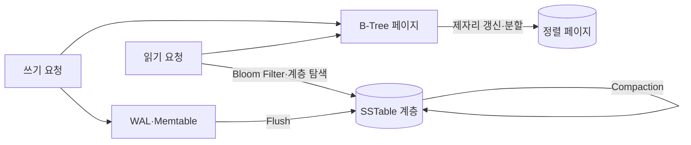
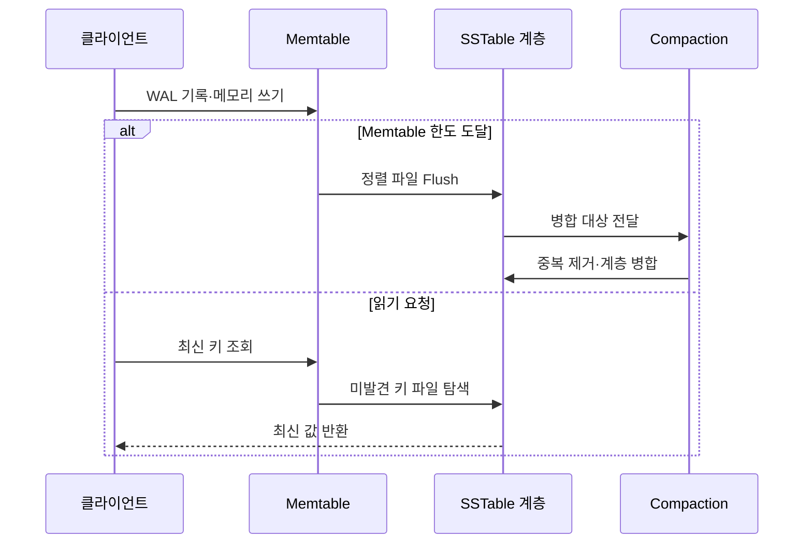

---
sidebar:
  order: 97
  label: "097. B-Tree vs LSM-Tree 비교 (B-Tree vs LSM-Tree)"
  badge:
    text: "기출 · 50%"
    variant: note
title: "B-Tree vs LSM-Tree 비교 (B-Tree vs LSM-Tree)"
date: "2026-07-27T23:59:59+09:00"
tags:
  - "notes-software"
weight: 97
extra:
  question_no: "097"
  source_status: "기출"
  source_history: "137회"
  priority: 50
  priority_note: "137회 기출, 쓰기·읽기 구조 절충 비교"
---

## 미리 알고가기

- **B-트리(B-Tree)**: ‘비 트리’로 읽고 Bayer·McCreight가 제안한 균형 트리의 관례 명칭이며, 정렬된 페이지를 제자리 갱신해 일정한 높이의 탐색 경로를 제공함
- **로그 구조 병합 트리(Log-Structured Merge-Tree, LSM-Tree)**: ‘엘에스엠 트리’로 읽고 영문 핵심 글자를 딴 약어이며, 쓰기를 메모리에 모아 정렬 파일로 내리고 계층별 병합함
- **쓰기 전 로그(Write-Ahead Log, WAL)**: ‘더블유에이엘’로 읽고 영문 머리글자를 딴 약어이며, 데이터 반영 전에 변경을 순차 기록해 장애 복구를 지원함
- **정렬 문자열 테이블(Sorted String Table, SSTable)**: ‘에스에스테이블’로 읽고 영문 핵심 글자를 딴 명칭이며, 키순으로 정렬된 불변 파일
- **메모리 테이블(Memtable)**: LSM-Tree가 새 쓰기를 키순으로 모아 두는 메모리 자료구조
- **블룸 필터(Bloom Filter)**: Burton Bloom의 성을 딴 확률 자료구조이며, 키가 특정 파일에 없음을 빠르게 판별해 불필요한 읽기를 줄임
- **컴팩션(Compaction)**: 여러 정렬 파일을 병합해 중복·삭제 표식을 정리하고 계층을 유지하는 작업
- **읽기·쓰기·공간 증폭**: 한 번의 논리 연산이 추가 읽기·재기록·중복 공간을 발생시키는 비율
- **쓰기 정체(Write Stall)**: 컴팩션이 쓰기 유입을 따라가지 못해 새 쓰기가 대기하는 현상

## Ⅰ. 개요

- 정의/개념: 제자리 갱신과 **순차 기록·병합 구조의 절충 비교**
- 기존 한계: 단일 저장 구조로는 **읽기·쓰기 비용 동시 최소화 불가**

### 쉽게 이해하기 (학습용)

- B-Tree는 장부를 즉시 제자리에 고치고 LSM-Tree는 메모지에 모아 순서대로 저장한 뒤 나중에 합친다.

## Ⅱ. 특징

- B-Tree의 **단일 탐색 경로·제자리 갱신**
- LSM-Tree의 **순차 쓰기·백그라운드 병합**
- 구조별 **읽기·쓰기·공간 증폭 절충**

### 쉽게 이해하기 (학습용)

- 즉시 정리하면 읽기 경로가 짧고 몰아서 정리하면 쓰기가 효율적이지만 나중에 찾고 합치는 비용이 생긴다.

## Ⅲ. 아키텍처 및 구성요소

| 구성요소 | 책임 |
|:---|:---|
| B-Tree 페이지 | 키의 **정렬 탐색·제자리 갱신** |
| WAL | 미반영 쓰기의 **순차 기록·복구** |
| Memtable | 쓰기의 **메모리 정렬·누적** |
| SSTable 계층 | 불변 파일의 **수준별 저장** |
| Compaction | 파일 병합과 **중복·삭제 정리** |
| Bloom Filter | 미존재 파일의 **불필요 탐색 차단** |

> 요약: B-Tree는 페이지 갱신, LSM-Tree는 불변 파일 병합

### 쉽게 이해하기 (학습용)

- 한쪽은 정렬 장부의 해당 쪽을 고치고 다른 쪽은 새 장부 조각을 만든 뒤 여러 조각을 주기적으로 합친다.

## Ⅳ. 원리 및 절차 흐름

| 절차 | 설명 |
|:---|:---|
| WAL·메모리 쓰기 | 변경의 **복구 기록·정렬 누적** |
| 정렬 파일 Flush | 한도 도달 시 **불변 파일 생성** |
| 병합 대상 전달 | 계층 기준의 **파일 선택** |
| 계층 병합 | 중복·삭제 정리와 **파일 재기록** |
| 최신 키 조회 | Memtable부터 **최신 버전 탐색** |
| 파일 탐색 | Bloom Filter로 **읽기 후보 축소** |

> 요약: LSM-Tree는 쓰기를 모아 내리고 계층 병합으로 정리

### 쉽게 이해하기 (학습용)

- 최신 메모지부터 찾고 없으면 최근 장부 조각부터 확인하며, 조각이 많아지면 오래된 내용을 합쳐 정리한다.

## Ⅴ. 종류 및 비교

| 저장 구조 | B-Tree | LSM-Tree |
|:---|:---|:---|
| 적용 기준 | 읽기 중심·**예측 가능한 지연** | 쓰기 중심·**높은 유입 처리량** |
| 핵심 특징 | 정렬 페이지의 **제자리 갱신** | 메모리 누적 후 **순차 Flush·병합** |
| 한계 | 임의 쓰기·**페이지 분할** | 읽기·쓰기 증폭·**컴팩션 정체** |

> 요약: 읽기 지연과 쓰기 처리량의 우선순위로 구조 선택

### 쉽게 이해하기 (학습용)

- 자주 읽고 즉시 찾는 장부는 B-Tree, 쓰기를 빠르게 모아 처리하는 기록소는 LSM-Tree가 적합하다.

## Ⅵ. 실무 사례

1. 거래 원장의 점·범위 조회는 **B-Tree 저장 엔진** 적용

### 쉽게 이해하기 (학습용)

- 거래 원장은 안정된 조회 경로를 쓰고 계속 쌓이는 로그는 쓰기를 모아 파일로 내린다.

## Ⅶ. 결론

- 읽기 지연 우선은 **B-Tree**, 쓰기 처리량 우선은 **LSM-Tree**

### 쉽게 이해하기 (학습용)

- 이름보다 실제 읽기·쓰기 비율과 증폭, 컴팩션이 지연에 미치는 영향을 측정해 선택한다.
