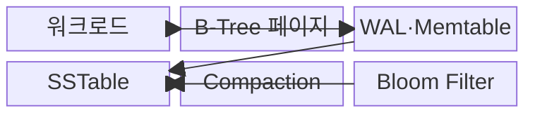
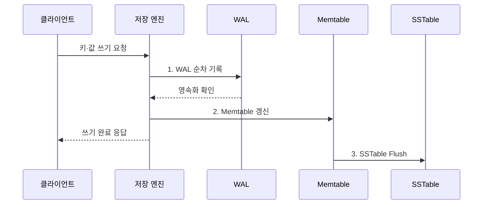

---
sidebar:
  order: 97
  label: "097. B-Tree vs LSM-Tree 비교 (B-Tree vs LSM-Tree)"
  badge:
    text: "기출 · 50%"
    variant: note
title: "B-Tree vs LSM-Tree 비교 (B-Tree vs LSM-Tree)"
date: "2026-07-30T15:38:00+09:00"
tags:
  - "notes-software"
weight: 97
extra:
  question_no: "097"
  source_status: "기출"
  source_history: "137회"
  priority: 50
  priority_note: "137회 기출, 쓰기·읽기 구조 절충 비교"
---

## 미리 알고가기

- **B-트리(B-Tree)**: ‘비 트리’로 읽고 Bayer·McCreight가 제안한 균형 트리의 관례 명칭이며, 정렬된 페이지를 제자리 갱신해 일정한 높이의 탐색 경로를 제공한다.
- **로그 구조 병합 트리(Log-Structured Merge-Tree, LSM-Tree)**: ‘엘에스엠 트리’로 읽고 영문 핵심 글자를 딴 약어이며, 쓰기를 메모리에 모아 정렬 파일로 내리고 계층별 병합한다.
- **쓰기 전 로그(Write-Ahead Log, WAL)**: ‘더블유에이엘’로 읽고 영문 머리글자를 딴 약어이며, 데이터 반영 전에 변경을 순차 기록해 장애 복구를 지원한다.
- **정렬 문자열 테이블(Sorted String Table, SSTable)**: ‘에스에스테이블’로 읽고 영문 핵심 글자를 딴 명칭이며, 키순으로 정렬된 불변 파일
- **메모리 테이블(Memtable)**: LSM-Tree가 새 쓰기를 키순으로 모아 두는 메모리 자료구조
- **블룸 필터(Bloom Filter)**: Burton Bloom의 성을 딴 확률 자료구조이며, 키가 특정 파일에 없음을 빠르게 판별해 불필요한 읽기를 줄이는 방식
- **컴팩션(Compaction)**: 여러 정렬 파일을 병합해 중복·삭제 표식을 정리하고 계층을 유지하는 작업
- **읽기·쓰기·공간 증폭**: 한 번의 논리 연산이 추가 읽기·재기록·중복 공간을 발생시키는 비율
- **쓰기 정체(Write Stall)**: 컴팩션이 쓰기 유입을 따라가지 못해 새 쓰기가 대기하는 현상
- **페이지 분할(Page Split)**: 가득 찬 B-Tree 페이지를 둘로 나누고 부모 키를 갱신하는 작업
- **플러시(Flush)**: 메모리의 변경 내용을 저장장치에 영속화하는 작업
- **캐시(Cache)**: 자주 읽는 페이지를 메모리에 보관해 저장장치 접근을 줄이는 영역
- **체크포인트(Checkpoint)**: 복구 시작점을 줄이도록 현재 저장 상태를 기록하는 지점
- **복구 시간 목표(Recovery Time Objective, RTO)**: 장애 후 서비스를 복구해야 하는 목표 시간
- **99백분위 지연(99th Percentile Latency, p99)**: ‘피 구십구’로 읽으며 요청의 99%가 완료되는 지연값

## Ⅰ. 개요

- 정의/개념: **제자리 갱신과 순차 병합**을 대비한 저장 구조 비교
- 배경/필요성: 단일 저장 구조는 **읽기·쓰기 편향**에 취약

### 쉽게 이해하기 (학습용)

- B-Tree는 장부를 즉시 제자리에 고치고 LSM-Tree는 메모지에 모아 순서대로 저장한 뒤 나중에 합친다.

## Ⅱ. 특징

- **B-Tree**: 균형 트리와 제자리 페이지 갱신
- **LSM-Tree**: 메모리 흡수 후 정렬 파일 기록
- **컴팩션**: 중복 정리와 쓰기 증폭 발생

### 쉽게 이해하기 (학습용)

- 즉시 정리하면 읽기 경로가 짧고 몰아서 정리하면 쓰기가 효율적이지만 나중에 찾고 합치는 비용이 생긴다.

## Ⅲ. 구조 및 구성요소

| 구성요소 | 책임 |
|:---|:---|
| B-Tree 페이지 | 정렬 탐색과 갱신·분할 수행 |
| 워크로드 | 읽기·쓰기 비율과 지연 목표 제공 |
| WAL·Memtable | 변경 복구와 메모리 누적 |
| SSTable | 키순 불변 파일 저장 |
| Compaction | 파일 병합과 중복 정리 |
| Bloom Filter | 없는 키의 파일 읽기 차단 |

### 쉽게 이해하기 (학습용)

- 즉시 고치는 페이지와 모아 병합하는 파일 구조의 구성 차이다.

## Ⅳ. 흐름도

**동작 원리**

- **1. WAL 순차 기록**: Memtable보다 먼저 복구 로그 보존
- **2. Memtable 갱신**: 메모리 정렬 구조에 최신 값 반영
- **3. SSTable Flush**: 한도 도달 시 정렬 파일로 영속화

### 쉽게 이해하기 (학습용)

- LSM-Tree는 변경을 복구 장부와 메모리에 먼저 적고, 모이면 정렬 파일로 내려 쓴다.

## Ⅴ. 종류 및 비교

| 판단 기준 | **B-Tree** | **LSM-Tree** |
|:---|:---|:---|
| 적용 기준 | 점·범위 읽기와 안정 지연 | 높은 순차 쓰기 처리량 |
| 핵심 특징 | 정렬 페이지 제자리 갱신 | WAL·Memtable 후 파일 병합 |
| 한계 | 페이지 분할·임의 쓰기 | 컴팩션·읽기·공간 증폭 |

> 선택 기준: 데이터 크기·캐시·저장장치·정책을 반영한 **읽기·쓰기 실측**

### 쉽게 이해하기 (학습용)

- B-Tree는 해당 장부를 바로 고치고, LSM-Tree는 새 조각을 빠르게 만든 뒤 나중에 합친다.

## Ⅵ. 실무 고려사항 및 대책

| 고려사항 | 대책 | 효과 |
|:---|:---|:---|
| 평균 비율이 피크 부하를 은폐 | **점·범위·갱신·피크** 부하 측정 | 워크로드 오판 방지 |
| 증폭 증가로 장치 수명·용량 저하 | **읽기·쓰기·공간 증폭** 계측 | 장치 수명·용량 통제 |
| 컴팩션 적체로 쓰기 정체 발생 | **대역폭·백로그 경보** 조정 | 꼬리 지연 감소 |
| 캐시와 쓰기 버퍼의 메모리 경쟁 | **캐시·쓰기 버퍼 예산** 분리 | 메모리 경쟁 완화 |
| 긴 로그 재생으로 RTO 초과 | **체크포인트·플러시·RTO** 검증 | 재시작 지연 통제 |

> **적용 사례**: 거래 원장의 점·범위 조회에는 B-Tree를, 고속 시계열 적재에는 LSM-Tree를 후보로 두되 실제 증폭과 p99 지연으로 선택

### 쉽게 이해하기 (학습용)

- 평균 속도뿐 아니라 정리 작업 중 가장 느린 응답과 저장장치 부담까지 비교해야 한다.

## Ⅶ. 결론

- 점·범위 읽기는 **B-Tree**, 쓰기 집중은 **LSM-Tree** 선택

### 쉽게 이해하기 (학습용)

- 바로 고칠지 모아 합칠지 결정하고, 찾기·쓰기·정리 비용을 모두 재어 선택한다.
