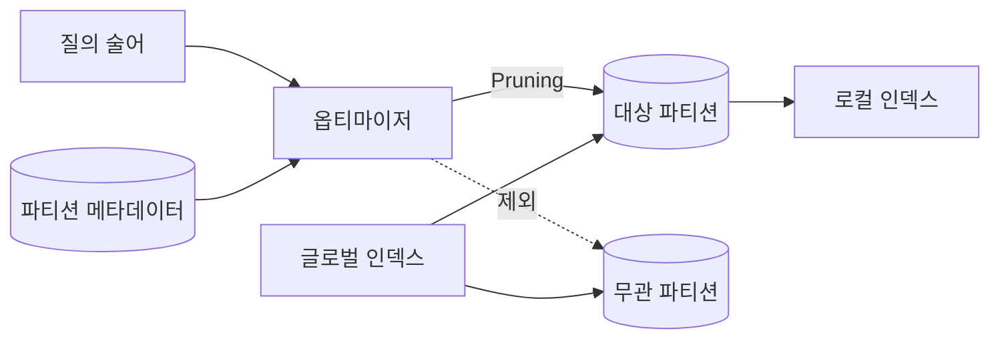
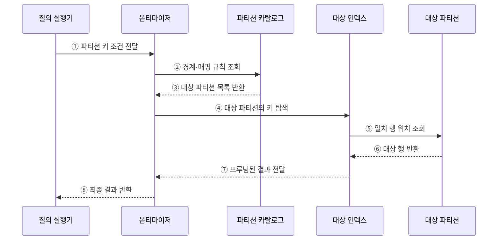

---
sidebar:
  order: 98
  label: "098. 파티셔닝 — 범위·해시·리스트 (Partitioning)"
  badge:
    text: "미출제 · 50%"
    variant: note
title: "파티셔닝 — 범위·해시·리스트 (Partitioning)"
date: "2026-07-25T18:30:00+09:00"
tags:
  - "notes-software"
weight: 98
extra:
  question_no: "098"
  source_status: "미출제"
  source_history: ""
  priority: 50
  priority_note: "파티션 키·분할 방식은 대용량 설계 핵심"
---

## 미리 알고가기

- **파티셔닝(Partitioning)**: 한 테이블·인덱스를 여러 논리 저장 단위로 나누는 기법
- **파티션 프루닝(Partition Pruning)**: 질의와 무관한 파티션을 실행 대상에서 제외하는 최적화
- **파티션 키(Partition Key)**: 각 행이 저장될 파티션을 결정하는 열·표현식
- **로컬 인덱스(Local Index)**: 각 파티션의 데이터만 별도로 색인하는 구조
- **글로벌 인덱스(Global Index)**: 여러 파티션의 데이터를 하나의 키 구조로 색인하는 구조
- **질의 술어(Query Predicate)**: 조회할 행이 만족해야 하는 조건식
- **데이터 편중(Data Skew)**: 일부 파티션에 데이터·요청이 과도하게 몰리는 현상
- **수명주기(Lifecycle)**: 데이터의 생성·사용·보관·삭제 단계

## Ⅰ. 개요

- 파티셔닝은 대용량 테이블·인덱스를 키 규칙에 따라 여러 논리 단위로 나누는 기법이다.
- 질의 범위와 파티션 키가 맞으면 프루닝으로 읽기 범위를 줄이고 보관·삭제도 파티션 단위로 수행할 수 있다.

### 쉽게 이해하기 (학습용)

- 자료를 날짜나 고객별 서랍으로 나누고 필요한 서랍만 여는 방식이다.

## Ⅱ. 특징

- 파티션 키 조건으로 무관한 범위를 읽기에서 제외한다.
- 삭제·보관·재구성을 파티션 단위로 처리한다.
- 키가 질의 조건과 다르면 프루닝 이득을 얻지 못한다.
- 특정 파티션 집중은 부하 편중과 관리 비용을 키운다.

### 쉽게 이해하기 (학습용)

- 나누는 기준이 나쁘면 한 서랍만 가득 차거나 조회할 때 모든 서랍을 열게 된다.

## Ⅲ. 아키텍처 및 구성요소

**도표안 A — 구조도**

**도표안 B — sequenceDiagram**

| 구성요소 | 역할 |
|:---|:---|
| 파티션 키 | 행의 저장 위치와 프루닝 가능성 결정 |
| 매핑 규칙 | 범위·해시·목록으로 키를 파티션에 대응 |
| 파티션 카탈로그 | 경계·위치·상태 등 메타데이터 관리 |
| 로컬·글로벌 인덱스 | 파티션 내부 또는 전체 파티션의 키 탐색 |
| 수명주기 작업 | 파티션 추가·분할·교환·병합·삭제 수행 |

**동작 원리**

- ① 질의 실행기가 파티션 키를 포함한 조건을 옵티마이저에 전달한다.
- ② 옵티마이저가 카탈로그에서 파티션 경계와 매핑 규칙을 조회한다.
- ③ 카탈로그가 조건에 해당하는 파티션 목록을 반환한다.
- ④ 옵티마이저가 대상 파티션의 인덱스만 탐색한다.
- ⑤ 인덱스가 일치하는 행 위치로 대상 파티션을 조회한다.
- ⑥ 대상 파티션이 조건을 만족하는 행을 반환한다.
- ⑦ 인덱스가 프루닝된 조회 결과를 옵티마이저에 전달한다.
- ⑧ 옵티마이저가 최종 결과를 질의 실행기에 반환한다.

### 쉽게 이해하기 (학습용)

- 날짜 조건을 경계표와 대조해 해당 기간의 서랍과 색인만 읽는다.

## Ⅳ. 종류 및 비교

| 방식 | 분할 기준 | 적합한 상황 | 주요 위험 |
|:---|:---|:---|:---|
| 범위 파티셔닝 | 연속 값 구간 | 시계열 조회·기간별 보관 | 최신 구간 집중·경계 관리 |
| 해시 파티셔닝 | 해시 함수 결과 | 균등 분산·점 조회 | 범위 프루닝 약화·재분할 |
| 리스트 파티셔닝 | 명시한 값 집합 | 지역·업무 유형별 관리 | 새 값 누락·목록 관리 |
| 복합 파티셔닝 | 두 방식의 계층 조합 | 기간 분리와 부하 분산 동시 요구 | 파티션 수·운영 복잡성 증가 |

> 파티셔닝은 물리·논리 관리 범위를 나누는 기법이며 여러 독립 DB 노드로 데이터를 분산하는 샤딩과는 범위가 다르다.

### 쉽게 이해하기 (학습용)

- 범위는 기간, 해시는 균등 분배, 리스트는 정해진 업무 구분에 알맞다.

## Ⅴ. 실무 고려사항 및 대책

| 고려사항 | 위험 | 대책 |
|:---|:---|:---|
| 파티션 키 | 주요 질의에 키 조건이 없어 전체 탐색 | 실제 술어·조인·보관 기준으로 키 선정 |
| 파티션 수 | 너무 많거나 큰 파티션으로 계획·관리 지연 | 행 수·크기·보관 주기에 맞춘 단위 설정 |
| 데이터 편중 | 특정 파티션의 저장·요청 집중 | 분포 측정, 하위 해시 분할·경계 조정 |
| 인덱스 | 글로벌 인덱스가 파티션 작업을 방해 | 로컬 우선 검토, 글로벌 유지 비용 검증 |
| 수명주기 | 미래 파티션 누락·보관 실패 | 자동 생성·교환·삭제와 경계 경보 |
| 프루닝 | 함수·형 변환으로 키 조건 인식 실패 | 실행 계획에서 실제 대상 파티션 확인 |

> **적용 사례**: 주문을 월별 범위 파티션으로 나누면 최근 조회는 관련 월만 읽고 오래된 주문은 파티션 단위로 보관할 수 있다.

### 쉽게 이해하기 (학습용)

- 서랍을 나눈 뒤에는 필요한 서랍만 열리는지와 한 서랍에 자료가 몰리지 않는지 확인해야 한다.

## Ⅵ. 결론

- 파티셔닝의 핵심은 분할 자체가 아니라 질의 프루닝과 데이터 수명주기 관리이다.
- 주요 질의 조건·데이터 분포·보관 정책에 맞는 키를 선택하고 프루닝 비율과 편중을 지속해서 측정해야 한다.

### 쉽게 이해하기 (학습용)

- 잘 나눈 서랍은 필요한 곳만 열게 하고 오래된 자료를 서랍째 정리하게 한다.
