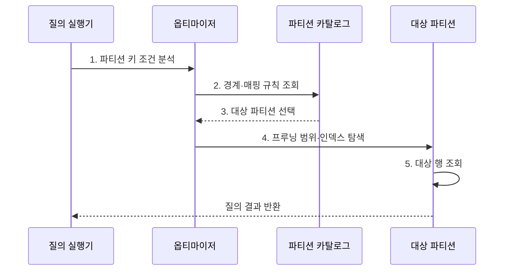

---
sidebar:
  order: 98
  label: "098. 파티셔닝: 범위·해시·리스트 (Partitioning)"
  badge:
    text: "미출제 · 50%"
    variant: note
title: "파티셔닝: 범위·해시·리스트 (Partitioning)"
date: "2026-08-02T12:00:00+09:00"
tags:
  - "notes-software"
weight: 98
extra:
  question_no: "098"
  source_status: "미출제"
  source_history: ""
  priority: 50
  priority_note: "파티션 키·분할 방식은 대용량 설계 핵심"
---

## Ⅰ. 개요

핵심 용어

- **테이블을 논리 단위로 나누는 기법**: 파티션 키 규칙에 따라 하나의 테이블을 여러 저장 단위로 분리하는 기법이다.

- 정의/개념: 키 규칙으로 **테이블을 논리 단위로 나누는 기법**
- 배경/필요성: 단일 저장 단위는 **전체 탐색·대용량 데이터 수명주기 관리** 부담

#### 한줄 요약

- 자료를 날짜나 고객별 서랍으로 나누고 필요한 서랍만 여는 방식이다.

## Ⅱ. 특징

핵심 용어

- **프루닝**: 질의 조건과 무관한 파티션을 실행 대상에서 제외하는 최적화이다.

- **프루닝**: 무관한 파티션을 읽기에서 제외
- **수명주기**: 삭제·보관을 파티션 단위 처리
- **키 민감성**: 질의 불일치·편중 시 효과 저하

#### 한줄 요약

- 나누는 기준이 나쁘면 한 서랍만 가득 차거나 조회할 때 모든 서랍을 열게 된다.

## Ⅲ. 구조 및 구성요소

핵심 용어

- **파티션 키**: 각 행의 저장 위치와 질의 시 프루닝 가능성을 결정하는 열 또는 표현식이다.

| 구성요소 | 책임 |
|:---|:---|
| 파티션 키 | **저장 위치·프루닝 가능성** 결정 |
| 매핑 규칙 | **범위·해시·목록**으로 위치 대응 |
| 파티션 카탈로그 | **경계·위치·상태** 관리 |
| 로컬·글로벌 인덱스 | **내부·전체 키** 탐색 |
| 수명주기 작업 | **추가·분할·교환·삭제** 수행 |

#### 한줄 요약

- 키와 경계표로 저장 위치를 나누고 필요한 파티션만 읽는다.

## Ⅳ. 흐름도

핵심 용어

- **3. 대상 파티션 선택**: 조건과 겹치지 않는 파티션을 제외하고 실제 접근 범위를 정하는 단계이다.

**동작 원리**

- **1. 파티션 키 조건 분석**: 질의 술어에서 키 범위 추출
- **2. 경계·매핑 규칙 조회**: 카탈로그를 확인
- **3. 대상 파티션 선택**: 조건과 겹치지 않는 범위 제외
- **4. 프루닝 범위·인덱스 탐색**: 선택된 파티션의 인덱스만 접근
- **5. 대상 행 조회**: 남은 파티션에서 조건 결과 반환

#### 한줄 요약

- 날짜 조건을 경계표와 대조해 해당 기간의 서랍과 색인만 읽는다.

## Ⅴ. 종류 및 비교

핵심 용어

- **범위 파티셔닝**: 연속 값 구간으로 데이터를 나눠 시계열 조회와 기간별 보관에 적합한 방식이다.

| 판단 기준 | 범위 파티셔닝 | 해시 파티셔닝 | 리스트 파티셔닝 |
|:---|:---|:---|:---|
| 적용 기준 | **시계열·기간 보관** | **균등 분산·점 조회** | **지역·업무 유형** |
| 핵심 특징 | **연속 값 구간 분할** | **해시 결과로 분할** | **명시 값 집합 분할** |
| 한계 | **최신 구간 집중** | **범위 프루닝 약화** | **새 값 누락·목록 관리** |

> 파티셔닝은 물리·논리 관리 범위를 나누는 기법이며 여러 독립 DB 노드로 데이터를 분산하는 샤딩과는 범위가 상이

#### 한줄 요약

- 범위는 기간, 해시는 균등 분배, 리스트는 정해진 업무 구분에 알맞다.

## Ⅵ. 실무 고려사항 및 대책

핵심 용어

- **술어와 파티션 키가 불일치**: 질의 조건으로 대상 파티션을 좁히지 못해 전체 탐색이 발생하는 문제이다.

| 문제 | 대책 | 효과 |
|:---|:---|:---|
| 술어와 파티션 키가 불일치 | **술어·조인·보관 기준**으로 선정 | **전체 탐색** 방지 |
| 과도한 파티션 수로 계획 지연 | **크기·보관 주기**에 맞춘 단위 설정 | **계획·관리 지연** 감소 |
| 데이터 편중으로 저장·요청 집중 | **분포 측정·하위 해시** 적용 | **저장·요청 집중** 완화 |
| 글로벌 인덱스가 파티션 작업 방해 | **로컬 우선·글로벌 비용** 검증 | **파티션 작업 영향** 감소 |
| 미래 파티션 누락으로 적재 실패 | **자동 생성·경계 경보** 적용 | **미래 파티션 누락** 방지 |

> **적용 사례**: 주문을 월별로 나누면 최근 조회 범위를 줄이고 오래된 주문을 파티션째 보관

#### 한줄 요약

- 서랍을 나눈 뒤에는 필요한 서랍만 열리는지와 한 서랍에 자료가 몰리지 않는지 확인해야 한다.

## Ⅶ. 결론

핵심 용어

- **범위**: 기간 조회와 보관 주기로 데이터를 나눌 때 적합한 파티션 방식이다.

- 기간·보관은 **범위**, 균등 점 조회는 **해시**, 업무 값은 **리스트** 선택

#### 한줄 요약

- 잘 나눈 서랍은 필요한 곳만 열게 하고 오래된 자료를 서랍째 정리하게 한다.
