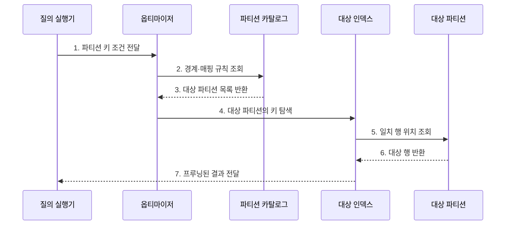

---
sidebar:
  order: 98
  label: "098. 파티셔닝: 범위·해시·리스트 (Partitioning)"
  badge:
    text: "미출제 · 50%"
    variant: note
title: "파티셔닝: 범위·해시·리스트 (Partitioning)"
date: "2026-07-25T18:30:00+09:00"
tags:
  - "notes-software"
weight: 98
extra:
  question_no: "098"
  source_status: "미출제"
  source_history: ""
  priority: 50
  priority_note: "파티션 키·분할 방식은 대용량 설계 핵심"
---

## 미리 알고가기

- **파티셔닝(Partitioning)**: 한 테이블·인덱스를 여러 논리 저장 단위로 나누는 기법
- **파티션 프루닝(Partition Pruning)**: 질의와 무관한 파티션을 실행 대상에서 제외하는 최적화
- **파티션 키(Partition Key)**: 각 행이 저장될 파티션을 결정하는 열·표현식
- **로컬 인덱스(Local Index)**: 각 파티션의 데이터만 별도로 색인하는 구조
- **글로벌 인덱스(Global Index)**: 여러 파티션의 데이터를 하나의 키 구조로 색인하는 구조
- **질의 술어(Query Predicate)**: 조회할 행이 만족해야 하는 조건식
- **데이터 편중(Data Skew)**: 일부 파티션에 데이터·요청이 과도하게 몰리는 현상
- **수명주기(Lifecycle)**: 데이터의 생성·사용·보관·삭제 단계

## Ⅰ. 개요

- 정의/개념: 키 규칙으로 **테이블을 논리 단위로 나누는 기법**
- 배경/필요성: 읽기 범위와 수명주기 작업 축소

### 쉽게 이해하기 (학습용)

- 자료를 날짜나 고객별 서랍으로 나누고 필요한 서랍만 여는 방식이다.

## Ⅱ. 특징

- **프루닝**: 무관한 파티션을 읽기에서 제외
- **수명주기**: 삭제·보관을 파티션 단위 처리
- **키 민감성**: 질의 불일치·편중 시 효과 저하

### 쉽게 이해하기 (학습용)

- 나누는 기준이 나쁘면 한 서랍만 가득 차거나 조회할 때 모든 서랍을 열게 된다.

## Ⅲ. 구조 및 구성요소

| 구성요소 | 책임 |
|:---|:---|
| 파티션 키 | 저장 위치와 프루닝 가능성 결정 |
| 매핑 규칙 | 범위·해시·목록으로 위치 대응 |
| 파티션 카탈로그 | 경계·위치·상태 관리 |
| 로컬·글로벌 인덱스 | 내부·전체 키 탐색 |
| 수명주기 작업 | 추가·분할·교환·삭제 수행 |

### 쉽게 이해하기 (학습용)

- 키와 경계표로 저장 위치를 나누고 필요한 파티션만 읽는다.

## Ⅳ. 흐름도

**동작 원리**

- **1. 파티션 키 조건 전달**: 질의 술어를 전달
- **2. 경계·매핑 규칙 조회**: 카탈로그를 확인
- **3. 대상 파티션 목록 반환**: 읽을 범위를 선택
- **4. 대상 파티션의 키 탐색**: 필요한 인덱스만 확인
- **5. 일치 행 위치 조회**: 대상 데이터를 검색
- **6. 대상 행 반환**: 조건 결과를 전달
- **7. 프루닝된 결과 전달**: 제외 후 결과를 반환

### 쉽게 이해하기 (학습용)

- 날짜 조건을 경계표와 대조해 해당 기간의 서랍과 색인만 읽는다.

## Ⅴ. 종류 및 비교

| 판단 기준 | 범위 파티셔닝 | 해시 파티셔닝 | 리스트 파티셔닝 |
|:---|:---|:---|:---|
| 적용 기준 | 시계열·기간 보관 | 균등 분산·점 조회 | 지역·업무 유형 |
| 핵심 특징 | 연속 값 구간 분할 | 해시 결과로 분할 | 명시 값 집합 분할 |
| 한계 | 최신 구간 집중 | 범위 프루닝 약화 | 새 값 누락·목록 관리 |

> 파티셔닝은 물리·논리 관리 범위를 나누는 기법이며 여러 독립 DB 노드로 데이터를 분산하는 샤딩과는 범위가 상이

### 쉽게 이해하기 (학습용)

- 범위는 기간, 해시는 균등 분배, 리스트는 정해진 업무 구분에 알맞다.

## Ⅵ. 실무 고려사항 및 대책

| 고려사항 | 대책 | 효과 |
|:---|:---|:---|
| 파티션 키 | 술어·조인·보관 기준으로 선정 | 전체 탐색 방지 |
| 파티션 수 | 크기·보관 주기에 맞춘 단위 설정 | 계획·관리 지연 감소 |
| 데이터 편중 | 분포 측정과 하위 해시·경계 조정 | 저장·요청 집중 완화 |
| 인덱스 | 로컬 우선과 글로벌 비용 검증 | 파티션 작업 영향 감소 |
| 수명주기 | 자동 생성·삭제와 경계 경보 | 미래 파티션 누락 방지 |

> **적용 사례**: 주문을 월별 범위 파티션으로 나누면 최근 조회는 관련 월만 읽고 오래된 주문은 파티션 단위로 보관할 수 존재

### 쉽게 이해하기 (학습용)

- 서랍을 나눈 뒤에는 필요한 서랍만 열리는지와 한 서랍에 자료가 몰리지 않는지 확인해야 한다.

## Ⅶ. 결론

- **질의 조건·데이터 분포·보관 정책**으로 파티션 키를 결정

### 쉽게 이해하기 (학습용)

- 잘 나눈 서랍은 필요한 곳만 열게 하고 오래된 자료를 서랍째 정리하게 한다.
