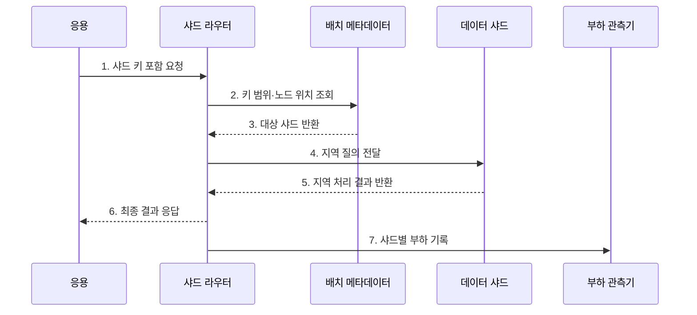

---
sidebar:
  order: 99
  label: "099. 샤딩: 수평 분할 (Sharding)"
  badge:
    text: "기출 · 50%"
    variant: note
title: "샤딩: 수평 분할 (Sharding)"
date: "2026-07-27T23:59:59+09:00"
tags:
  - "notes-software"
weight: 99
extra:
  question_no: "099"
  source_status: "기출"
  source_history: "123회"
  priority: 50
  priority_note: "123회 기출, 샤드 키·재분배 설계 가치"
---

## 미리 알고가기

- **샤딩(Sharding)**: 하나의 논리 데이터 집합을 행 단위로 분할해 여러 노드에 저장·처리하는 수평 분산 방식
- **샤드 키(Shard Key)**: 각 행이 저장될 샤드를 결정하는 열 또는 값
- **샤드 라우터(Shard Router)**: 요청의 샤드 키와 배치 정보를 이용해 대상 샤드로 전달하는 구성요소
- **재샤딩(Resharding)**: 샤드 수·범위·데이터 배치를 다시 조정하는 작업
- **수평 확장(Scale-out)**: 단일 서버의 성능 대신 노드 수를 늘려 용량·처리량을 높이는 방식
- **교차 샤드 질의(Cross-shard Query)**: 둘 이상의 샤드에 요청을 보내 결과를 결합하는 질의
- **분산 트랜잭션(Distributed Transaction)**: 여러 샤드의 변경을 하나의 논리 작업으로 조정하는 트랜잭션
- **팬아웃(Fan-out)**: 하나의 요청을 여러 샤드에 보내고 결과를 모으는 처리
- **핫스팟(Hotspot)**: 데이터나 요청이 특정 샤드에 집중되어 병목이 발생한 상태
- **재균형(Rebalancing)**: 샤드 간 데이터·요청 편차를 줄이도록 배치를 이동하는 작업

## Ⅰ. 개요

- 정의/개념: 행 단위 데이터를 여러 노드에 나누는 **수평 분할 기법**
- 배경/필요성: 단일 노드의 용량·처리량 한계 해소

### 쉽게 이해하기 (학습용)

- 한 도서관의 책을 번호 규칙으로 여러 지점에 나누고 같은 규칙으로 책이 있는 지점을 찾는 방식이다.

## Ⅱ. 특징

- **수평 확장**: 노드 추가로 용량·처리량 확대
- **키 중심**: 분포·지역성·핫스팟 결정
- **분산 비용**: 팬아웃·재샤딩·복구 필요

### 쉽게 이해하기 (학습용)

- 자료를 고르게 나누고 한 지점에서 찾게 해야 확장 효과가 크며, 여러 지점을 동시에 찾으면 조정 비용이 커진다.

## Ⅲ. 구조 및 구성요소

| 구성요소 | 책임 |
|:---|:---|
| 샤드 키 | 행과 요청의 대상 샤드 결정 |
| 샤드 라우터 | 배치 정보로 요청 전달 |
| 배치 메타데이터 | 키 범위·노드 위치 관리 |
| 데이터 샤드 | 지역 저장·질의·트랜잭션 처리 |
| 재균형 제어기 | 편중 감지와 데이터 이동 |

### 쉽게 이해하기 (학습용)

- 안내소가 번호표와 배치표로 자료가 있는 지점을 찾는다.

## Ⅳ. 흐름도

**동작 원리**

- **1. 샤드 키 포함 요청**: 키와 연산을 전달
- **2. 키 범위·노드 위치 조회**: 배치표를 확인
- **3. 대상 샤드 반환**: 현재 위치를 반환
- **4. 지역 질의 전달**: 해당 노드로 요청
- **5. 지역 처리 결과 반환**: 자체 데이터만 처리
- **6. 최종 결과 응답**: 응용에 결과를 전달
- **7. 샤드별 부하 기록**: 편중 판단값을 기록

### 쉽게 이해하기 (학습용)

- 안내소가 번호로 담당 지점을 찾고 요청을 한 곳에서 끝낸 뒤 혼잡도까지 기록한다.

## Ⅴ. 종류 및 비교

| 판단 기준 | 범위 샤딩 | 해시 샤딩 | 디렉터리 샤딩 |
|:---|:---|:---|:---|
| 적용 기준 | 범위 조회·지역성 | 균등 분산·점 조회 | 임차인별 위치 지정 |
| 핵심 특징 | 연속 키 구간 배치 | 해시 버킷 배치 | 매핑표 기반 배치 |
| 한계 | 증가 키 집중 | 범위 질의 팬아웃 | 매핑표 가용성 |

> 샤딩: 여러 독립 노드에 데이터를 분산해 **테이블 파티셔닝보다 넓은 운영 범위**

### 쉽게 이해하기 (학습용)

- 번호 구간으로 나누면 범위 찾기가 쉽고, 해시로 나누면 고르며, 목록으로 지정하면 원하는 위치에 둘 수 있다.

## Ⅵ. 실무 고려사항 및 대책

| 고려사항 | 대책 | 효과 |
|:---|:---|:---|
| 키 선택 | 접근·소유권 단위로 선정 | 교차 샤드 연산 감소 |
| 데이터 편중 | 가상 버킷·복합 키 적용 | 핫스팟 완화 |
| 라우팅 | 버전·리디렉션 적용 | 오래된 위치 접근 방지 |
| 재샤딩 | 복사·검증·원자 전환 | 누락·중복 방지 |
| 전역 기능 | 별도 서비스·비동기 집계 | 전역 조정 비용 통제 |

> **적용 사례**: 다중 임차 서비스는 임차인 ID로 데이터를 모아 대부분의 요청을 한 샤드에서 끝내고 대형 임차인은 별도 샤드로 격리

### 쉽게 이해하기 (학습용)

- 고객 자료를 한 지점에 모으되 큰 고객 하나가 지점을 독점하지 않게 분포를 감시한다.

## Ⅶ. 결론

- **접근 패턴·분포·재배치 비용**으로 샤드 키를 결정

### 쉽게 이해하기 (학습용)

- 한 번에 담당 지점을 찾고 어느 지점도 과부하되지 않게 나누는 것이 핵심이다.
