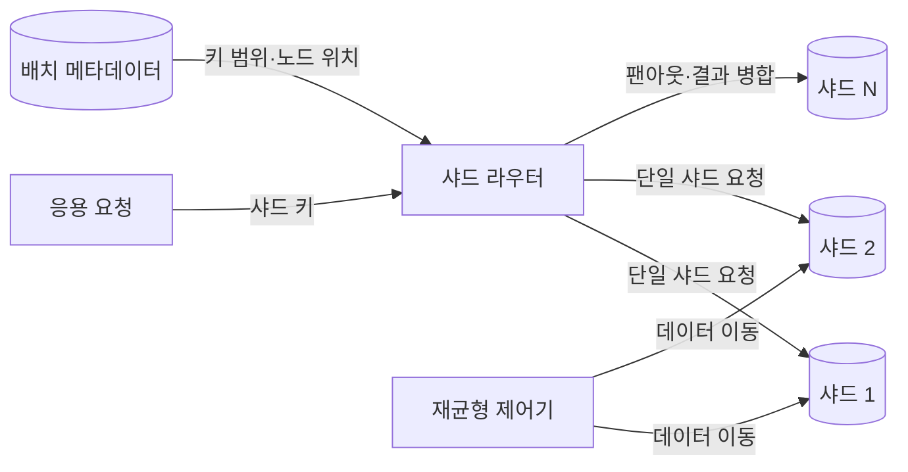
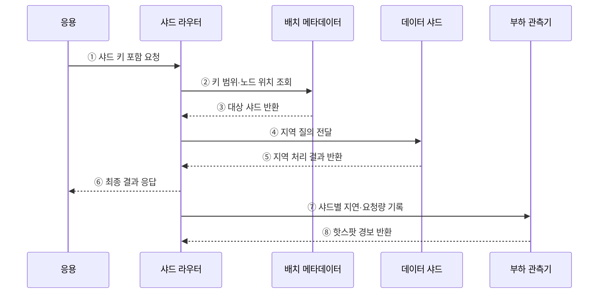

---
sidebar:
  order: 99
  label: "099. 샤딩 — 수평 분할 (Sharding)"
  badge:
    text: "기출 · 50%"
    variant: note
title: "샤딩 — 수평 분할 (Sharding)"
date: "2026-07-27T23:59:59+09:00"
tags:
  - "notes-software"
weight: 99
extra:
  question_no: "099"
  source_status: "기출"
  source_history: "123회"
  priority: 50
  priority_note: "123회 기출, 샤드 키·재분배 설계 가치"
---

## 미리 알고가기

- **샤딩(Sharding)**: 하나의 논리 데이터 집합을 행 단위로 분할해 여러 노드에 저장·처리하는 수평 분산 방식
- **샤드 키(Shard Key)**: 각 행이 저장될 샤드를 결정하는 열 또는 값
- **샤드 라우터(Shard Router)**: 요청의 샤드 키와 배치 정보를 이용해 대상 샤드로 전달하는 구성요소
- **재샤딩(Resharding)**: 샤드 수·범위·데이터 배치를 다시 조정하는 작업
- **수평 확장(Scale-out)**: 단일 서버의 성능 대신 노드 수를 늘려 용량·처리량을 높이는 방식
- **교차 샤드 질의(Cross-shard Query)**: 둘 이상의 샤드에 요청을 보내 결과를 결합하는 질의
- **분산 트랜잭션(Distributed Transaction)**: 여러 샤드의 변경을 하나의 논리 작업으로 조정하는 트랜잭션
- **팬아웃(Fan-out)**: 하나의 요청을 여러 샤드에 보내고 결과를 모으는 처리
- **핫스팟(Hotspot)**: 데이터나 요청이 특정 샤드에 집중되어 병목이 발생한 상태
- **재균형(Rebalancing)**: 샤드 간 데이터·요청 편차를 줄이도록 배치를 이동하는 작업

## Ⅰ. 개요

- 샤딩은 하나의 논리 데이터 집합을 행 단위로 나눠 여러 독립 노드에 저장·처리하는 수평 분산 방식이다.
- 단일 노드의 저장 용량과 처리량 한계를 넘을 수 있지만 교차 샤드 질의·트랜잭션·재배치 비용이 생긴다.

### 쉽게 이해하기 (학습용)

- 한 도서관의 책을 번호 규칙으로 여러 지점에 나누고 같은 규칙으로 책이 있는 지점을 찾는 방식이다.

## Ⅱ. 특징

- **수평 확장**: 샤드 노드를 추가해 저장 용량과 병렬 처리량을 늘린다.
- **키 중심 설계**: 샤드 키가 데이터 분포·조회 지역성·핫스팟을 결정한다.
- **지역 처리**: 요청이 한 샤드에서 끝날수록 지연과 조정 비용이 작다.
- **분산 복잡성**: 팬아웃, 분산 트랜잭션, 재샤딩, 장애 복구가 어려워진다.

### 쉽게 이해하기 (학습용)

- 자료를 고르게 나누고 한 지점에서 찾게 해야 확장 효과가 크며, 여러 지점을 동시에 찾으면 조정 비용이 커진다.

## Ⅲ. 아키텍처 및 구성요소

**도표안 A — 구조도**

**도표안 B — sequenceDiagram**

| 구성요소 | 역할 |
|:---|:---|
| 샤드 키 | 각 행과 요청의 대상 샤드 결정 |
| 샤드 라우터 | 키와 배치 정보를 이용해 요청 전달 |
| 배치 메타데이터 | 키 범위·버킷과 노드 위치·세대 관리 |
| 데이터 샤드 | 분할 데이터의 지역 저장·질의·트랜잭션 처리 |
| 재균형 제어기 | 편중 감지와 데이터 이동·배치 전환 조정 |

**동작 원리**

- ① 응용이 샤드 키를 포함한 데이터 요청을 라우터에 보낸다.
- ② 라우터가 배치 메타데이터에서 현재 키 범위와 노드 위치를 조회한다.
- ③ 배치 메타데이터가 세대가 맞는 대상 샤드를 반환한다.
- ④ 라우터가 해당 샤드에 지역 질의를 전달한다.
- ⑤ 데이터 샤드가 자체 데이터만 처리해 결과를 반환한다.
- ⑥ 라우터가 최종 결과를 응용에 응답한다.
- ⑦ 라우터가 샤드별 요청량·지연·오류를 관측기에 기록한다.
- ⑧ 부하 관측기가 임계치를 넘은 핫스팟을 라우터에 알린다.

### 쉽게 이해하기 (학습용)

- 안내소가 번호로 담당 지점을 찾고 요청을 한 곳에서 끝낸 뒤 혼잡도까지 기록한다.

## Ⅳ. 종류 및 비교

| 방식 | 배치 원리 | 적합한 상황 | 주요 한계 |
|:---|:---|:---|:---|
| 범위 샤딩 | 연속 키 구간을 노드에 배치 | 범위 조회·지역성 보존 | 증가 키 핫스팟·경계 이동 |
| 해시 샤딩 | 해시 버킷을 노드에 배치 | 균등 분산·점 조회 | 범위 팬아웃·버킷 재배치 |
| 디렉터리 샤딩 | 매핑표로 키 위치를 지정 | 임차인·조직의 유연한 배치 | 메타데이터 가용성·일관성 |
| 지리 샤딩 | 지역·법역별 노드에 배치 | 지연·데이터 주권 대응 | 전역 질의·지역 장애 조정 |

> 샤딩은 여러 독립 노드로 데이터를 분산한다는 점에서 단일 DB 내부의 테이블 파티셔닝보다 운영 범위가 크다.

### 쉽게 이해하기 (학습용)

- 번호 구간으로 나누면 범위 찾기가 쉽고, 해시로 나누면 고르며, 목록으로 지정하면 원하는 위치에 둘 수 있다.

## Ⅴ. 실무 고려사항 및 대책

| 고려사항 | 위험 | 대책 |
|:---|:---|:---|
| 키 선택 | 교차 샤드 질의·트랜잭션 증가 | 주요 접근·소유권 단위를 샤드 키로 선택 |
| 분포 | 큰 임차인·증가 키의 핫스팟 | 가상 버킷·복합 키·대형 임차인 격리 |
| 라우팅 | 오래된 배치 정보로 잘못된 노드 접근 | 버전·리디렉션·캐시 무효화 적용 |
| 재샤딩 | 이동 중 누락·중복·긴 중단 | 복사·이중 읽기/쓰기·검증·원자 전환 |
| 전역 기능 | UNIQUE·조인·집계의 전역 보장 어려움 | 키 범위 내 제약, 별도 전역 서비스·비동기 집계 |
| 장애 | 샤드 하나가 일부 사용자 전체에 영향 | 샤드별 복제·백업·복구·격리 검증 |

> **적용 사례**: 다중 임차 서비스는 임차인 ID로 데이터를 모아 대부분의 요청을 한 샤드에서 끝내고 대형 임차인은 별도 샤드로 격리한다.

### 쉽게 이해하기 (학습용)

- 고객 자료를 한 지점에 모으되 큰 고객 하나가 지점을 독점하지 않게 분포를 감시한다.

## Ⅵ. 결론

- 샤딩의 성패는 대부분의 요청을 한 노드에서 끝내면서 데이터와 부하를 고르게 나누는 샤드 키에 달려 있다.
- 초기 분포뿐 아니라 핫스팟·재샤딩·교차 샤드 비용과 장애 복구까지 운영 설계에 포함해야 한다.

### 쉽게 이해하기 (학습용)

- 한 번에 담당 지점을 찾고 어느 지점도 과부하되지 않게 나누는 것이 핵심이다.
