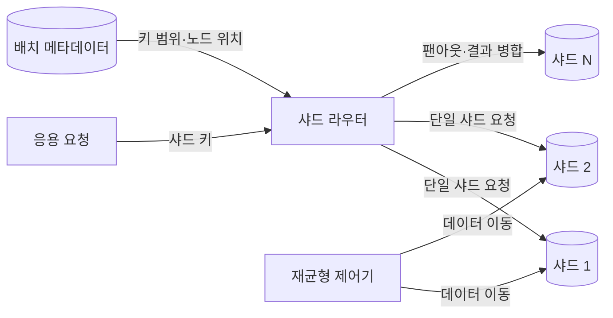
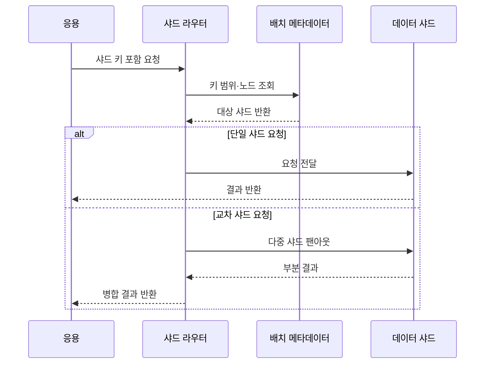

---
sidebar:
  order: 99
  label: "099. 샤딩 — 수평 분할 (Sharding)"
  badge:
    text: "기출 · 50%"
    variant: note
title: "샤딩 — 수평 분할 (Sharding)"
date: "2026-07-27T23:59:59+09:00"
tags:
  - "notes-software"
weight: 99
extra:
  question_no: "099"
  source_status: "기출"
  source_history: "123회"
  priority: 50
  priority_note: "123회 기출, 샤드 키·재분배 설계 가치"
---

## 미리 알고가기

- **샤딩(Sharding)**: 하나의 논리 데이터 집합을 행 단위로 분할해 여러 노드에 저장·처리하는 수평 분산 방식
- **샤드 키(Shard Key)**: 각 행이 저장될 샤드를 결정하는 열 또는 값
- **샤드 라우터(Shard Router)**: 요청의 샤드 키와 배치 정보를 이용해 대상 샤드로 전달하는 구성요소
- **재샤딩(Resharding)**: 샤드 수·범위·데이터 배치를 다시 조정하는 작업
- **수평 확장(Scale-out)**: 단일 서버의 성능 대신 노드 수를 늘려 용량·처리량을 높이는 방식
- **교차 샤드 질의(Cross-shard Query)**: 둘 이상의 샤드에 요청을 보내 결과를 결합하는 질의
- **분산 트랜잭션(Distributed Transaction)**: 여러 샤드의 변경을 하나의 논리 작업으로 조정하는 트랜잭션
- **팬아웃(Fan-out)**: 하나의 요청을 여러 샤드에 보내고 결과를 모으는 처리
- **핫스팟(Hotspot)**: 데이터나 요청이 특정 샤드에 집중되어 병목이 발생한 상태
- **재균형(Rebalancing)**: 샤드 간 데이터·요청 편차를 줄이도록 배치를 이동하는 작업

## Ⅰ. 개요

- **정의/개념**: 행 데이터를 여러 노드에 **수평 분할·분산 처리**
- **기존 한계**: 단일 노드의 **저장 용량·처리량 확장 한계**

### 쉽게 이해하기 (학습용)

- 한 도서관의 책을 번호 규칙으로 여러 지점에 나누고 같은 규칙으로 책이 있는 지점을 찾는 방식이다.

## Ⅱ. 특징

- 노드 추가의 **저장·처리량 수평 확장**
- 샤드 키의 **데이터 분포·조회 지역성 결정**
- 교차 샤드의 **질의·트랜잭션 조정 비용**

### 쉽게 이해하기 (학습용)

- 자료를 고르게 나누고 한 지점에서 찾게 해야 확장 효과가 크며, 여러 지점을 동시에 찾으면 조정 비용이 커진다.

## Ⅲ. 아키텍처 및 구성요소

| 구성요소 | 책임 |
|:---|:---|
| 응용 요청 | 라우팅용 **샤드 키 제공** |
| 샤드 라우터 | 요청의 **대상 샤드 결정** |
| 배치 메타데이터 | **키 범위·노드 위치** 관리 |
| 데이터 샤드 | 분할 데이터의 **저장·질의 처리** |
| 재균형 제어기 | 편중 감지와 **데이터 재배치** |

> 요약: 샤드 키와 배치 정보가 요청 위치와 분포를 결정

### 쉽게 이해하기 (학습용)

- 안내소가 책 번호와 지점 지도를 보고 요청을 해당 지점으로 보내며, 혼잡한 지점의 책은 다른 지점으로 옮긴다.

## Ⅳ. 원리 및 절차 흐름

| 절차 | 설명 |
|:---|:---|
| 샤드 키 추출 | 요청에서 **분할 기준값 확인** |
| 배치 조회 | 키에 대응하는 **노드 위치 확인** |
| 단일 샤드 전달 | 대상 노드의 **지역 질의 수행** |
| 다중 샤드 팬아웃 | 여러 노드의 **부분 질의 수행** |
| 결과 병합 | 정렬·집계의 **전역 결과 구성** |

> 요약: 샤드 키가 있으면 단일 라우팅, 없으면 팬아웃 수행

### 쉽게 이해하기 (학습용)

- 지점 번호가 있으면 한 곳만 찾고 번호가 없으면 여러 지점에 물어본 뒤 답을 합친다.

## Ⅴ. 종류 및 비교

| 샤딩 방식 | 범위 샤딩 | 해시 샤딩 | 디렉터리 샤딩 |
|:---|:---|:---|:---|
| 적용 기준 | 범위 조회·**지역성 보존** | 균등 분산·**점 조회** | 유연한 **사용자·조직 배치** |
| 핵심 특징 | 연속 키의 **구간별 배치** | 해시값의 **버킷별 배치** | 매핑표의 **명시적 위치 지정** |
| 한계 | 순차 키·**핫스팟 발생** | 범위 팬아웃·**재분배 비용** | 메타데이터 병목·**일관성 관리** |

> 요약: 범위 지역성·균등 분산·배치 유연성으로 방식 선택

### 쉽게 이해하기 (학습용)

- 번호 구간으로 나누면 범위 찾기가 쉽고, 해시로 나누면 고르며, 목록으로 지정하면 원하는 위치에 둘 수 있다.

## Ⅵ. 실무 사례

1. 다중 임차 서비스는 **임차인 ID 샤드 키**로 요청 격리
2. 시계열 데이터는 **장치 해시+시간 범위**로 쓰기 편중 완화

### 쉽게 이해하기 (학습용)

- 고객별 자료는 고객 번호로 한 샤드에 모으고, 계속 증가하는 시간값만 쓰지 않도록 장치값을 함께 섞는다.

## Ⅶ. 결론

- 지역 질의·균등 분포·재샤딩 비용을 **샤드 키로 통제**

### 쉽게 이해하기 (학습용)

- 대부분의 요청이 한 샤드에서 끝나고 데이터가 고르게 퍼지도록 실제 조회 조건에서 키를 검증해야 한다.
