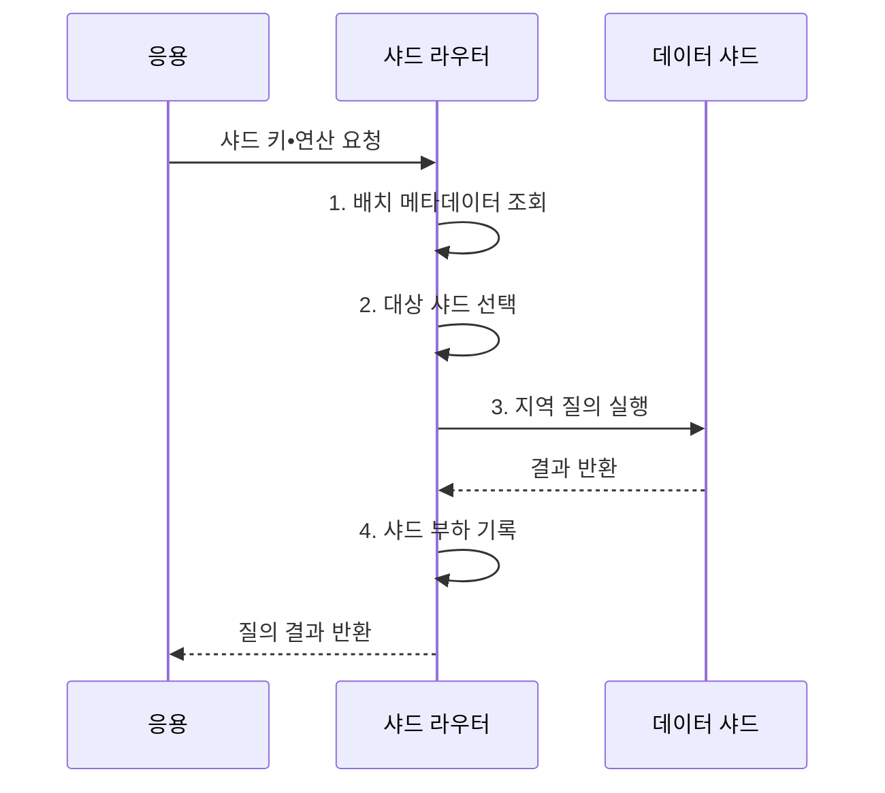

---
sidebar:
  order: 99
  label: "099. 샤딩: 수평 분할 (Sharding)"
  badge:
    text: "기출 • 50%"
    variant: note
title: "샤딩: 수평 분할 (Sharding)"
date: "2026-08-03T08:48:47+09:00"
tags:
  - "notes-software"
weight: 99
extra:
  question_no: "099"
  source_status: "기출"
  source_history: "123회"
  priority: 50
  priority_note: "123회 기출, 샤드 키•재분배 설계 가치"
---

## Ⅰ. 개요

핵심 용어

- **샤딩(Sharding)**: 행 단위 데이터를 샤드 키 규칙으로 여러 독립 데이터베이스 노드에 나눠 용량과 처리량을 수평 확장하는 기법이다.

- 정의/개념: 행 단위 데이터를 여러 노드에 나누는 **수평 분할 기법**
- 배경/필요성: 단일 노드에서는 데이터 증가 시 **용량•처리량 확장 한계**

#### 한줄 요약

- 한 도서관의 책을 번호 규칙으로 여러 지점에 나누고 같은 규칙으로 책이 있는 지점을 찾는 방식이다.

## Ⅱ. 특징

핵심 용어

- **수평 확장**: 노드를 추가해 저장 용량과 처리 능력을 키우는 특성이다.
- **키 중심 분배**: 샤드 키가 데이터 분포와 요청 지역성 및 핫스팟 발생을 좌우하는 특성이다.
- **분산 비용**: 여러 샤드 조회와 재배치 및 장애 복구에 추가되는 팬아웃•조정 부담이다.

- **수평 확장**: 노드 추가로 용량•처리량 확대
- **키 중심**: 분포•지역성•핫스팟 결정
- **분산 비용**: 팬아웃•재샤딩•복구 필요

#### 한줄 요약

- 자료를 고르게 나누고 한 지점에서 찾게 해야 확장 효과가 크며, 여러 지점을 동시에 찾으면 조정 비용이 커진다.

## Ⅲ. 구조 및 구성요소

핵심 용어

- **샤드 키(Shard Key)**: 각 행과 요청이 속할 데이터 샤드를 결정하는 열 또는 표현식이다.
- **샤드 라우터**: 샤드 키와 배치 정보로 요청을 담당 데이터 샤드에 전달하는 구성요소이다.
- **배치 메타데이터**: 키 범위와 소유 노드 위치 및 버전을 관리하는 정보이다.
- **데이터 샤드**: 자신에게 배정된 데이터를 저장하고 지역 질의와 트랜잭션을 처리하는 독립 노드이다.
- **재균형 제어기**: 샤드별 데이터•요청 편중을 감지하고 키 범위와 데이터를 이동하는 구성요소이다.

| 구성요소 | 책임 |
|:---|:---|
| 샤드 키 | 행과 요청의 **대상 샤드** 결정 |
| 샤드 라우터 | **배치 정보** 로 요청 전달 |
| 배치 메타데이터 | **키 범위•노드 위치** 관리 |
| 데이터 샤드 | **지역 저장•질의•트랜잭션** 처리 |
| 재균형 제어기 | **편중 감지•데이터 이동** |

#### 한줄 요약

- 안내소가 번호표와 배치표로 자료가 있는 지점을 찾는다.

## Ⅳ. 흐름도

핵심 용어

- **1. 배치 메타데이터 조회**: 샤드 키 범위의 현재 소유 노드와 배치 버전을 확인하는 단계이다.
- **2. 대상 샤드 선택**: 현재 키 범위를 소유한 노드를 찾아 요청 경로를 확정하는 단계이다.
- **3. 지역 질의 실행**: 선택한 샤드 안의 데이터만 대상으로 조회•변경을 수행하는 단계이다.
- **4. 샤드 부하 기록**: 데이터 크기와 요청량 및 지연을 축적해 편중과 재샤딩 필요성을 판단하는 단계이다.

**동작 원리**

- **1. 배치 메타데이터 조회**: 키 범위와 노드 위치 확인
- **2. 대상 샤드 선택**: 현재 소유 노드로 경로 확정
- **3. 지역 질의 실행**: 선택 샤드의 데이터만 처리
- **4. 샤드 부하 기록**: 편중•재샤딩 판단값 축적

#### 한줄 요약

- 안내소가 번호로 담당 지점을 찾고 요청을 한 곳에서 끝낸 뒤 혼잡도까지 기록한다.

## Ⅴ. 종류 및 비교

핵심 용어

- **해시 샤딩**: 키의 해시값으로 데이터를 고르게 분산해 점 조회에 적합한 방식이다.
- **범위 샤딩**: 연속 키 구간을 각 샤드에 배정해 범위 조회와 데이터 지역성을 지원하는 방식이다.
- **디렉터리 샤딩**: 별도 매핑표에서 키나 임차인별 데이터 위치를 명시적으로 지정하는 방식이다.

| 판단 기준 | 범위 샤딩 | 해시 샤딩 | 디렉터리 샤딩 |
|:---|:---|:---|:---|
| 적용 기준 | **범위 조회•지역성** | **균등 분산•점 조회** | **임차인별 위치 지정** |
| 핵심 특징 | **연속 키 구간 배치** | **해시 버킷 배치** | **매핑표 기반 배치** |
| 한계 | **증가 키 집중** | **범위 질의 팬아웃** | **매핑표 가용성** |

> 샤딩: 여러 독립 노드에 데이터를 분산해 **테이블 파티셔닝보다 넓은 운영 범위**

#### 한줄 요약

- 번호 구간으로 나누면 범위 찾기가 쉽고, 해시로 나누면 고르며, 목록으로 지정하면 원하는 위치에 둘 수 있다.

## Ⅵ. 실무 고려사항 및 대책

핵심 용어

- **접근•소유권 단위**: 대부분의 업무 요청과 트랜잭션이 함께 다루는 데이터 경계를 샤드 키로 삼는 기준이다.
- **가상 버킷•복합 키**: 논리 버킷을 실제 노드에 재배치하거나 편중 키에 추가 분산 값을 결합해 핫스팟을 줄이는 방식이다.
- **버전 확인•리디렉션**: 라우터의 배치 정보가 오래됐는지 확인하고 새 소유 노드로 요청을 다시 보내는 통제이다.
- **복사•검증•원자 전환**: 재샤딩 대상 데이터를 새 위치로 옮기고 일치 여부를 확인한 뒤 소유권을 한 번에 바꾸는 절차이다.
- **별도 서비스•비동기 집계**: 모든 샤드의 데이터를 매 요청마다 읽지 않고 전용 분석 경로에서 미리 모으는 방식이다.

| 문제 | 대책 | 효과 |
|:---|:---|:---|
| 접근 단위와 샤드 키 불일치 | **접근•소유권 단위** 로 키 선정 | **교차 샤드 연산** 감소 |
| 키 편중으로 특정 샤드 과부하 | **가상 버킷•복합 키** 적용 | **핫스팟** 완화 |
| 캐시한 배치 정보의 버전 노후화 | **버전 확인•리디렉션** 적용 | **이전 위치 접근** 방지 |
| 재샤딩 중 소유권 경계 불명확 | **복사•검증•원자 전환** 수행 | **누락•중복** 방지 |
| 전역 집계가 모든 샤드에 팬아웃 | **별도 서비스•비동기 집계** 적용 | **전역 조정 비용** 통제 |

> **적용 사례**: 다중 임차 서비스는 임차인 ID로 데이터를 모아 대부분의 요청을 한 샤드에서 끝내고 대형 임차인은 별도 샤드로 격리

#### 한줄 요약

- 고객 자료를 한 지점에 모으되 큰 고객 하나가 지점을 독점하지 않게 분포를 감시한다.

## Ⅶ. 결론

핵심 용어

- **디렉터리**: 매핑표로 데이터 배치 위치를 명시적으로 지정할 때 적합한 샤딩 방식이다.
- **범위**: 연속 키 구간의 조회와 지역성을 우선할 때 적합한 샤딩 방식이다.
- **해시**: 점 조회와 균등 분산을 우선할 때 키의 해시값으로 배치하는 샤딩 방식이다.

- 범위 조회는 **범위**, 균등 점 조회는 **해시**, 지정 배치는 **디렉터리** 선택

#### 한줄 요약

- 한 번에 담당 지점을 찾고 어느 지점도 과부하되지 않게 나누는 것이 핵심이다.
