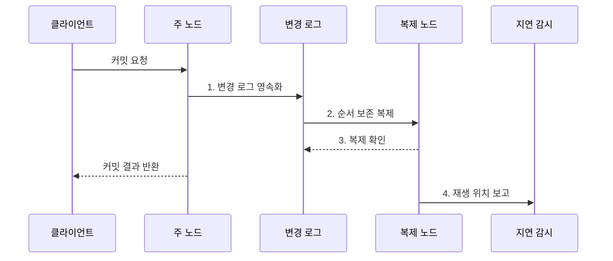

---
sidebar:
  order: 100
  label: "100. 데이터베이스 복제: 마스터-슬레이브·멀티마스터 (Database Replication)"
  badge:
    text: "미출제 · 50%"
    variant: note
title: "데이터베이스 복제: 마스터-슬레이브·멀티마스터 (Database Replication)"
date: "2026-07-31T10:37:16+09:00"
tags:
  - "notes-software"
weight: 100
extra:
  question_no: "100"
  source_status: "미출제"
  source_history: ""
  priority: 50
  priority_note: "복제 지연·일관성·장애전환 설계 가치"
---

## 미리 알고가기

- **데이터베이스(Database, DB)**: 구조화된 데이터를 저장·조회·변경하도록 관리하는 데이터 집합
- **데이터베이스 복제(Database Replication)**: 한 DB의 변경을 다른 노드에 전달해 데이터 사본을 유지하는 기술
- **주 노드(Primary Node)**: 단일 주 노드 방식에서 쓰기 순서를 확정하는 노드
- **복제 노드(Replica Node)**: 주 노드의 변경 로그를 받아 사본에 적용하는 노드
- **동기 복제(Synchronous Replication)**: 정해진 복제 확인을 기다린 뒤 커밋 성공을 반환하는 방식
- **비동기 복제(Asynchronous Replication)**: 주 노드가 먼저 커밋을 반환하고 복제 노드가 뒤따라 반영하는 방식
- **장애 조치(Failover)**: 주 노드 장애 시 승격 조건을 충족한 복제 노드를 전환하는 절차
- **분할 뇌(Split Brain)**: 둘 이상의 노드가 동시에 주 노드가 되어 데이터가 분기되는 상태
- **복구 시간 목표(Recovery Time Objective, RTO)**: 장애 후 서비스를 복구해야 하는 목표 시간
- **복구 시점 목표(Recovery Point Objective, RPO)**: 장애 시 허용할 수 있는 데이터 손실 시점
- **변경 로그(Change Log)**: 데이터 변경 내용과 순서를 복제하도록 기록한 로그
- **커밋(Commit)**: 트랜잭션 변경을 확정해 영구 반영하는 작업
- **재생 위치(Replay Position)**: 복제 노드가 변경 로그를 적용한 마지막 지점
- **정족수(Quorum)**: 전체 노드 중 결정을 확정하는 데 필요한 최소 동의 수
- **세대 번호(Generation Number)**: 새 주 노드의 임기를 이전 임기와 구분하는 증가값
- **펜싱(Fencing)**: 이전 주 노드가 저장소나 서비스에 쓰지 못하도록 차단하는 절차
- **시점 복구(Point-in-Time Recovery)**: 백업과 로그로 장애 전 특정 시점까지 데이터를 복원하는 방식

> **키워드:** 데이터베이스 복제: 마스터-슬레이브·멀티마스터 (Database Replication)

## Ⅰ. 개요

- 정의/개념: 변경 로그를 전달해 **여러 노드에 사본을 유지하는 기법**
- 배경/필요성: 단일 노드 장애는 **서비스 중단·복구 지연** 유발

### 쉽게 이해하기 (학습용)

- 원본 장부의 변경 일지를 다른 지점에 보내 같은 사본을 유지하는 방식이다.

## Ⅱ. 특징

- **읽기 확장**: 복제본으로 조회 부하 분산
- **장애 전환**: 복제 노드를 주 노드로 승격
- **일관성 비용**: 확인 수준에 따라 지연·손실 변화

### 쉽게 이해하기 (학습용)

- 사본이 늘면 읽기와 장애 대응은 좋아지지만 최신성 지연과 원본 충돌을 관리해야 한다.

## Ⅲ. 구조 및 구성요소

| 구성요소 | 책임 |
|:---|:---|
| 주 노드 | **쓰기 순서·커밋** 확정 |
| 변경 로그 | **복제할 변경 순서** 기록 |
| 복제 노드 | **로그 수신·영속·재생** |
| 지연 감시 | **송신·재생 위치 차이** 측정 |
| 장애 조치 제어기 | **후보 승격·기존 주 노드 차단** |

### 쉽게 이해하기 (학습용)

- 원본 장부와 변경 일지, 사본, 감시자, 승격 담당자로 구성된다.

## Ⅳ. 흐름도

**동작 원리**

- **1. 변경 로그 영속화**: 변경 순서를 내구 저장소에 기록
- **2. 순서 보존 복제**: 로그를 복제 노드에 같은 순서로 전송
- **3. 복제 확인**: 동기 정책의 요구 확인 수 충족
- **4. 재생 위치 보고**: 적용 지점 차이로 복제 지연 측정

### 쉽게 이해하기 (학습용)

- 원본이 변경 일지를 보내고 사본의 확인 수준과 따라오는 속도를 계속 측정한다.

## Ⅴ. 종류 및 비교

| 판단 기준 | 단일 주 노드 | 다중 주 노드 | 비동기 복제 |
|:---|:---|:---|:---|
| 적용 기준 | **명확한 쓰기 순서** | **다지역 쓰기** | **낮은 쓰기 지연** |
| 핵심 특징 | **한 노드가 순서 확정** | **여러 노드가 쓰기 수용** | **로컬 커밋 후 전파** |
| 한계 | **전환 공백** | **충돌·데이터 분기** | **지연·최근 데이터 손실** |

### 쉽게 이해하기 (학습용)

- 한 원본은 순서가 단순하고 여러 원본은 가까이서 쓸 수 있지만 충돌 해결이 필요하다.

## Ⅵ. 실무 고려사항 및 대책

| 고려사항 | 대책 | 효과 |
|:---|:---|:---|
| 비동기 복제본의 과거 값 조회 | **주 노드 읽기·로그 위치 대기** | **읽기 최신성** 확보 |
| 재생 지연으로 오래된 사본 노출 | **시간·재생 위치 경보** 설정 | **뒤처진 사본** 제외 |
| 확인 수가 목표 손실과 불일치 | **RPO·RTO별 확인 수** 정의 | **손실·복구 시간** 통제 |
| 망 분리로 둘 이상의 주 노드 발생 | **정족수·세대·펜싱** 적용 | **분할 뇌** 차단 |
| 논리 오류가 모든 복제본에 전파 | **시점 복구용 독립 백업** 유지 | **오류·삭제 전파** 복구 |

> **적용 사례**: 조회 부하는 비동기 복제본으로 분산하되 쓰기 직후 조회는 주 노드로 보내고 허용 지연을 넘은 복제본은 라우팅에서 제외

### 쉽게 이해하기 (학습용)

- 사본이 늦으면 최신 값이 필요한 읽기에서 빼고, 원본 장애 때 둘이 동시에 원본이 되지 않게 막아야 한다.

## Ⅶ. 결론

- 쓰기 순서는 **단일 주**, 다지역 쓰기는 **다중 주**, 지연 우선은 **비동기** 선택

### 쉽게 이해하기 (학습용)

- 사본을 만드는 것보다 언제 최신이고 누가 원본이며 장애 때 얼마나 잃는지를 정하는 일이 중요하다.
