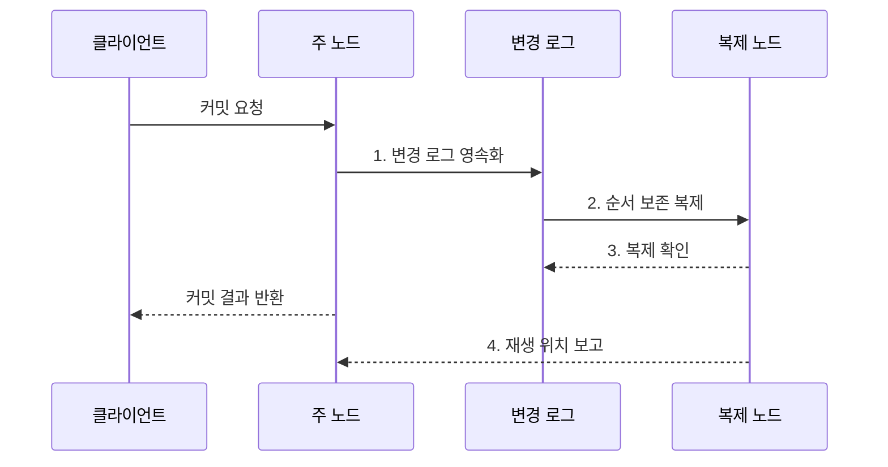

---
sidebar:
  order: 100
  label: "100. 데이터베이스 복제: 마스터-슬레이브•멀티마스터 (Database Replication)"
  badge:
    text: "미출제 • 50%"
    variant: note
title: "데이터베이스 복제: 마스터-슬레이브•멀티마스터 (Database Replication)"
date: "2026-08-03T09:16:12+09:00"
tags:
  - "notes-software"
weight: 100
extra:
  question_no: "100"
  source_status: "미출제"
  source_history: ""
  priority: 50
  priority_note: "복제 지연•일관성•장애전환 설계 가치"
---

## Ⅰ. 개요

핵심 용어

- **데이터베이스 복제(Database Replication)**: 데이터 변경을 노드 간에 전파•동기화해 여러 노드에 같은 데이터의 사본을 유지하는 기법이다.

- 정의/개념: 데이터 변경을 전파•동기화해 **여러 노드에 사본을 유지하는 기법**
- 배경/필요성: 단일 노드 장애는 **서비스 중단•복구 지연** 유발

#### 한줄 요약

- 원본 장부의 변경 일지를 다른 지점에 보내 같은 사본을 유지하는 방식이다.

## Ⅱ. 특징

핵심 용어

- **장애 전환**: 주 노드 장애 때 복제 노드를 새 주 노드로 승격하는 특성이다.
- **읽기 확장**: 여러 복제본에 조회 요청을 분산해 주 노드의 읽기 부하를 줄이는 특성이다.
- **일관성 비용**: 복제 확인 강도를 높여 최신성과 손실 방지를 강화할수록 커밋 지연이 늘어나는 절충이다.

- **읽기 확장**: 복제본으로 조회 부하 분산
- **장애 전환**: 복제 노드를 주 노드로 승격
- **일관성 비용**: 확인 수준에 따라 지연•손실 변화

#### 한줄 요약

- 사본이 늘면 읽기와 장애 대응은 좋아지지만 최신성 지연과 원본 충돌을 관리해야 한다.

## Ⅲ. 구조 및 구성요소

핵심 용어

- **변경 로그**: 복제 노드가 같은 순서로 변경을 적용하도록 변경 내용을 기록하는 구성요소이다.
- **주 노드(Primary Node)**: 쓰기를 받아 변경 순서와 커밋 결과를 확정하는 원본 노드이다.
- **복제 노드(Replica Node)**: 주 노드의 변경 로그를 수신•저장•재생해 사본을 유지하는 노드이다.
- **지연 감시**: 주 노드의 송신 위치와 복제 노드의 재생 위치 차이를 측정하는 기능이다.
- **장애 조치 제어기**: 승격 후보를 선택하고 기존 주 노드를 차단해 단일 쓰기 권한을 보장하는 구성요소이다.

| 구성요소 | 책임 |
|:---|:---|
| 주 노드 | **쓰기 순서•커밋** 확정 |
| 변경 로그 | **복제할 변경 순서** 기록 |
| 복제 노드 | **로그 수신•영속•재생** |
| 지연 감시 | **송신•재생 위치 차이** 측정 |
| 장애 조치 제어기 | **후보 승격•기존 주 노드 차단** |

#### 한줄 요약

- 원본 장부와 변경 일지, 사본, 감시자, 승격 담당자로 구성된다.

## Ⅳ. 흐름도

핵심 용어

- **2. 순서 보존 복제**: 변경 로그를 복제 노드에 원래 커밋 순서대로 전송하는 단계이다.
- **1. 변경 로그 영속화**: 데이터 변경 순서와 내용을 장애에도 남는 저장소에 먼저 기록하는 단계이다.
- **3. 복제 확인**: 동기 정책이 요구한 수의 복제 노드가 로그를 수신•영속화했음을 알리는 단계이다.
- **4. 재생 위치 보고**: 복제 노드가 실제 적용한 마지막 로그 위치를 보내 지연을 측정하는 단계이다.

**동작 원리**

- **1. 변경 로그 영속화**: 변경 순서를 내구 저장소에 기록
- **2. 순서 보존 복제**: 로그를 복제 노드에 같은 순서로 전송
- **3. 복제 확인**: 동기 정책의 요구 확인 수 충족
- **4. 재생 위치 보고**: 적용 지점 차이로 복제 지연 측정

#### 한줄 요약

- 원본이 변경 일지를 보내고 사본의 확인 수준과 따라오는 속도를 계속 측정한다.

## Ⅴ. 종류 및 비교

핵심 용어

- **단일 주 노드**: 한 노드가 쓰기 순서를 확정해 충돌 관리를 단순화하는 복제 방식이다.
- **다중 주 노드**: 여러 노드가 쓰기를 수용해 다지역 지연을 줄이지만 동시 변경 충돌을 해결해야 하는 방식이다.
- **비동기 복제**: 주 노드가 로컬 커밋을 먼저 완료한 뒤 로그를 전파해 쓰기 지연을 낮추는 방식이다.

| 판단 기준 | 단일 주 노드 | 다중 주 노드 | 비동기 복제 |
|:---|:---|:---|:---|
| 적용 기준 | **명확한 쓰기 순서** | **다지역 쓰기** | **낮은 쓰기 지연** |
| 핵심 특징 | **한 노드가 순서 확정** | **여러 노드가 쓰기 수용** | **로컬 커밋 후 전파** |
| 한계 | **전환 공백** | **충돌•데이터 분기** | **지연•최근 데이터 손실** |

#### 한줄 요약

- 한 원본은 순서가 단순하고 여러 원본은 가까이서 쓸 수 있지만 충돌 해결이 필요하다.

## Ⅵ. 실무 고려사항 및 대책

핵심 용어

- **주 노드 읽기•로그 위치 대기**: 쓰기 직후 조회를 원본으로 보내거나 복제본이 해당 변경 위치까지 적용할 때까지 기다리는 최신성 통제이다.
- **시간•재생 위치 경보**: 복제본의 지연 시간과 마지막 적용 로그 위치를 감시해 뒤처진 노드를 라우팅에서 제외하는 통제이다.
- **복구 시점 목표(Recovery Point Objective, RPO)•복구 시간 목표(Recovery Time Objective, RTO)별 확인 수**: 허용 데이터 손실과 서비스 복구 시간에 맞춰 커밋 전에 응답해야 할 복제본 수를 정하는 기준이다.
- **정족수•세대•펜싱**: 과반수 동의와 리더 임기 식별자 및 옛 주 노드의 쓰기 차단으로 분할 뇌를 막는 통제이다.
- **시점 복구용 독립 백업**: 논리 오류가 복제본에 전파돼도 오류 이전 시점으로 되돌릴 수 있도록 별도로 보관한 백업이다.

| 문제 | 대책 | 효과 |
|:---|:---|:---|
| 비동기 복제본의 과거 값 조회 | **주 노드 읽기•로그 위치 대기** | **읽기 최신성** 확보 |
| 재생 지연으로 오래된 사본 노출 | **시간•재생 위치 경보** 설정 | **뒤처진 사본** 제외 |
| 확인 수가 목표 손실과 불일치 | **복구 시점 목표(Recovery Point Objective, RPO)•복구 시간 목표(Recovery Time Objective, RTO)별 확인 수** 정의 | **손실•복구 시간** 통제 |
| 망 분리로 둘 이상의 주 노드 발생 | **정족수•세대•펜싱** 적용 | **분할 뇌** 차단 |
| 논리 오류가 모든 복제본에 전파 | **시점 복구용 독립 백업** 유지 | **오류•삭제 전파** 복구 |

> **적용 사례**: 조회 부하는 비동기 복제본으로 분산하되 쓰기 직후 조회는 주 노드로 보내고 허용 지연을 넘은 복제본은 라우팅에서 제외

#### 한줄 요약

- 사본이 늦으면 최신 값이 필요한 읽기에서 빼고, 원본 장애 때 둘이 동시에 원본이 되지 않게 막아야 한다.

## Ⅶ. 결론

핵심 용어

- **비동기**: 주 노드가 먼저 커밋한 뒤 변경을 전파해 쓰기 지연을 낮추는 복제 방식이다.
- **단일 주**: 한 노드만 쓰기 순서를 확정해 충돌을 단순화하는 복제 방식이다.
- **다중 주**: 여러 지역 노드가 쓰기를 수용하되 충돌 해결이 필요한 복제 방식이다.

- 쓰기 순서는 **단일 주**, 다지역 쓰기는 **다중 주**, 지연 우선은 **비동기** 선택

#### 한줄 요약

- 사본을 만드는 것보다 언제 최신이고 누가 원본이며 장애 때 얼마나 잃는지를 정하는 일이 중요하다.
