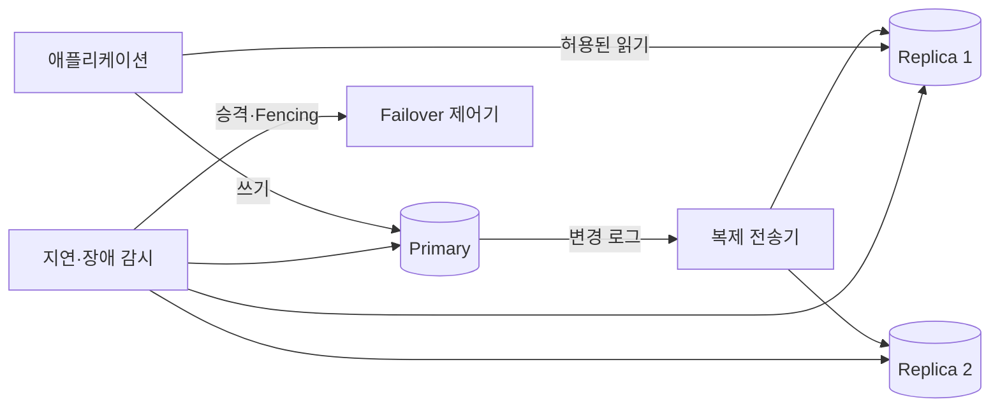
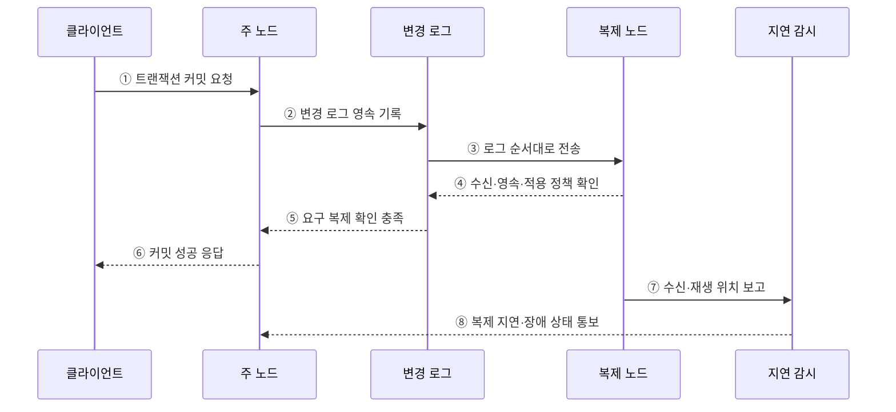

---
sidebar:
  order: 100
  label: "100. 데이터베이스 복제 — 마스터-슬레이브·멀티마스터 (Database Replication)"
  badge:
    text: "미출제 · 50%"
    variant: note
title: "데이터베이스 복제 — 마스터-슬레이브·멀티마스터 (Database Replication)"
date: "2026-07-25T18:32:00+09:00"
tags:
  - "notes-software"
weight: 100
extra:
  question_no: "100"
  source_status: "미출제"
  source_history: ""
  priority: 50
  priority_note: "복제 지연·일관성·장애전환 설계 가치"
---

## 미리 알고가기

- **데이터베이스 복제(Database Replication)**: 한 DB의 변경을 다른 노드에 전달해 데이터 사본을 유지하는 기술
- **주 노드(Primary Node)**: 단일 주 노드 방식에서 쓰기 순서를 확정하는 노드
- **복제 노드(Replica Node)**: 주 노드의 변경 로그를 받아 사본에 적용하는 노드
- **동기 복제(Synchronous Replication)**: 정해진 복제 확인을 기다린 뒤 커밋 성공을 반환하는 방식
- **비동기 복제(Asynchronous Replication)**: 주 노드가 먼저 커밋을 반환하고 복제 노드가 뒤따라 반영하는 방식
- **장애 조치(Failover)**: 주 노드 장애 시 적합한 복제 노드를 승격하는 절차
- **분할 뇌(Split Brain)**: 둘 이상의 노드가 동시에 주 노드가 되어 데이터가 분기되는 상태
- **RTO / RPO**: 복구 목표 시간 / 허용 가능한 데이터 손실 시점

## Ⅰ. 개요

- 데이터베이스 복제는 주 노드의 변경 로그를 다른 노드에 전달·재생해 데이터 사본을 유지한다.
- 읽기 확장과 장애 복구에 유용하지만 복제 지연·데이터 손실·쓰기 충돌·분할 뇌를 별도로 통제해야 한다.

### 쉽게 이해하기 (학습용)

- 원본 장부의 변경 일지를 다른 지점에 보내 같은 사본을 유지하는 방식이다.

## Ⅱ. 특징

- 읽기 부하를 여러 복제본으로 나눠 처리량을 높인다.
- 다른 노드를 승격해 장애 복구 시간을 줄인다.
- 비동기는 응답을 앞당기지만 복제 지연을 만든다.
- 다중 주 노드는 쓰기 가용성과 충돌·분기를 함께 늘린다.

### 쉽게 이해하기 (학습용)

- 사본이 늘면 읽기와 장애 대응은 좋아지지만 최신성 지연과 원본 충돌을 관리해야 한다.

## Ⅲ. 아키텍처 및 구성요소

**도표안 A — 구조도**

**도표안 B — sequenceDiagram**

| 구성요소 | 역할 |
|:---|:---|
| 주 노드 | 쓰기를 받아 전역 또는 복제 그룹 내 변경 순서 확정 |
| 변경 로그 | 커밋 순서와 복구·복제할 변경 내용 기록 |
| 복제 전송기·반영기 | 로그를 전송하고 복제 노드에서 순서대로 재생 |
| 지연 감시 | 송신·수신·재생 위치 차이와 시간 측정 |
| 장애 조치 제어기 | 후보 선택·승격·기존 주 노드 차단 수행 |

**동작 원리**

- ① 클라이언트가 주 노드에 트랜잭션 커밋을 요청한다.
- ② 주 노드가 내구성을 위해 변경 로그를 먼저 영속 기록한다.
- ③ 변경 로그가 커밋 순서대로 복제 노드에 전달된다.
- ④ 복제 노드는 설정된 수신·영속·적용 단계의 확인을 반환한다.
- ⑤ 로그 계층이 동기 정책에서 요구한 복제 확인 충족을 알린다.
- ⑥ 주 노드가 클라이언트에 커밋 성공을 응답한다.
- ⑦ 복제 노드가 현재 로그 수신·재생 위치를 감시 계층에 보고한다.
- ⑧ 감시 계층이 복제 지연이나 장애 상태를 주 노드에 알린다.

### 쉽게 이해하기 (학습용)

- 원본이 변경 일지를 보내고 사본의 확인 수준과 따라오는 속도를 계속 측정한다.

## Ⅳ. 종류 및 비교

| 구성 방식 | 단일 주 노드 복제 | 다중 주 노드 복제 |
|:---|:---|:---|
| 쓰기 위치 | 한 노드 | 여러 노드 |
| 변경 순서 | 주 노드가 단일 순서 확정 | 노드 간 동시 변경 조정 필요 |
| 장점 | 충돌이 적고 운영이 단순 | 지역 쓰기·일부 장애 시 쓰기 가용성 |
| 위험 | 주 노드 병목·전환 공백 | 충돌·순환 복제·데이터 분기 |
| 적합 조건 | 읽기 확장과 명확한 쓰기 순서 | 충돌 규칙이 명확한 다지역 쓰기 |

| 확인 방식 | 동기 복제 | 비동기 복제 |
|:---|:---|:---|
| 응답 시점 | 정해진 복제 확인 후 | 주 노드의 로컬 커밋 후 |
| 장점 | 장애 시 데이터 손실 범위 축소 | 낮은 쓰기 지연·복제 장애 격리 |
| 위험 | 네트워크·복제 장애가 쓰기 지연·중단 유발 | 복제 지연·장애 시 최근 데이터 손실 |

### 쉽게 이해하기 (학습용)

- 한 원본은 순서가 단순하고 여러 원본은 가까이서 쓸 수 있지만 충돌 해결이 필요하다.

## Ⅴ. 실무 고려사항 및 대책

| 고려사항 | 위험 | 대책 |
|:---|:---|:---|
| 일관성 | 쓰기 직후 복제본에서 과거 값 조회 | 주 노드 읽기, 세션 고정, 로그 위치 대기 |
| 지연 | 복제본이 장시간 뒤처짐 | 바이트·시간·재생 지연과 원인별 경보 |
| RPO | 비동기 장애 전환 시 최근 커밋 손실 | 동기 확인 수와 허용 손실 기준 설정 |
| RTO | 승격 판단·전환 지연 | 자동 탐지·후보 선정·연결 전환 훈련 |
| 분할 뇌 | 이전 주 노드가 쓰기를 계속 수용 | 정족수·세대 번호·Fencing으로 차단 |
| 백업 오해 | 오류·삭제도 모든 복제본에 전파 | 시점 복구 가능한 독립 백업 유지 |

> **적용 사례**: 조회 부하는 비동기 복제본으로 분산하되 쓰기 직후 조회는 주 노드로 보내고 허용 지연을 넘은 복제본은 라우팅에서 제외한다.

### 쉽게 이해하기 (학습용)

- 사본이 늦으면 최신 값이 필요한 읽기에서 빼고, 원본 장애 때 둘이 동시에 원본이 되지 않게 막아야 한다.

## Ⅵ. 결론

- 데이터베이스 복제는 읽기 확장과 가용성을 높이지만 최신성과 쓰기 확정 비용을 바꾼다.
- 동기 수준·허용 지연·RPO·RTO·승격·Fencing을 하나의 운영 정책으로 설계하고 반복 검증해야 한다.

### 쉽게 이해하기 (학습용)

- 사본을 만드는 것보다 언제 최신이고 누가 원본이며 장애 때 얼마나 잃는지를 정하는 일이 중요하다.
