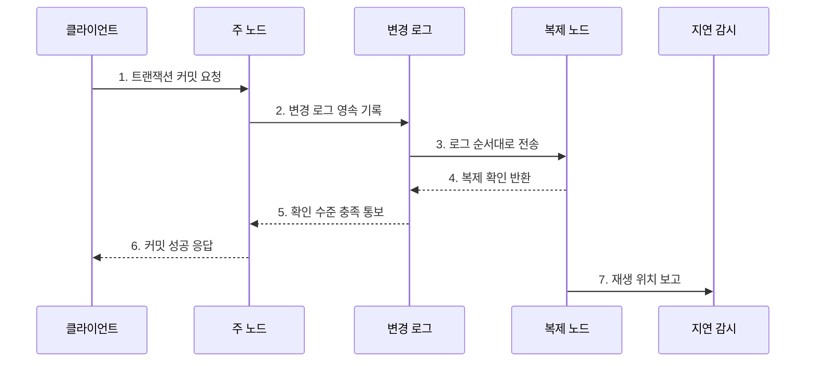

---
sidebar:
  order: 100
  label: "100. 데이터베이스 복제: 마스터-슬레이브·멀티마스터 (Database Replication)"
  badge:
    text: "미출제 · 50%"
    variant: note
title: "데이터베이스 복제: 마스터-슬레이브·멀티마스터 (Database Replication)"
date: "2026-07-25T18:32:00+09:00"
tags:
  - "notes-software"
weight: 100
extra:
  question_no: "100"
  source_status: "미출제"
  source_history: ""
  priority: 50
  priority_note: "복제 지연·일관성·장애전환 설계 가치"
---

## 미리 알고가기

- **데이터베이스 복제(Database Replication)**: 한 DB의 변경을 다른 노드에 전달해 데이터 사본을 유지하는 기술
- **주 노드(Primary Node)**: 단일 주 노드 방식에서 쓰기 순서를 확정하는 노드
- **복제 노드(Replica Node)**: 주 노드의 변경 로그를 받아 사본에 적용하는 노드
- **동기 복제(Synchronous Replication)**: 정해진 복제 확인을 기다린 뒤 커밋 성공을 반환하는 방식
- **비동기 복제(Asynchronous Replication)**: 주 노드가 먼저 커밋을 반환하고 복제 노드가 뒤따라 반영하는 방식
- **장애 조치(Failover)**: 주 노드 장애 시 승격 조건을 충족한 복제 노드를 전환하는 절차
- **분할 뇌(Split Brain)**: 둘 이상의 노드가 동시에 주 노드가 되어 데이터가 분기되는 상태
- **RTO / RPO**: 복구 목표 시간 / 허용 가능한 데이터 손실 시점

## Ⅰ. 개요

- 정의/개념: 변경 로그를 전달해 **여러 노드에 사본을 유지하는 기법**
- 배경/필요성: 읽기 확장과 장애 복구 시간 단축

### 쉽게 이해하기 (학습용)

- 원본 장부의 변경 일지를 다른 지점에 보내 같은 사본을 유지하는 방식이다.

## Ⅱ. 특징

- **읽기 확장**: 복제본으로 조회 부하 분산
- **장애 전환**: 복제 노드를 주 노드로 승격
- **일관성 비용**: 확인 수준에 따라 지연·손실 변화

### 쉽게 이해하기 (학습용)

- 사본이 늘면 읽기와 장애 대응은 좋아지지만 최신성 지연과 원본 충돌을 관리해야 한다.

## Ⅲ. 구조 및 구성요소

| 구성요소 | 책임 |
|:---|:---|
| 주 노드 | 쓰기 순서와 커밋 확정 |
| 변경 로그 | 복제할 변경 순서 기록 |
| 복제 노드 | 로그 수신·영속·재생 |
| 지연 감시 | 송신·재생 위치 차이 측정 |
| 장애 조치 제어기 | 후보 승격과 기존 주 노드 차단 |

### 쉽게 이해하기 (학습용)

- 원본 장부와 변경 일지, 사본, 감시자, 승격 담당자로 구성된다.

## Ⅳ. 흐름도

**동작 원리**

- **1. 트랜잭션 커밋 요청**: 쓰기 확정을 요청
- **2. 변경 로그 영속 기록**: 변경 순서를 기록
- **3. 로그 순서대로 전송**: 복제 노드로 전달
- **4. 복제 확인 반환**: 정책 단계까지 반영
- **5. 확인 수준 충족 통보**: 요구 수를 확인
- **6. 커밋 성공 응답**: 결과를 클라이언트에 전달
- **7. 재생 위치 보고**: 복제 지연을 측결정

### 쉽게 이해하기 (학습용)

- 원본이 변경 일지를 보내고 사본의 확인 수준과 따라오는 속도를 계속 측정한다.

## Ⅴ. 종류 및 비교

| 판단 기준 | 단일 주 노드 | 다중 주 노드 | 비동기 복제 |
|:---|:---|:---|:---|
| 적용 기준 | 명확한 쓰기 순서 | 다지역 쓰기 | 낮은 쓰기 지연 |
| 핵심 특징 | 한 노드가 순서 확정 | 여러 노드가 쓰기 수용 | 로컬 커밋 후 전파 |
| 한계 | 전환 공백 | 충돌·데이터 분기 | 지연·최근 데이터 손실 |

### 쉽게 이해하기 (학습용)

- 한 원본은 순서가 단순하고 여러 원본은 가까이서 쓸 수 있지만 충돌 해결이 필요하다.

## Ⅵ. 실무 고려사항 및 대책

| 고려사항 | 대책 | 효과 |
|:---|:---|:---|
| 읽기 최신성 | 주 노드 읽기·로그 위치 대기 | 과거 값 조회 방지 |
| 복제 지연 | 시간·재생 위치 경보 | 뒤처진 사본 제외 |
| RPO·RTO | 확인 수·승격 절차 정의 | 손실·복구 시간 통제 |
| 분할 뇌 | 정족수·세대·Fencing 적용 | 이중 주 노드 차단 |
| 백업 | 시점 복구용 독립 사본 유지 | 오류·삭제 전파 복구 |

> **적용 사례**: 조회 부하는 비동기 복제본으로 분산하되 쓰기 직후 조회는 주 노드로 보내고 허용 지연을 넘은 복제본은 라우팅에서 제외

### 쉽게 이해하기 (학습용)

- 사본이 늦으면 최신 값이 필요한 읽기에서 빼고, 원본 장애 때 둘이 동시에 원본이 되지 않게 막아야 한다.

## Ⅶ. 결론

- **최신성·RPO·RTO·쓰기 지연**으로 복제 방식을 결정

### 쉽게 이해하기 (학습용)

- 사본을 만드는 것보다 언제 최신이고 누가 원본이며 장애 때 얼마나 잃는지를 정하는 일이 중요하다.
