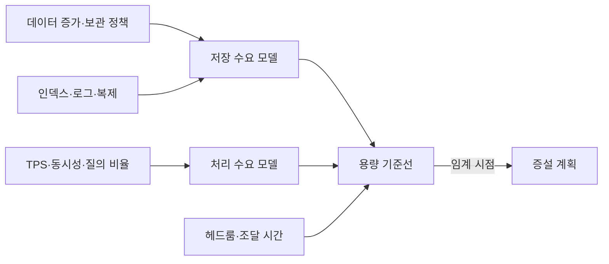
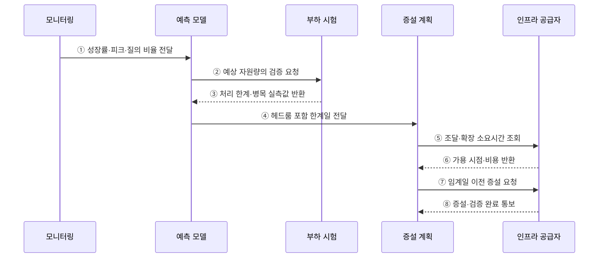

---
sidebar:
  order: 101
  label: "101. 데이터베이스 용량 산정 (DB Capacity Planning)"
  badge:
    text: "기출 · 50%"
    variant: note
title: "데이터베이스 용량 산정 (DB Capacity Planning)"
date: "2026-07-27T23:59:59+09:00"
tags:
  - "notes-software"
weight: 101
extra:
  question_no: "101"
  source_status: "기출"
  source_history: "131회"
  priority: 50
  priority_note: "131회 기출, 저장량·증가율 용량 산정"
---

## 미리 알고가기

- **데이터베이스(Database, DB)**: 구조화된 데이터를 저장·조회·관리하는 시스템
- **용량 계획(Capacity Planning)**: 예상 수요에 필요한 저장·처리 자원 규모와 증설 시점을 정하는 활동
- **초당 트랜잭션 수(Transactions Per Second, TPS)**: 시스템이 1초 동안 처리하는 트랜잭션 수
- **초당 입출력 작업 수(Input/Output Operations Per Second, IOPS)**: 저장장치가 1초 동안 처리하는 읽기·쓰기 작업 수
- **중앙 처리 장치(Central Processing Unit, CPU)**: 질의의 계산·정렬·집계를 수행하는 처리장치
- **헤드룸(Headroom)**: 수요 급증·장애·예측 오차에 대응하도록 남겨 둔 여유 자원
- **보관 기간(Retention Period)**: 데이터를 삭제하지 않고 유지해야 하는 기간
- **운영 오버헤드(Operational Overhead)**: 원본 외에 인덱스·로그·복제본·임시 작업이 추가로 사용하는 자원
- **피크 부하(Peak Load)**: 관측 기간 중 가장 높은 요청량·동시성·자원 사용량
- **조달 선행 시간(Provisioning Lead Time)**: 증설 결정부터 실제 자원 사용까지 걸리는 시간

## Ⅰ. 개요

- 데이터베이스 용량 계획은 데이터 성장과 처리 부하를 예측해 필요한 저장·CPU·메모리·I/O 규모와 증설 시점을 정하는 활동이다.
- 평균 사용량만 따르면 피크·장애·조달 지연을 견디지 못하므로 헤드룸과 복구 구성을 함께 산정한다.

### 쉽게 이해하기 (학습용)

- 창고의 현재 물건뿐 아니라 증가량, 성수기 반입, 복제품, 확장 공사 기간까지 계산해 크기와 증설일을 정한다.

## Ⅱ. 특징

- **저장 수요**: 행 크기·증가량·보관 기간에 인덱스·로그·복제 오버헤드를 더한다.
- **처리 수요**: 피크 TPS·동시성·질의 비율로 CPU·메모리·IOPS 요구량을 구한다.
- **실측 보정**: 압축률·캐시 적중률·질의 비용을 부하 시험으로 보정한다.
- **선행 증설**: 임계 도달 예상일에서 조달·이관·검증 시간을 역산한다.

### 쉽게 이해하기 (학습용)

- 평균치가 아니라 가장 붐비는 시간과 성장 속도, 새 자원을 준비하는 데 걸리는 시간을 함께 계산한다.

## Ⅲ. 아키텍처 및 구성요소

**도표안 A — 구조도**

**도표안 B — sequenceDiagram**

| 구성요소 | 역할 |
|:---|:---|
| 수요 측정 | 데이터 증가·피크 TPS·동시성·질의 비율 수집 |
| 저장 모델 | 원본·인덱스·로그·임시 공간·복제본 예측 |
| 처리 모델 | CPU·메모리·IOPS·네트워크 요구량 예측 |
| 부하 시험 | 실제 질의와 장애 조건으로 처리 한계 검증 |
| 용량 기준선 | 헤드룸·조달 시간·증설 임계치와 책임 정의 |

**동작 원리**

- ① 모니터링이 성장률·피크 부하·질의 비율을 예측 모델에 전달한다.
- ② 예측 모델이 계산한 저장·처리 자원량의 부하 검증을 요청한다.
- ③ 부하 시험이 실제 처리 한계와 병목 자원을 반환한다.
- ④ 예측 모델이 실측 보정과 헤드룸을 반영한 한계 도달일을 전달한다.
- ⑤ 증설 계획이 인프라 공급자에게 조달·확장 소요시간을 조회한다.
- ⑥ 인프라 공급자가 자원 가용 시점과 비용을 반환한다.
- ⑦ 계획 담당이 임계 도달 전에 완료되도록 증설을 요청한다.
- ⑧ 인프라 공급자가 증설과 용량 검증 완료를 통보한다.

### 쉽게 이해하기 (학습용)

- 증가 속도로 한계일을 구하고 시험으로 보정한 뒤 공사 기간만큼 먼저 확장한다.

## Ⅳ. 종류 및 비교

| 산정 영역 | 주요 입력 | 산정 결과 | 대표 오차 |
|:---|:---|:---|:---|
| 저장 용량 | 행 크기·증가량·보관 기간 | 원본·인덱스·로그·백업 공간 | 압축률·삭제 지연 |
| 처리 용량 | 피크 TPS·동시성·질의 비율 | CPU·메모리·IOPS·네트워크 | 데이터 분포·캐시 효과 |
| 가용성 용량 | 장애 시 부하·복제 구성 | N+1·대기 노드·장애 헤드룸 | 장애 중 복제·복구 부하 |
| 운영 용량 | 백업·재구성·정렬·이관 | 임시 공간·작업 시간대 | 작업 중 중복 공간 |

> 저장 용량과 처리 용량은 같은 비율로 늘지 않으므로 병목 자원별로 따로 예측해야 한다.

### 쉽게 이해하기 (학습용)

- 자료를 담는 공간, 요청을 처리하는 능력, 고장 때 대신 일할 여유를 각각 계산해야 한다.

## Ⅴ. 실무 고려사항 및 대책

| 고려사항 | 위험 | 대책 |
|:---|:---|:---|
| 기준 데이터 | 짧은 평균으로 계절·행사 피크 누락 | 장기 추세·피크·성장 시나리오 분리 |
| 저장 산식 | 원본 데이터만 계산 | 인덱스·WAL·복제·백업·임시 공간 포함 |
| 장애 조건 | 정상 상태 처리량만 검증 | 노드 한 대 상실 상태의 부하 시험 |
| 헤드룸 | 근거 없이 과소·과대 설정 | 수요 변동·예측 오차·조달 시간별 근거 기록 |
| 확장 한계 | 수직 증설 가능성만 가정 | 라이선스·노드·샤드·이관 한계 사전 검증 |
| 경보 | 용량 부족 직전에 대응 | 소진 예상일과 조달 선행시간 기반 경보 |

> **기본 산식**: 예상 저장량 = 일평균 증가량 × 보관일 × (1 + 인덱스·로그 비율) × 복제 계수 + 운영 여유 공간

> **적용 사례**: 주문 DB는 월말 피크 질의를 장애 상태에서 재현하고, 예상 한계일보다 조달·이관 기간만큼 먼저 증설한다.

### 쉽게 이해하기 (학습용)

- 원본뿐 아니라 색인·로그·사본을 더하고 가장 바쁜 날과 고장 상황까지 시험한다.

## Ⅵ. 결론

- DB 용량 계획은 저장량·처리량·가용성 요구를 실측으로 보정해 자원 한계와 증설 시점을 예측하는 활동이다.
- 성장률·피크·운영 오버헤드·헤드룸·조달 시간을 함께 반영해 성능 저하 전에 증설해야 한다.

### 쉽게 이해하기 (학습용)

- 얼마나 커지고 바빠지는지 계산해 준비 기간보다 먼저 늘리는 것이 핵심이다.
