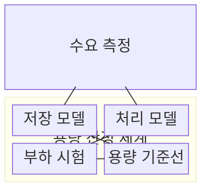
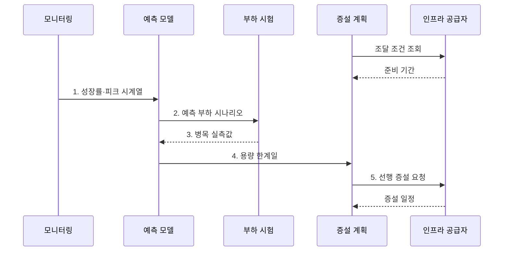

---
sidebar:
  order: 101
  label: "101. 데이터베이스 용량 산정 (DB Capacity Planning)"
  badge:
    text: "기출 · 50%"
    variant: note
title: "데이터베이스 용량 산정 (DB Capacity Planning)"
date: "2026-08-02T12:00:00+09:00"
tags:
  - "notes-software"
weight: 101
extra:
  question_no: "101"
  source_status: "기출"
  source_history: "131회"
  priority: 50
  priority_note: "131회 기출, 저장량·증가율 용량 산정"
---

## Ⅰ. 개요

핵심 용어

- **용량·증설 시점**: 데이터 증가량과 질의 부하를 예측해 필요한 자원 규모와 확장 시기를 정하는 기준이다.

- 정의/개념: **DB 용량 계획**은 데이터 증가율과 질의·트랜잭션 부하를 예측하여 저장·메모리·처리 용량과 증설 시점을 결정하는 관리 활동
- 배경/필요성: 평균 사용량만으로는 **피크·장애 시점의 자원 고갈** 예측 불가

#### 한줄 요약

- 창고의 현재 물건뿐 아니라 증가량, 성수기 반입, 복제품, 확장 공사 기간까지 계산해 크기와 증설일을 정한다.

## Ⅱ. 특징

핵심 용어

- **선행 증설**: 용량 한계일에서 자원 조달 기간을 역산해 미리 확장을 시작하는 방식이다.

> 파란 예측선이 5개월째 운영 한계선에 닿고 증설 리드타임을 2개월로 가정했으므로 3개월째 착수해야 한다는 예시이며, 실제 성장률과 여유율은 관측 자료로 산정한다.

- **저장 산정**: 원본·인덱스·로그·복제 포함
- **처리 산정**: 피크 TPS·동시성·IOPS 반영
- **선행 증설**: 준비 기간을 한계일에서 역산

#### 한줄 요약

- 평균치가 아니라 가장 붐비는 시간과 성장 속도, 새 자원의 준비 시간을 함께 계산한다.

## Ⅲ. 구조 및 구성요소

핵심 용어

- **저장 모델**: 원본 데이터와 인덱스·로그·복제본 등 운영 오버헤드를 합쳐 저장 수요를 예측하는 구성요소이다.

| 구성요소 | 책임 |
|:---|:---|
| 수요 측정 | **성장률·피크**와 질의 비율 수집 |
| 저장 모델 | 원본과 **운영 오버헤드** 예측 |
| 처리 모델 | **CPU·IOPS**와 메모리 수요 예측 |
| 부하 시험 | 예상 질의로 **병목 자원** 검증 |
| 용량 기준선 | **헤드룸·증설 시점** 결정 |

#### 한줄 요약

- 증가량과 혼잡도를 재고 시험 결과로 창고 확장 시점을 정한다.

## Ⅳ. 흐름도

핵심 용어

- **4. 용량 한계일**: 성장률과 헤드룸을 반영해 현재 자원이 소진될 시점을 산출하는 단계이다.

**동작 원리**

1. **성장률·피크 시계열**: 저장량·TPS·동시성의 시간별 추세 확보
2. **예측 부하 시나리오**: 미래 피크와 장애 조건을 시험 입력으로 구성
3. **병목 실측값**: 부하 증가 시 먼저 한계에 닿는 자원 식별
4. **용량 한계일**: 성장률·헤드룸으로 자원 소진 시점 산출
5. **선행 증설 요청**: 한계일에서 조달 선행 시간을 역산해 착수

#### 한줄 요약

- 증가 속도로 한계일을 구하고 시험으로 보정한 뒤 공사 기간만큼 먼저 확장한다.

## Ⅴ. 종류 및 비교

핵심 용어

- **처리 용량**: 피크 TPS·동시성과 CPU·메모리·IOPS 수요를 중심으로 산정하는 용량이다.

| 용량 산정 축 | 저장 용량 | 처리 용량 | 가용성 용량 |
|:---|:---|:---|:---|
| 적용 기준 | **데이터 증가량·보관 기간** 중심 | **피크 TPS·동시성** 중심 | **장애 시 잔여 처리량** 중심 |
| 핵심 특징 | 원본과 **운영 오버헤드** 합산 | **CPU·메모리·IOPS** 산정 | 대기 노드와 **헤드룸** 포함 |
| 한계 | **압축률·삭제율** 예측 오차 | **캐시 적중률·질의 분포** 예측 오차 | **복구 부하** 누락 위험 |

> 요약: 저장·처리·가용성 수요를 분리한 **병목 자원별 예측**

#### 한줄 요약

- 자료를 담는 공간, 요청을 처리하는 능력, 고장 때 대신 일할 여유를 각각 계산해야 한다.

## Ⅵ. 실무 고려사항 및 대책

핵심 용어

- **평균값 중심 수요 데이터는 월말 피크 누락**: 평균 사용량만 사용해 계절성과 최대 부하를 반영하지 못하는 문제이다.

| 문제 | 대책 | 효과 |
|:---|:---|:---|
| 평균값 중심 수요 데이터는 월말 피크 누락 | 장기 추세·피크를 분리한 **시계열 예측** | **계절 부하** 반영 |
| 원본만 합산하면 인덱스·로그·복제 공간 누락 | **운영 오버헤드** 포함 산식 | **실제 저장량** 오차 감소 |
| 정상 상태 시험만 하면 노드 장애 시 처리량 미확인 | **노드 상실 부하 시험** | 장애 시 **잔여 처리량** 검증 |
| 고정 여유율은 변동성과 예측 오차를 반영하지 못함 | 오차 분포 기반 **헤드룸** 설정 | **과소·과대 산정** 감소 |
| 준비 기간 미반영 시 한계 도달 전 증설 불가 | 소진일에서 **조달 선행 시간** 역산 | **용량 고갈 전 증설** 완료 |

> **저장 용량** = 일평균 증가량 × 보관일 × 오버헤드 × 복제 계수 + 헤드룸

#### 한줄 요약

- 원본뿐 아니라 색인·로그·사본을 더하고 가장 바쁜 날과 고장 상황까지 시험한다.

## Ⅶ. 결론

핵심 용어

- **선행 증설**: 용량 고갈 전에 준비를 끝내도록 조달 기간만큼 앞서 착수하는 활동이다.

- **용량 한계일**에서 조달 기간을 역산해 **선행 증설** 착수

#### 한줄 요약

- 얼마나 커지고 바빠지는지 계산해 준비 기간보다 먼저 늘리는 것이 핵심이다.
