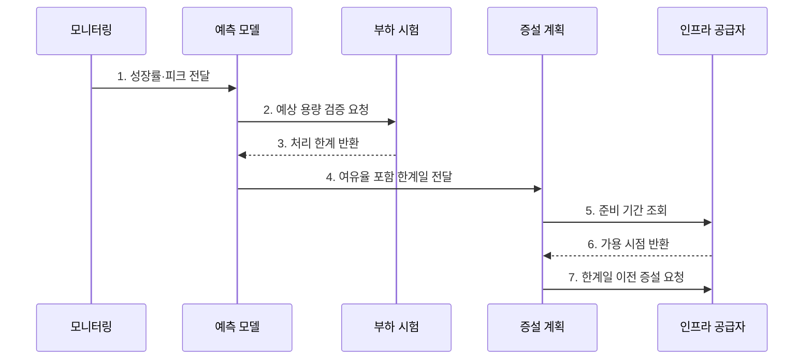

---
sidebar:
  order: 101
  label: "101. 데이터베이스 용량 산정 (DB Capacity Planning)"
  badge:
    text: "기출 · 50%"
    variant: note
title: "데이터베이스 용량 산정 (DB Capacity Planning)"
date: "2026-07-27T23:59:59+09:00"
tags:
  - "notes-software"
weight: 101
extra:
  question_no: "101"
  source_status: "기출"
  source_history: "131회"
  priority: 50
  priority_note: "131회 기출, 저장량·증가율 용량 산정"
---

## 미리 알고가기

- **데이터베이스(Database, DB)**: 구조화된 데이터를 저장·조회·관리하는 시스템
- **용량 계획(Capacity Planning)**: 예상 수요에 필요한 저장·처리 자원 규모와 증설 시점을 정하는 활동
- **초당 트랜잭션 수(Transactions Per Second, TPS)**: 시스템이 1초 동안 처리하는 트랜잭션 수
- **초당 입출력 작업 수(Input/Output Operations Per Second, IOPS)**: 저장장치가 1초 동안 처리하는 읽기·쓰기 작업 수
- **중앙 처리 장치(Central Processing Unit, CPU)**: 질의의 계산·정렬·집계를 수행하는 처리장치
- **헤드룸(Headroom)**: 수요 급증·장애·예측 오차에 대응하도록 남겨 둔 여유 자원
- **보관 기간(Retention Period)**: 데이터를 삭제하지 않고 유지해야 하는 기간
- **운영 오버헤드(Operational Overhead)**: 원본 외에 인덱스·로그·복제본·임시 작업이 추가로 사용하는 자원
- **피크 부하(Peak Load)**: 관측 기간 중 가장 높은 요청량·동시성·자원 사용량
- **조달 선행 시간(Provisioning Lead Time)**: 증설 결정부터 실제 자원 사용까지 필요한 시간

## Ⅰ. 개요

- 정의/개념: 수요를 예측해 **자원 규모와 증설 시점을 정하는 활동**
- 배경/필요성: 피크·장애·준비 기간 이전 증설

### 쉽게 이해하기 (학습용)

- 창고의 현재 물건뿐 아니라 증가량, 성수기 반입, 복제품, 확장 공사 기간까지 계산해 크기와 증설일을 정한다.

## Ⅱ. 특징

- **저장 산정**: 원본·인덱스·로그·복제 포함
- **처리 산정**: 피크 TPS·동시성·IOPS 반영
- **선행 증설**: 준비 기간을 한계일에서 역산

### 쉽게 이해하기 (학습용)

- 평균치가 아니라 가장 붐비는 시간과 성장 속도, 새 자원의 준비 시간을 함께 계산한다.

## Ⅲ. 구조 및 구성요소

| 구성요소 | 책임 |
|:---|:---|
| 수요 측정 | 성장률·피크·질의 비율 수집 |
| 저장 모델 | 원본·인덱스·로그·복제 예측 |
| 처리 모델 | CPU·메모리·IOPS 예측 |
| 부하 시험 | 실제 질의로 처리 한계 검증 |
| 용량 기준선 | 여유율·임계치·증설 시점 정의 |

### 쉽게 이해하기 (학습용)

- 증가량과 혼잡도를 재고 시험 결과로 창고 확장 시점을 정한다.

## Ⅳ. 흐름도

**동작 원리**

- **1. 성장률·피크 전달**: 관측값을 수집
- **2. 예상 용량 검증 요청**: 산정값을 시험
- **3. 처리 한계 반환**: 병목 실측값을 전달
- **4. 여유율 포함 한계일 전달**: 소진일을 계산
- **5. 준비 기간 조회**: 조달·이관 기간을 확인
- **6. 가용 시점 반환**: 완료 가능일을 제시
- **7. 한계일 이전 증설 요청**: 선행 작업을 시작

### 쉽게 이해하기 (학습용)

- 증가 속도로 한계일을 구하고 시험으로 보정한 뒤 공사 기간만큼 먼저 확장한다.

## Ⅴ. 종류 및 비교

| 판단 기준 | 저장 용량 | 처리 용량 | 가용성 용량 |
|:---|:---|:---|:---|
| 적용 기준 | 데이터·보관 기간 | 피크 TPS·동시성 | 장애 시 잔여 처리량 |
| 핵심 특징 | 원본·부가 공간 합산 | CPU·메모리·I/O 산정 | 대기 노드·여유율 포함 |
| 한계 | 압축·삭제율 오차 | 캐시·분포 오차 | 복구 부하 누락 |

> 저장 용량과 처리 용량은 같은 비율로 늘지 않으므로 병목 자원별로 따로 예측해야 한다.

### 쉽게 이해하기 (학습용)

- 자료를 담는 공간, 요청을 처리하는 능력, 고장 때 대신 일할 여유를 각각 계산해야 한다.

## Ⅵ. 실무 고려사항 및 대책

| 고려사항 | 대책 | 효과 |
|:---|:---|:---|
| 기준 데이터 | 장기 추세·피크 분리 | 계절 부하 누락 방지 |
| 저장 산식 | 인덱스·로그·복제 포함 | 실제 저장량 반영 |
| 장애 조건 | 노드 상실 상태 시험 | 장애 처리량 검증 |
| 여유율 | 변동·예측 오차 근거 기록 | 과소·과대 산정 감소 |
| 증설 시점 | 소진일에서 준비 기간 역산 | 용량 부족 전 확장 |

> **기본 산식**: 예상 저장량 = 일평균 증가량 × 보관일 × (1 + 인덱스·로그 비율) × 복제 계수 + 운영 여유 공간

> **적용 사례**: 주문 DB는 월말 피크 질의를 장애 상태에서 재현하고, 예상 한계일보다 조달·이관 기간만큼 먼저 증설

### 쉽게 이해하기 (학습용)

- 원본뿐 아니라 색인·로그·사본을 더하고 가장 바쁜 날과 고장 상황까지 시험한다.

## Ⅶ. 결론

- **성장률·피크·여유율·준비 기간**으로 증설 시점을 결정

### 쉽게 이해하기 (학습용)

- 얼마나 커지고 바빠지는지 계산해 준비 기간보다 먼저 늘리는 것이 핵심이다.
