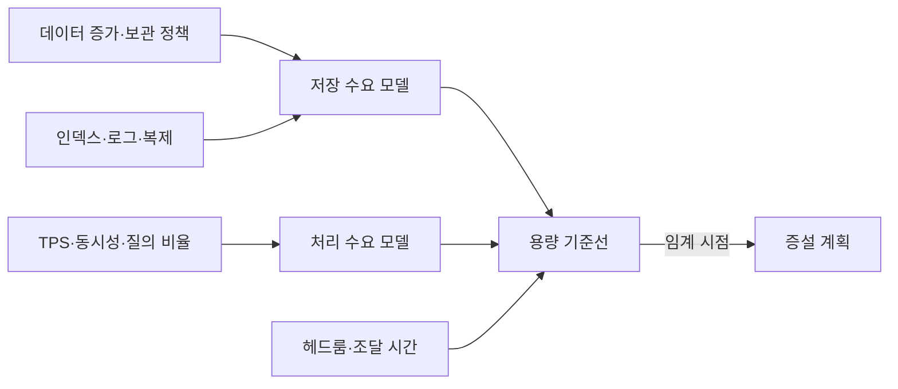
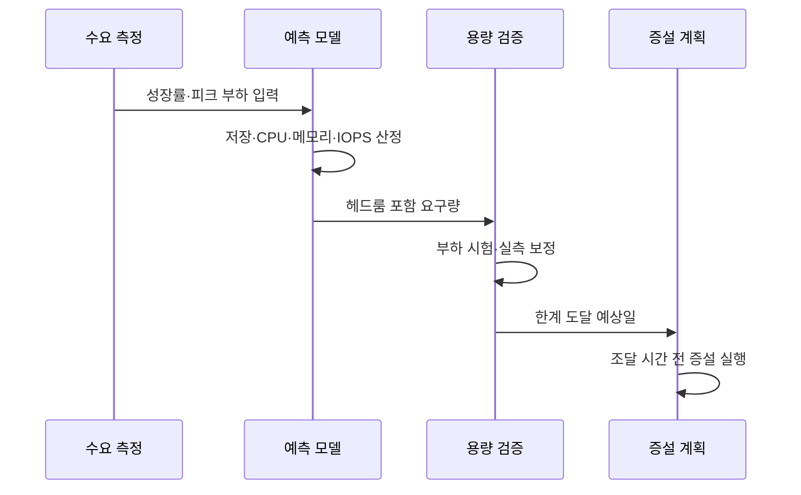

---
sidebar:
  order: 101
  label: "101. 데이터베이스 용량 산정 (DB Capacity Planning)"
  badge:
    text: "기출 · 50%"
    variant: note
title: "데이터베이스 용량 산정 (DB Capacity Planning)"
date: "2026-07-27T23:59:59+09:00"
tags:
  - "notes-software"
weight: 101
extra:
  question_no: "101"
  source_status: "기출"
  source_history: "131회"
  priority: 50
  priority_note: "131회 기출, 저장량·증가율 용량 산정"
---

## 미리 알고가기

- **데이터베이스(Database, DB)**: ‘디비’로 읽고 영문 머리글자를 딴 약어이며, 구조화 데이터를 저장·조회·관리하는 시스템
- **용량 계획(Capacity Planning)**: 예상 수요에 필요한 저장·처리 자원 규모와 증설 시점을 정하는 활동
- **초당 트랜잭션 수(Transactions Per Second, TPS)**: ‘티피에스’로 읽고 영문 머리글자를 딴 약어이며, 시스템이 초당 처리하는 트랜잭션 수
- **초당 입출력 작업 수(Input/Output Operations Per Second, IOPS)**: ‘아이옵스’로 읽고 영문 머리글자를 딴 약어이며, 저장장치가 초당 처리하는 읽기·쓰기 작업 수
- **중앙 처리 장치(Central Processing Unit, CPU)**: ‘시피유’로 읽고 영문 머리글자를 딴 약어이며, 질의 계산·정렬·집계를 수행하는 장치
- **헤드룸(Headroom)**: 수요 급증·장애·예측 오차에 대응하도록 남겨 둔 여유 자원
- **보관 기간(Retention Period)**: 데이터를 삭제하지 않고 유지해야 하는 기간
- **운영 오버헤드(Operational Overhead)**: 원본 외에 인덱스·로그·복제본·임시 작업이 추가로 사용하는 자원
- **피크 부하(Peak Load)**: 관측 기간 중 가장 높은 요청량·동시성·자원 사용량
- **조달 선행 시간(Provisioning Lead Time)**: 증설 결정부터 실제 자원 사용까지 걸리는 시간

## Ⅰ. 개요

- 정의/개념: 수요 예측으로 **자원 규모·증설 시점을 산정**
- 기존 한계: 평균 사용량 기준의 **피크 장애·증설 지연**

### 쉽게 이해하기 (학습용)

- 창고의 현재 물건뿐 아니라 증가량, 성수기 반입, 복제품, 확장 공사 기간까지 계산해 크기와 증설일을 정한다.

## Ⅱ. 특징

- 데이터 증가·보관 기간의 **저장 수요 예측**
- TPS·동시성·질의 유형의 **처리 수요 산정**
- 헤드룸·조달 시간의 **증설 기준 설정**

### 쉽게 이해하기 (학습용)

- 평균치가 아니라 가장 붐비는 시간과 성장 속도, 새 자원을 준비하는 데 걸리는 시간을 함께 계산한다.

## Ⅲ. 아키텍처 및 구성요소

| 구성요소 | 책임 |
|:---|:---|
| 저장 수요 모델 | 증가량·보관의 **원본 용량 예측** |
| 처리 수요 모델 | TPS·동시성의 **자원 요구 예측** |
| 운영 오버헤드 | **인덱스·로그·복제 공간** 합산 |
| 용량 기준선 | 사용률과 **여유 한계 설정** |
| 증설 계획 | 조달 시간을 반영한 **실행 시점 결정** |

> 요약: 저장·처리 수요와 여유·조달 시간을 증설 계획에 연결

### 쉽게 이해하기 (학습용)

- 물건의 부피와 작업량을 따로 계산하고 예비 공간과 공사 기간을 더해 창고 확장 시점을 정한다.

## Ⅳ. 원리 및 절차 흐름

| 절차 | 설명 |
|:---|:---|
| 수요 측정 | 성장률·피크·**질의 비율 수집** |
| 자원 산정 | 저장·CPU·메모리·**IOPS 계산** |
| 헤드룸 반영 | 장애·급증의 **여유 용량 추가** |
| 부하 검증 | 실제 질의로 **모델 오차 보정** |
| 한계일 예측 | 기준 사용률의 **도달 시점 계산** |
| 증설 실행 | 조달 기간 전 **자원 확보** |

> 요약: 실측 보정한 한계 도달일에서 조달 시간을 역산

### 쉽게 이해하기 (학습용)

- 현재 증가 속도로 창고가 차는 날을 계산하고 공사 기간만큼 앞당겨 확장을 시작한다.

## Ⅴ. 종류 및 비교

| 산정 대상 | 저장 용량 | 처리 용량 | 가용성 용량 |
|:---|:---|:---|:---|
| 적용 기준 | 데이터 성장·**보관 정책** | TPS·동시성·**피크 부하** | 장애 시 **서비스 지속** |
| 핵심 특징 | 원본과 **인덱스·로그 합산** | CPU·메모리·**IOPS 병목 산정** | 복제·대기 노드의 **여유 자원** |
| 한계 | 압축률·**증가율 오차** | 질의 분포·**피크 변동** | 중복 투자·**운영 비용 증가** |

> 요약: 저장·처리·장애 대응 용량을 분리 산정 후 합산

### 쉽게 이해하기 (학습용)

- 자료를 담는 공간, 요청을 처리하는 능력, 고장 때 대신 일할 여유를 각각 계산해야 한다.

## Ⅵ. 실무 사례

1. 주문 DB는 **일증가량×보관일+인덱스·복제**로 저장 산정

### 쉽게 이해하기 (학습용)

- 주문 원본뿐 아니라 보관 기간과 색인·복사본을 더하고, 월말 집중 요청을 실제처럼 실행해 처리 한계를 찾는다.

## Ⅶ. 결론

- **성장률·피크·오버헤드·헤드룸·조달 시간**으로 증설 결정

### 쉽게 이해하기 (학습용)

- 평균 사용률만 보지 말고 성장과 가장 바쁜 순간, 숨은 공간, 준비 기간을 모두 반영해야 한다.
